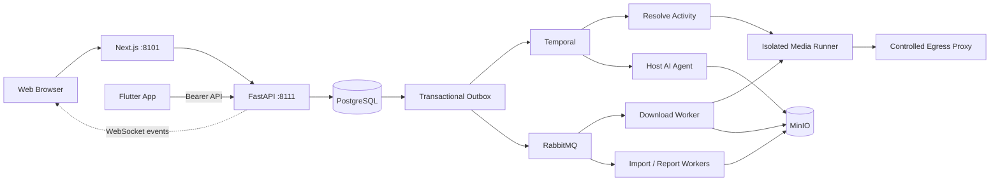

# FrameFetch

**An open-source, self-hosted personal video and screenplay workstation.** Bring in material, understand it, and turn it into usable notes and reports.

[](https://github.com/StephenQiu30/video-server/actions/workflows/ci.yml)
[](https://github.com/StephenQiu30/video-server/releases)
[](https://github.com/StephenQiu30/video-server/stargazers)
[](LICENSE)


[Product](#what-is-framefetch) · [Workflow](#from-material-to-report) · [AI capabilities](#ai-analysis-and-reports) · [Screenshots](#screenshots) · [Quick start](#quick-start) · [Architecture](#architecture) · [简体中文](README.md)


> Actual pages from the current source on 2026-10-02, using isolated demo responses to show layout and workflows. Example content is not evidence of real download or AI-analysis acceptance. The header logo is the same brand asset used by the Flutter App.

## What is FrameFetch?

FrameFetch is a personal video and screenplay workstation that you deploy for your own use. It is designed for creators, content researchers and developers. Authorized video links, local MP4 files and screenplay documents enter one workflow: obtain and verify material, track background jobs, read structured AI analysis, and export reports for further editing.

This repository provides the API, Next.js Web application and background components. The separate [Flutter App](https://github.com/StephenQiu30/video-app) connects to the same backend. See [design 01](docs/design/01-产品定位与边界.md) for product scope (Chinese).

## Use cases

- **Review shots and narrative**: import your own footage or authorized videos, then inspect shots, scenes, highlights and time evidence to study framing, editing rhythm and story structure.
- **Review and rewrite screenplays**: read screenplay documents, analyze story, characters, scenes and dialogue, and produce revision advice or Chinese/English rewrite candidates.
- **Organize material and articles**: retain verified videos and documents, reorganize a video into an article draft, and export Markdown/DOCX for further editing.
- **Build on open source**: extend providers, analysis methods or clients using OpenAPI as the single REST contract.

## From material to report

1. **Bring in material**: paste an authorized single-video link, upload a local MP4, or import a DOCX, text-extractable PDF, TXT, Markdown or Fountain screenplay.
2. **Confirm source and format**: inspect media metadata, access decisions and actual formats. Only downloadable links can create download jobs; expired results must be resolved again.
3. **Follow background jobs**: track inspection, download or import status; cancel, retry or retrieve history as needed. Long-running work stays outside the HTTP request process.
4. **Keep verified material**: validate video identity, format, size, duration and SHA-256. Keep the original screenplay file and its normalized text.
5. **Run optional AI analysis**: select a built-in method, output language and focus. Analysis has its own state; an AI failure does not change a successful download.
6. **Review and export**: read conclusions alongside video time evidence or screenplay scenes, then export a Markdown/DOCX report for continued editing and use.

The Web application includes job history and details, screenplay reading, provider status and account settings. Administrators can manage users, files and AI services, and inspect download/AI statistics and operation logs. WebSocket delta events and reconnect resync update the Web interface; PostgreSQL remains the source of truth. Expiring access URLs do not delete stored material or reports; cleanup is an explicit operation.

## AI analysis and reports

The current server code catalog contains **12 video methods and 8 screenplay methods**. A Skill defines the analysis focus; a fixed result contract defines the report structure. Catalog size does not mean that every method has passed independent real-work acceptance. The independent desktop has its own first-version method set.

- **Video**: comprehensive analysis, storyboard tables, scene extraction, highlights, asset catalogs, director breakdowns, narrative structure, editing rhythm, continuity and finished-video QA, article drafts, short-video packaging and opening-hook review.
- **Screenplay**: story coverage, short-drama coverage, character and conflict, scene, dialogue, structure and continuity review, plus Chinese/English rewriting.

| Result type | What you can read |
| --- | --- |
| Visual video analysis | Main conclusions, scenes, consecutive shots, highlights, visual assets and time evidence |
| Video article | Title, lead, body sections, key points and closing; editorial evidence and limitations are separate |
| General structured report | Summary, analysis sections, candidate items, time evidence and limitations |
| Screenplay analysis | Story overview, structure, characters, scenes, dialogue and revision advice |
| Screenplay rewrite | Target-language text candidates and a glossary |

### Execution and review

- **Observation and evidence**: FFmpeg/ffprobe and restricted video-observation tools support media inspection. API routes use bounded, time-ordered frame evidence. Video conclusions carry time ranges; screenplay conclusions refer to normalized scenes. The current system does not perform ASR/OCR and must not invent dialogue or quotations without reliable audio evidence.
- **Methods and structure**: each job fixes an immutable Skill instruction snapshot. Results undergo strict schema, timeline and evidence validation before storage; reports retain the analysis scope and limitations. Structural validation does not replace human fact-checking.
- **Background execution**: the host AI Worker uses Temporal `SkillWorkflow`; step logs reuse completed chunks, and model calls with unknown outcomes are not automatically repeated. A separate report pipeline publishes Markdown/DOCX.
- **Model integrations**: Codex App Server, Claude CLI, DeepSeek, OpenRouter and OpenAI Chat Completions-compatible routes are supported by adapters. Administrators configure engines and models; users select a Skill, language and focus. Availability depends on actual configuration, model capability and real acceptance.

See [AI analysis](docs/design/10-AI分析.md) and [Skill methods and result contracts](docs/design/16-Skill体系与结果契约.md) for implementation and verification boundaries (Chinese).

## Ways to use FrameFetch and current status

| Product form | Scope and current status |
| --- | --- |
| Web/Server | Self-hosted source and Compose workflows; inspection, download, import, screenplay, optional AI, report and management pipelines are implemented. Actual platform and model support still requires real acceptance |
| iOS/Android | A separate [Flutter client](https://github.com/StephenQiu30/video-app) connects to the same backend, with native file selection, job tracking, playback, report reading and sharing. Build from source; no prebuilt App Store/Google Play package. Real-device and real-account business end-to-end acceptance is pending |
| Independent desktop | `video-electron` **0.1.0 internal test version is implemented**. It provides local MP4/screenplay import, a media library and playback, inspection/download jobs, cancellation and recovery, model configuration, 5 analysis methods and Markdown/DOCX reports. Installed macOS arm64 DMG import, playback, document reading and restart persistence have been verified on the development host |

The phone does not run media extractors, transcoders or offline AI; the operator's server performs that work. Web and mobile use the same backend facts and files. The App currently updates active jobs through controlled polling.

The desktop runs independently. Its installer includes the Python engine, FFmpeg/ffprobe, yt-dlp and Deno; SQLite and the local filesystem hold its data, with no deployment of this server required. An unsigned internal `FrameFetch-0.1.0-mac-arm64.dmg` has been produced. Local import, playback, history and saved reports can work offline. Its 5 methods are comprehensive analysis, shots, highlights, video-to-article and screenplay analysis. Real platform downloads, real user-provided model calls, Windows/Intel Mac installation and formal signing/notarization still require independent acceptance; server evidence cannot substitute for those checks.

**Deployment and costs**: the source is MIT licensed. You provide the server, infrastructure services, storage and network; external model calls may also cost money. Free hosting and model credits are not included. Requirements and commands are under [Quick start](#quick-start).

**Data flow**: Web/App originals, normalized text and reports reside in your configured server infrastructure; the independent desktop keeps them locally. Enabling external AI sends the text or frames needed for analysis to the selected service. Self-hosting or a local workspace does not mean all processing is offline.

## Resolution engine

The current engine uses Registry ladders for HTTP extraction, proof preparation and browser resolution, with controlled egress and a Chrome extension identity source. Temporal runs a single resolve Activity; RabbitMQ workers download and verify artifacts. yt-dlp and FFmpeg supply media adaptation and processing tools; FrameFetch adds input, jobs, isolated execution, storage, documents and analysis. An installed extractor does not guarantee a successful download in the current deployment.

FrameFetch only handles HTTP(S), non-DRM content the user is authorized to obtain. The Registry declares identity and content scope independently; account material does not expand the content scope. Encrypted media and content keys are not decrypted or extracted. Component wiring, successful metadata inspection and complete-file delivery are different states. Implementation status, platform limits and real evidence are maintained only in [design 17](docs/design/17-解析引擎重建.md).

## Screenshots

### Web

The header and following screenshots were captured from **local preview pages built from the current source on 2026-10-02**. `agent-browser` and isolated demo responses show the workspace, job history, AI report and screenplay reader. They contain no real user data, credentials or third-party hotlinks.


**Job history and processing states.**


**Structured AI report.** The report content comes from demo responses. No real model analysis was performed for these screenshots; they do not replace AI product acceptance.


**Screenplay reading and analysis entry.**

The deployment's `/providers` page and real complete-file acceptance establish platform availability. The Web application also exposes `/guide/`, `/self-hosting/`, `/about/` and `/llms.txt`. See the [documentation index](docs/design/README.md) for maintained design (Chinese).

### Independent desktop

These actual screenshots show the **0.1.0 unsigned internal macOS arm64 installed application** (2026-10-02). They are unedited copies of `video-electron/.artifacts/packaged-*.png`, showing settings and the local media library. The pictured video is first-party validation material.


**Local directories and model settings.**


**The installed application's local media library.**

## Quick start

Use `docker-compose.yml` locally and `docker-compose-prod.yml` in production. Platform availability requires complete-file acceptance under design 17.

### Requirements

- Docker Engine and Docker Compose
- Existing PostgreSQL, RabbitMQ, Redis, MinIO and Temporal services; reuse their addresses and credentials
- Strong random secrets and a public origin before any internet-facing deployment

### Automatic local start (macOS)

```bash
git clone https://github.com/StephenQiu30/video-server.git
cd video-server
test -f .env || cp .env.example .env

# Configure .env to reuse existing PostgreSQL, RabbitMQ, Redis, MinIO and Temporal

# Start: the migrate container applies the idempotent backend/sql/schema.sql first
docker compose up -d --build --wait --remove-orphans
```

All containerized background loops run in the single `worker` container. Its `RABBITMQ_WORKER_USER` / `RABBITMQ_WORKER_PASS` account needs restricted permissions for current business queues in `RABBITMQ_VHOST`; see [design 13](docs/design/13-可靠性与运行.md).

The business worker connects to the existing Temporal service through `TEMPORAL_HOST` / `TEMPORAL_PORT`, defaulting to `host.docker.internal:7233`. Host CLI and AI workers use `TEMPORAL_ADDRESS`, defaulting to `127.0.0.1:7233`. The worker initializes `TEMPORAL_NAMESPACE` (default `framefetch`) when needed; the existing service owns its storage and backups.

For an empty user table, create the first administrator on the deployment host. The command prompts for a password, refuses to run once any user exists, and does not expose a remote bootstrap endpoint:

```bash
uv run --project backend python -m app.workers.bootstrap_admin \
  --env-file .env --username your-admin --email you@example.com
```

### Identity and upgrades

Platform identity uses `framefetch-identity`, an MV3 extension loaded from the main checkout's `browser-extension/`, and a per-user `cookie-source` LaunchAgent. From the main checkout's `backend/`, run:

```bash
uv run python -m app.workers.identity.cli install
uv run python -m app.workers.identity.cli check
```

In Chrome 120+, enable developer mode and load that unpacked extension into the single ordinary Profile you use for platform sign-in. Do not load it from a worktree. After updates, run `install` again and reload the extension. Generated pairing configuration and manifest are ignored by Git; pairing configuration is private to the current user but cannot protect against malicious processes running as that same user.

Only the Runner receives `COOKIE_SOURCE_TOKEN`; the extension pairing key is separate. Cookie requests use the exact host/port/path proxy exception, with no redirects or upstream Clash routing. Installation, permissions and operational details are in the [Chinese runtime instructions](README.md#平台身份与升级); the protocol and acceptance boundaries are in [design 17 section 3.4](docs/design/17-解析引擎重建.md#34-身份层).

Before upgrading, pause admissions, drain media operations and back up the business database. Apply the current schema.sql, then rebuild the API, worker, session-runner and frontend together. Production:

```bash
docker compose --env-file .env.prod -f docker-compose-prod.yml up -d --build --wait --remove-orphans
```

Open the services after startup:

- Web application: <http://localhost:8101>
- Swagger UI: <http://localhost:8111/docs>
- OpenAPI contract: <http://localhost:8111/openapi.json>

```bash
curl --fail http://127.0.0.1:8111/health/live
curl --fail http://127.0.0.1:8111/health/ready
curl --fail --head http://127.0.0.1:8101/
```

Set `ANALYSIS_ENABLED=false` in `.env` when you only need downloads and screenplay imports. See [reliability and operations](docs/design/13-可靠性与运行.md) (Chinese) for startup, shutdown, existing infrastructure and recovery. After updating code, run `git pull --ff-only` and the same start command again: `docker compose restart` does not apply a new image or configuration.

### Optional AI worker

The AI worker runs on the host and is intentionally not part of the business Compose topology. The default route can reuse a signed-in Codex App Server; administrators may also configure supported model providers in the web application.

```bash
cd backend
uv sync --frozen --dev
uv run python -m app.workers.analysis.agent_cli doctor
uv run python -m app.workers.analysis.agent_cli install
uv run python -m app.workers.analysis.agent_cli status
```

When the business services use `.env.prod`, the host agent must read the same file:

```bash
uv run python -m app.workers.analysis.agent_cli doctor --env-file ../.env.prod
uv run python -m app.workers.analysis.agent_cli install --env-file ../.env.prod
```

Do not copy or mount Codex/Claude OAuth directories into containers. Before enabling an external model, complete a real analysis acceptance with authorized material and review the provider's terms and your organization's data policy.

## Architecture

This diagram describes the shared Web/App server architecture. The independent Electron desktop uses its own local engine and does not require these services.



| Technologies | Role and user value |
| --- | --- |
| Next.js, React, TypeScript, Tailwind CSS, Radix/shadcn | Browser workspace, accessible controls, job tracking and structured result reading |
| Python, FastAPI, Pydantic, OpenAPI | Submit, query and cancel through a generated REST contract shared by Web, App and extensions |
| PostgreSQL, SQLAlchemy, Transactional Outbox | Persist job facts and delivery intent in the same transaction; recovery does not depend only on process memory |
| Temporal, RabbitMQ | Temporal orchestrates inspection and Skill analysis; RabbitMQ handles downloads, imports, report publication and live events, with one execution owner per business flow |
| Redis | Rate-limit counters, login-session caching and short-lived leases; never the business source of truth |
| yt-dlp, FFmpeg/ffprobe, isolated Runner, Squid | Adapt media sources, inspect and process formats, verify final files, and isolate untrusted media processing with controlled egress |
| MinIO, restricted multipart uploads, short-lived presigned URLs | Store originals, artifacts and reports, upload large files, and retrieve files through authorized access |
| Flutter, Riverpod, Dio, media_kit/libmpv | Native iOS/Android input, state and playback; system secure storage holds refresh credentials, and generated OpenAPI clients keep contracts aligned |
| Electron, React, local Python engine, SQLite | Independent desktop workspace, native file authorization, local jobs and reports; bundled runtimes require no separate Python/FFmpeg or database-server installation |
| Docker Compose, separate host AI Worker | Reuse existing infrastructure for business services and separate AI execution from media jobs along credential and trust boundaries |

See [docs/design/README.md](docs/design/README.md) for the maintained system design.

## Security and content boundaries

- Process only content you are legally authorized to download or analyze.
- Content scope and identity follow design 17; platform support requires complete-file acceptance. Private-network URLs, arbitrary yt-dlp arguments and shell input are always rejected.
- Normal API requests never accept raw cookies. Identity uses the Chrome extension and host cookie-source specified in design 17 section 3.4. ExecutionContext stores the twelve non-secret fields defined in design 17 section 3.7.
- An edge agent may transfer only a clear file the user has legally obtained and explicitly selected. It must not inspect platform sessions, intercept traffic, extract content keys or transform protected media.
- External media access must pass through an egress proxy that blocks private networks; input validation is not a substitute for network isolation.

Do not disclose exploit details, secrets or user content in a public issue. Follow the [Security Policy](SECURITY.md) to report vulnerabilities privately.

## Current limitations

- Chrome extension identity is connected to the engine. Design 17 section 8 owns login-platform and full-matrix acceptance status; identity wiring or successful metadata does not establish complete-file availability.
- FrameFetch is evolving open-source software. It currently provides self-hosted source and Compose workflows, not an official SaaS, public demo or availability SLA.
- Provider behavior can change with source pages and platforms. A platform name does not imply support for every item, region or account entitlement.
- AI analysis needs a separate host agent or a deployment-configured model service. Disabling AI does not disable downloads or document imports.
- Live recording, unbounded playlists, OCR/image-only PDFs, batch file input and collaborative editing are outside the current scope. Creation and platform publishing are not implemented; see [design 11](docs/design/11-内容创作与发布.md).
- Presigned URLs expire, but stored artifacts are not automatically deleted for that reason. Operators must plan MinIO capacity, backups and explicit retention cleanup.
- Replace every placeholder credential in your deployment environment and complete network, storage, runner and complete-file acceptance before exposing a deployment to the internet.

## Development

The frontend requires Node.js `>=24.15 <25` and pnpm 12. The backend requires Python `>=3.12 <3.13` and [uv](https://docs.astral.sh/uv/).

```bash
cd backend
uv sync --frozen --dev
uv run --frozen ruff check app tests
uv run --frozen ruff format --check app tests
uv run --frozen mypy --strict app
uv run --frozen pytest -q

cd ../frontend
pnpm install --frozen-lockfile
pnpm format:check
pnpm lint
pnpm test
pnpm build
```

## Roadmap

Implementation status and technical debt for every area are tracked in [status and backlog](docs/design/14-状态与待办.md) (Chinese); the planned creation and publishing flow is described in [content creation and publishing](docs/design/11-内容创作与发布.md). Discuss priorities in [Issues](https://github.com/StephenQiu30/video-server/issues) — tasks labeled `good first issue` or `help wanted` are a good place to start.

## Contributing

Contributions to provider adapters, reliability, web and mobile UX, AI reports, tests and documentation are welcome. Before opening a pull request, read the [Contributing Guide](CONTRIBUTING.md), [Code of Conduct](CODE_OF_CONDUCT.md), [repository rules](AGENTS.md), [documentation index](docs/design/README.md), and [Security Policy](SECURITY.md).

Keep implementation, OpenAPI contracts, tests, operations documentation and acceptance evidence aligned. Prefer small, independently verifiable changes.

If FrameFetch helps your creative work, research or self-hosting setup, please give it a **Star** and watch [Releases](https://github.com/StephenQiu30/video-server/releases) for updates — it is the best way to keep the project maintained.

## Citation

To cite FrameFetch in papers, reports or course material, use “Cite this repository” in the GitHub sidebar or the root [`CITATION.cff`](CITATION.cff). See [Releases](https://github.com/StephenQiu30/video-server/releases) for version history.

## License

FrameFetch is available under the [MIT License](LICENSE). The software license does not grant rights to download, copy or analyze third-party media.

For public-site indexing and generative-search visibility, see [Web experience and SEO](docs/design/12-Web体验.md) (Chinese). Private self-hosted instances default to noindex; intentionally public sites must opt in with `SITE_INDEXABLE=true` and a stable `SITE_URL` at build and runtime.
