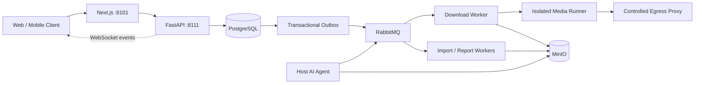

<div align="center">
  
  <h1>FrameFetch</h1>
  <p><strong>Open-source, self-hosted public-media download, screenplay processing and AI analysis workflow</strong></p>
  <p>
    <a href="https://github.com/StephenQiu30/video-server/actions/workflows/ci.yml"></a>
    <a href="https://github.com/StephenQiu30/video-server/releases"></a>
    <a href="https://github.com/StephenQiu30/video-server/stargazers"></a>
    <a href="LICENSE"></a>
    
    
    
  </p>
  <p>
    <a href="#whats-new">What's new</a> ·
    <a href="#quick-start">Quick start</a> ·
    <a href="#use-cases">Use cases</a> ·
    <a href="#capabilities">Capabilities</a> ·
    <a href="#frequently-asked-questions">FAQ</a> ·
    <a href="#screenshots">Screenshots</a> ·
    <a href="#architecture">Architecture</a> ·
    <a href="README.md">简体中文</a>
  </p>
</div>


> The screenshots were captured from a local preview instance with `agent-browser`. Media-bearing views use the repository's visual-regression fixture; none contains real user data, credentials, or third-party hotlinks.

## What is FrameFetch?

FrameFetch is an open-source, self-hosted video downloader and media workflow for creators, content researchers and developers. It turns an authorized public-media URL, local video or screenplay into an observable, recoverable job: inspect the source, select a real format, download and verify it in an isolated runner, persist the artifact, and optionally produce a structured AI analysis report.

FrameFetch is not designed to circumvent platform restrictions. By default it only handles HTTP(S) content the user is entitled to use and that is public, free and non-DRM. Membership, private, purchased, region-restricted and protected playback rights are outside the project's scope.

## What's new

**Unreleased · Login state read live from your Chrome**

- `./start`, the stored session copy, `session-browser` and the keep-alive state machine are gone: each parse reads the site's cookies from your own Chrome.
- A `migrate` container applies the schema, so `docker compose up -d --wait` is the whole cold start.
- TikTok now uses yt-dlp's maintained extractor; the provider canary probes the bundled public samples by default.

**[v0.2.0](https://github.com/StephenQiu30/video-server/releases/tag/v0.2.0) · Container-owned platform sessions**

- One command, `./start`, applies the schema, discovers platform logins from your local Chrome, registers them encrypted, has the containers verify them and starts every business service.
- Platform sessions are owned by `session-broker` and a containerized session browser: cold-start recovery, keep-alive, invalidation detection and automatic rotation. Users just paste a link.
- Online parsing always uses the site-session route; the anonymous and guest execution routes were removed, and success is judged by a real downloaded file.
- Web UX: avatar upload and profile page, unified two-column result cards, recoverable error notices and shadcn component clean-up.

Read the breaking changes in the [release notes](https://github.com/StephenQiu30/video-server/releases/tag/v0.2.0) before upgrading from v0.1.0.

## Use cases

- **Video and short-form breakdowns**: import your own footage or authorized public videos and generate storyboards, scene timelines and keyframe evidence to review pacing and narrative structure.
- **Screenplay and script research**: import Markdown, Fountain, TXT, PDF or DOCX screenplays, then read, analyze or rewrite them in one workspace and export Markdown / DOCX reports.
- **Team media library**: keep format-, duration- and SHA-256-verified media on your own servers, with users, roles, tasks and storage managed in one place.
- **Self-hosted video downloader**: submit authorized public media links from the Web UI, API or the iOS / Android client, download asynchronously and follow progress in real time without any hosted service.
- **Building on top**: use OpenAPI as the single contract to add providers, analysis capabilities or clients on FastAPI, Next.js and Flutter.

## From video parsing to an AI report

1. Inspect an authorized public-media link or import your own local video or screenplay.
2. Confirm the source and format, then track processing; media artifacts and AI analyses have separate task states.
3. Run an available video, scene, shot or screenplay analysis and review its timeline and keyframe evidence against the source.
4. Export a Markdown or DOCX report for content research, creative planning or team review.

The Web instance exposes public Chinese pages — `/guide/` (usage guide), `/self-hosting/` (deployment guide) and `/about/` (scope and boundaries) — plus an English `/llms.txt` summary for generative search engines. See the capability table below and the [design index](docs/design/README.md) (Chinese) for implementation and configuration. Available outputs depend on the configured analysis capabilities and AI service.

### Frequently asked questions

**How does FrameFetch relate to yt-dlp and FFmpeg?** They provide media adaptation and processing within the workflow. FrameFetch adds Web/API access, users and jobs, isolated workers, artifact storage, document processing and optional AI analysis. Extractor support does not guarantee that every platform works in a particular deployment.

**Does open source mean zero operating cost?** The source code is MIT licensed. Infrastructure, storage, bandwidth and external AI services may incur costs; free hosting or model credits are not included.

**Does self-hosting keep all data on the device?** Data resides in the infrastructure configured by the operator. When an external AI provider is used, the content needed for analysis is sent to that service. Check content permissions and the provider's data handling terms before enabling it.

**Where are the Web and mobile clients?** This repository maintains the API, Next.js Web and workers. [video-app](https://github.com/StephenQiu30/video-app) is the Flutter iOS/Android client that connects to this server; it does not run offline AI on the phone.

## Capabilities

| Capability | Current implementation |
| --- | --- |
| Public-media inspection | Extract source metadata and actual available formats from an authorized public URL or single-link share text |
| Reliable asynchronous jobs | FastAPI → Transactional Outbox → RabbitMQ → workers → isolated media runner |
| Artifact verification | Re-resolve the source, validate semantic format identity, run FFmpeg/ffprobe checks, and verify size, duration and SHA-256 before storage |
| Persistent artifacts | Store media, imported documents, normalized text and Markdown/DOCX reports in MinIO |
| Live status | WebSocket delta events with version checks, reconnect and resync; PostgreSQL remains the source of truth |
| Screenplay workflow | Import Markdown, Fountain, TXT, PDF and DOCX files for reading, navigation and analysis |
| Optional AI analysis | A host-side Codex Agent or an administrator-configured model provider, with Markdown/DOCX report export |
| Operations | User roles, provider health, download analytics, paginated artifacts and explicit retention cleanup |
| Native mobile client | Separate [FrameFetch Flutter client for iOS and Android](https://github.com/StephenQiu30/video-app) |

The system is built for recoverability and isolation rather than one-shot command execution. PostgreSQL stores job facts, the transactional outbox aligns state with message intent, and long-running download, FFmpeg and AI work never runs inside the HTTP request process.

## Screenshots


<p align="center"><strong>Authenticated media inspection and real-format workspace</strong></p>

<table>
  <tr>
    <td width="50%"></td>
    <td width="50%"></td>
  </tr>
  <tr>
    <td align="center"><strong>Provider capabilities and verification</strong></td>
    <td align="center"><strong>Account and secure session</strong></td>
  </tr>
</table>

The web application includes media inspection and download, job history and details, screenplay reading and analysis, provider status, account settings, and administrator views for users, files, analytics and AI providers. The deployment's `/providers` page reports registered routes and recent verification evidence; the result for a specific public link is established by its actual inspection and file download.

## Quick start

Use `docker-compose.yml` for local development and `docker-compose-prod.yml` for production. Fixed public platforms use their native public interfaces; every other platform uses the login state of your local Chrome. When Chrome is not signed in, FrameFetch asks you to sign in instead of silently switching routes. An installed extractor, an existing cookie or a healthy service does not prove that media can be downloaded; only a real file result does.

### Requirements

- Docker Engine and Docker Compose
- For the automatic macOS entry point: `uv`, platform logins already present in your local Chrome, and a one-time system read permission
- Existing PostgreSQL, RabbitMQ, Redis and MinIO services; reuse their addresses and credentials
- Strong random secrets and a public origin before any internet-facing deployment

### Automatic local start (macOS)

```bash
git clone https://github.com/StephenQiu30/video-server.git
cd video-server
test -f .env || cp .env.example .env

# Configure .env to reuse existing PostgreSQL, RabbitMQ, Redis and MinIO

# Once: install the Chrome login-state agent (starts at login, restarts on crash)
uv run --project backend python -m app.workers.session.chrome_agent install --env-file .env

# Start: the migrate container applies the idempotent backend/sql/schema.sql first
docker compose up -d --build --wait --remove-orphans
```

Every containerized background loop (Outbox dispatch, inspection and downloads, imports, report publication, provider canaries) runs in one `worker` container with one RabbitMQ account, `RABBITMQ_WORKER_USER` / `RABBITMQ_WORKER_PASS`, which needs configure/write/read on `RABBITMQ_VHOST`. When upgrading from the former multi-worker topology, create that account first; `--remove-orphans` removes the retired `outbox`, `worker-*`, `provider-canary`, `provider-lease-redis` and `workspace-init` containers.

Agent installation also runs a source check. Missing site logins may produce a nonzero check result even after the system service was installed. Fixed public platforms do not require Chrome login state; configure permissions and sign in for the platforms that do.

For an empty user table, create the first administrator on the deployment host. The command prompts for a password, refuses to run once any user exists, and does not expose a remote bootstrap endpoint:

```bash
uv run --project backend python -m app.workers.bootstrap_admin \
  --env-file .env --username your-admin --email you@example.com
```

### Platform login state

FrameFetch is a single-user tool: **the Chrome you use every day is the only source of platform login state.** Each parse reads the site's cookies live and discards them afterwards; no copy is stored and no second browser keeps it alive. After signing in again, the agent reads the new state once its 20-second memory cache expires; an actual parse or download must still verify that the platform accepts it. The broker relays requests on demand, without background scans, warmup timers or cookie writeback.

- After installing, run `uv run --project backend python -m app.workers.session.chrome_agent check --env-file .env` to see which sites are signed in. It prints the binary to add under System Settings → Privacy & Security → Full Disk Access; choose "Always Allow" for "Chrome Safe Storage" in the keychain prompt.
- If several Chrome profiles are signed in to one platform, pin one with `SITE_SESSION_SOURCE_PROFILES` in `.env`.
- Uninstall with `uv run --project backend python -m app.workers.session.chrome_agent uninstall`. See the [platform session design](docs/design/08-平台会话.md) (Chinese).

The production configuration uses its own env and Compose files and needs the same Chrome agent:

```bash
uv run --project backend python -m app.workers.session.chrome_agent install --env-file .env.prod
docker compose --env-file .env.prod -f docker-compose-prod.yml up -d --build --wait --remove-orphans
```

Open the services after startup:

- Web application: <http://localhost:8101>
- Swagger UI: <http://localhost:8111/docs>
- OpenAPI contract: <http://localhost:8111/openapi.json>

```bash
curl --fail http://127.0.0.1:8111/health/live
curl --fail http://127.0.0.1:8111/health/ready
curl --fail --head http://127.0.0.1:8101/
```

Set `ANALYSIS_ENABLED=false` in `.env` when you only need downloads and screenplay imports. See [reliability and operations](docs/design/13-可靠性与运行.md) (Chinese) for startup, shutdown, existing infrastructure and recovery. After updating code, run `git pull --ff-only` and the same start command again: `docker compose restart` does not apply a new image or configuration.

### Optional AI worker

The AI worker runs on the host and is intentionally not part of the business Compose topology. The default route can reuse a signed-in Codex App Server; administrators may also configure supported model providers in the web application.

```bash
cd backend
uv sync --frozen --dev
uv run python -m app.workers.analysis.agent_cli doctor
uv run python -m app.workers.analysis.agent_cli install
uv run python -m app.workers.analysis.agent_cli status
```

When the business services use `.env.prod`, the host agent must read the same file:

```bash
uv run python -m app.workers.analysis.agent_cli doctor --env-file ../.env.prod
uv run python -m app.workers.analysis.agent_cli install --env-file ../.env.prod
```

Do not copy or mount Codex/Claude OAuth directories into containers. Before enabling an external model, run a canary with authorized material and review the provider's terms and your organization's data policy.

## Architecture



| Layer | Technologies |
| --- | --- |
| Frontend | Next.js 16, React 19, TypeScript, Tailwind CSS, Radix UI |
| Backend | Python 3.12, FastAPI, SQLAlchemy, PostgreSQL |
| Async | Transactional Outbox, RabbitMQ, Redis, idempotent workers with leases and heartbeats |
| Media | FFmpeg, ffprobe, yt-dlp adapters, isolated runners and Squid egress proxy |
| Storage | MinIO object storage with short-lived presigned access URLs |
| Contract | OpenAPI is the single contract shared by the web, Flutter and server code |

See [docs/design/README.md](docs/design/README.md) for the maintained system design.

## Security and content boundaries

- Process only content you are legally authorized to download or analyze.
- Providers accept only public, free and non-DRM HTTP(S) content. Private-network URLs, arbitrary yt-dlp arguments and shell input are always rejected.
- Normal API requests never accept raw cookies. Login state is read per operation from the local Chrome and handed to `session-runner` over a sealed channel; the clear copy lives only in its tmpfs and is destroyed when the operation ends. See the [platform session design](docs/design/08-平台会话.md).
- An edge agent may transfer only a clear file the user has legally obtained and explicitly selected. It must not inspect platform sessions, intercept traffic, extract content keys or transform protected media.
- External media access must pass through an egress proxy that blocks private networks; input validation is not a substitute for network isolation.

Do not disclose exploit details, secrets or user content in a public issue. Follow the [Security Policy](SECURITY.md) to report vulnerabilities privately.

## Current limitations

- Tencent Video and Youku have an optional personal-session path that only attempts full, non-DRM content the account can access; full VIP downloads still await real-sample verification.
- FrameFetch is evolving open-source software. It currently provides self-hosted source and Compose workflows, not an official SaaS, public demo or availability SLA.
- Provider behavior can change with source pages and platforms. A platform name does not imply support for every item, region or account entitlement.
- AI analysis needs a separate host agent or a deployment-configured model service. Disabling AI does not disable downloads or document imports.
- Presigned URLs expire, but stored artifacts are not automatically deleted for that reason. Operators must plan MinIO capacity, backups and explicit retention cleanup.
- Replace every placeholder credential in your deployment environment and complete network, storage, runner and provider-canary acceptance before exposing a deployment to the internet.

## Development

The frontend requires Node.js `>=24.15 <25` and pnpm 12. The backend requires Python `>=3.12 <3.13` and [uv](https://docs.astral.sh/uv/).

```bash
cd backend
uv sync --frozen --dev
uv run --frozen ruff check app tests
uv run --frozen mypy --strict app
uv run --frozen pytest -q

cd ../frontend
pnpm install --frozen-lockfile
pnpm lint
pnpm test
pnpm build
```

## Roadmap

Implementation status and technical debt for every area are tracked in [status and backlog](docs/design/14-状态与待办.md) (Chinese); the planned creation and publishing flow is described in [content creation and publishing](docs/design/11-内容创作与发布.md). Discuss priorities in [Issues](https://github.com/StephenQiu30/video-server/issues) — tasks labeled `good first issue` or `help wanted` are a good place to start.

## Contributing

Contributions to provider adapters, reliability, web and mobile UX, AI reports, tests and documentation are welcome. Before opening a pull request, read the [Contributing Guide](CONTRIBUTING.md), [Code of Conduct](CODE_OF_CONDUCT.md), [repository rules](AGENTS.md), [documentation index](docs/design/README.md), and [Security Policy](SECURITY.md).

Keep implementation, OpenAPI contracts, tests, operations documentation and acceptance evidence aligned. Prefer small, independently verifiable changes.

If FrameFetch helps your creative work, research or self-hosting setup, please give it a **Star** and watch [Releases](https://github.com/StephenQiu30/video-server/releases) for updates — it is the best way to keep the project maintained.

## Citation

To cite FrameFetch in papers, reports or course material, use “Cite this repository” in the GitHub sidebar or the root [`CITATION.cff`](CITATION.cff). See [Releases](https://github.com/StephenQiu30/video-server/releases) for version history.

## License

FrameFetch is available under the [MIT License](LICENSE). The software license does not grant rights to download, copy or analyze third-party media.

For public-site indexing and generative-search visibility, see [Web experience and SEO](docs/design/12-Web体验.md) (Chinese). Private self-hosted instances default to noindex; intentionally public sites must opt in with `SITE_INDEXABLE=true` and a stable `SITE_URL` at build and runtime.
