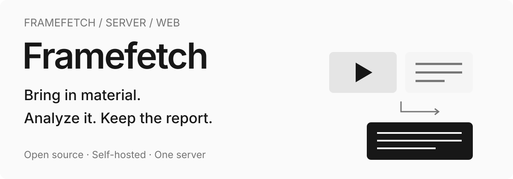
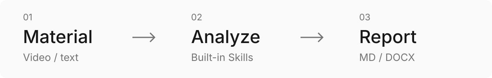
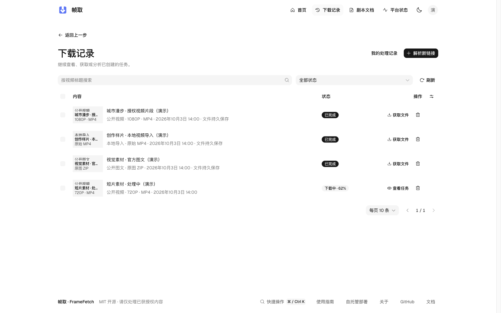
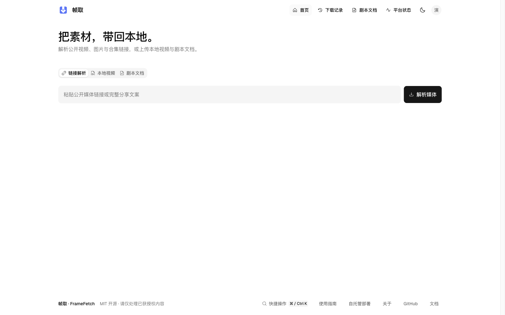
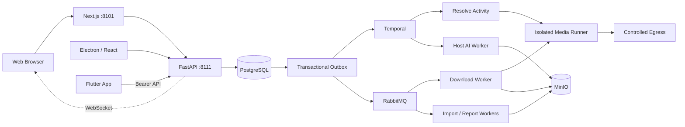

<p align="center">
  
</p>

#  FrameFetch Server / Web

**A self-hosted workstation for material acquisition and analysis.** Import authorized video and documents, invoke built-in Skills, inspect the evidence, and export Markdown / DOCX reports.

[](https://github.com/StephenQiu30/video-server/actions/workflows/ci.yml)
[](LICENSE)
[](https://github.com/StephenQiu30/video-server/releases)

[Quick start](#quick-start) · [Workflow](#from-material-to-report) · [Skills](#built-in-skills) · [Scope](#scope-and-deployment-requirements) · [Documentation](workspace/content/design/README.md) · [简体中文](README.md)


> Shared Web/desktop page demonstration from a released version. See the execution plan for the current Skill scope and real acceptance evidence.

## What is FrameFetch?

For creators, content researchers and developers who want to manage their own sources and reports. This repository provides **FastAPI APIs, a Next.js Web workspace and background processing**; [Desktop](https://github.com/StephenQiu30/video-electron) and [App](https://github.com/StephenQiu30/video-app) connect to the same server.

- **Bring in sources**: authorized media links, local MP4 and existing text documents. Availability follows each platform's actual capability.
- **Review evidence**: video observations refer to sampled frames and source times; text analysis refers to source units and quotations. Check model conclusions against the original.
- **Keep reports**: read and export Markdown / DOCX. Repeated exports reuse saved results without another model call.
- **Control your workstation**: choose infrastructure, storage and model services; share accounts, material and jobs across clients.

## Quick start

Use `docker-compose.yml` locally and `docker-compose-prod.yml` in production. Deploy the Server, then connect Web, Electron or mobile clients. Platform identity follows the Registry declarations through the ordinary Chrome extension.

### Requirements

- Docker Engine and Docker Compose
- Existing PostgreSQL, RabbitMQ, Redis, MinIO and Temporal services; reuse their addresses and credentials
- Strong random secrets and a public origin before any internet-facing deployment

### Automatic local start (macOS)

```bash
git clone https://github.com/StephenQiu30/video-server.git
cd video-server
test -f .env || cp .env.example .env

# Configure .env to reuse existing PostgreSQL, RabbitMQ, Redis, MinIO and Temporal

# Start: the migrate container applies the idempotent backend/sql/schema.sql first
docker compose up -d --build --wait --remove-orphans
```

Open the [Web workspace](http://localhost:8101), [Swagger UI](http://localhost:8111/docs) or [OpenAPI](http://localhost:8111/openapi.json). For an empty user table, first create the administrator as described below, then sign in.

All containerized background loops run in the single `worker` container. Its `RABBITMQ_WORKER_USER` / `RABBITMQ_WORKER_PASS` account needs restricted permissions for current business queues in `RABBITMQ_VHOST`; see [reliability design](workspace/content/design/12-可靠性与运行.md).

The business worker connects to the existing Temporal service through `TEMPORAL_HOST` / `TEMPORAL_PORT`, defaulting to `host.docker.internal:7233`. Host CLI and AI workers use `TEMPORAL_ADDRESS`, defaulting to `127.0.0.1:7233`. The worker initializes `TEMPORAL_NAMESPACE` (default `framefetch`) when needed; the existing service owns its storage and backups.

For an empty user table, create the first administrator on the deployment host. The command prompts for a password, refuses to run once any user exists, and does not expose a remote bootstrap endpoint:

```bash
uv run --project backend python -m app.workers.bootstrap_admin \
  --env-file .env --username your-admin --email you@example.com
```

<details>
<summary>Platform identity setup and upgrades</summary>

### Identity and upgrades

Platform identity uses `FrameFetch`, an MV3 extension loaded from the main checkout's `extension/`, and a per-user `cookie-source` LaunchAgent. From the main checkout's `backend/`, run:

```bash
uv run python -m app.workers.identity.cli install
uv run python -m app.workers.identity.cli check
```

In Chrome 120+, enable developer mode and load that unpacked extension into the single ordinary Profile you use for platform sign-in. Do not load it from a worktree. After updates, run `install` again and reload the extension. Generated pairing configuration and manifest are ignored by Git; pairing configuration is private to the current user but cannot protect against malicious processes running as that same user.

Only the Runner receives `COOKIE_SOURCE_TOKEN`; the extension pairing key is separate. Cookie requests use the exact host/port/path proxy exception, with no redirects or upstream Clash routing. Installation, permissions and operational details are in the [Chinese runtime instructions](README.md#平台身份与升级); the protocol and acceptance boundaries are in [platform identity design](workspace/content/design/15-平台身份.md).

Before upgrading, pause admissions, drain media operations and back up the business database. Apply the current schema.sql, then rebuild the API, worker, session-runner and frontend together. Production:

```bash
docker compose --env-file .env.prod -f docker-compose-prod.yml up -d --build --wait --remove-orphans
```

```bash
curl --fail http://127.0.0.1:8111/health/live
curl --fail http://127.0.0.1:8111/health/ready
curl --fail --head http://127.0.0.1:8101/
```

Set `ANALYSIS_ENABLED=false` in `.env` when you only need downloads and screenplay imports. See [reliability and operations](workspace/content/design/12-可靠性与运行.md) (Chinese) for startup, shutdown, existing infrastructure and recovery. After updating code, run `git pull --ff-only` and the same start command again: `docker compose restart` does not apply a new image or configuration.

</details>

<details>
<summary>Enable the host AI worker</summary>

### Optional AI worker

The AI worker runs on the host and is intentionally not part of the business Compose topology. The default route can reuse a signed-in Codex App Server; administrators may also configure supported model providers in the web application.

```bash
cd backend
uv sync --frozen --dev
uv run python -m app.workers.analysis.agent_cli doctor
uv run python -m app.workers.analysis.agent_cli install
uv run python -m app.workers.analysis.agent_cli status
```

When the business services use `.env.prod`, the host agent must read the same file:

```bash
uv run python -m app.workers.analysis.agent_cli doctor --env-file ../.env.prod
uv run python -m app.workers.analysis.agent_cli install --env-file ../.env.prod
```

Do not copy or mount Codex/Claude OAuth directories into containers. Before enabling an external model, complete a real analysis acceptance with authorized material and review the provider's terms and your organization's data policy.

</details>

## From material to report



1. **Bring it in**: paste one media URL or share text containing one URL for a video, gallery or bounded collection according to the platform's actual capabilities. You can also upload an MP4 or import one of five screenplay formats. Official-account articles provide source discovery only. Current discovered candidates expose no download formats; the UI directs you to official playback or authorized file import.
2. **Confirm**: inspect metadata, access decisions and actual formats. Choose video quality, container, codecs and audio, or check gallery/collection counts and confirm the ZIP download. Explicitly refresh expired results and reconfirm changed formats.
3. **Obtain**: download and import jobs run in the background with queue states, progress, cancellation, retry and history. Local video uses restricted multipart upload followed by Worker verification.
4. **Manage**: verified video artifacts provide details, previews and file delivery. Galleries and bounded collections deliver original-image/video ZIP files with `manifest.json` recording the title, media kind and item count. Screenplays retain originals and normalized scene text. All clients use the same server data.
5. **Analyze or organize**: choose a built-in Skill from existing video or document details and use the original language and prompt controls. Processing failure does not change acquisition success.
6. **Deliver**: read the report and inspect its sources and evidence, then export MD/DOCX. Export recovery reuses the saved result without another model call.

### Pages and daily management

The Web workspace includes inspection details, download history, personal activity records, video playback, screenplay reading, analysis/reports, provider status and account settings. `⌘K`/`Ctrl+K` opens quick actions. Light/dark themes, keyboard interactions and narrow-screen layouts support everyday use. WebSocket events update active jobs, with server resynchronization after reconnecting.

Administrators manage users, files, provider catalog entries and AI services, and read download/analysis statistics and operation logs. Material and reports persist; expiration of an access URL does not delete the stored file. Deletion and storage cleanup are explicit operations.

## Built-in Skills

This work preserves original pages, navigation and analysis forms. Skill selection, Chinese/English output, editable default prompts, reset and report actions remain. Improvements target invocation, Skill methods and output quality.

Film work prioritizes video review, breakdown and screenplay analysis. Article, WeChat and Xiaohongshu organization works on existing text while protecting facts, quotations, code and links. Reports connect findings to evidence, coverage and limitations and use the original MD/DOCX actions.

Original pages and invocation, six real model fixtures and MD/DOCX exports passed this round of acceptance. The iOS simulator App passed sign-in, original forms/readers, system file saving and share-sheet cancellation; the packaged macOS arm64 client passed native saving. Saved bytes match the reports. Platform and sample-quality boundaries are recorded in the [execution plan](workspace/content/plan/PLAN-内置Skill能力整合.md); product scope is defined in the [PRD](workspace/content/prd/PRD-内置Skill能力整合.md).

## One workstation, multiple clients

| Project                                                              | Role and features                                                                                                                                                                |
| -------------------------------------------------------------------- | -------------------------------------------------------------------------------------------------------------------------------------------------------------------------------- |
| **[video-server](https://github.com/StephenQiu30/video-server)**     | FastAPI + Next.js: browser workspace, unified API, media processing, AI, storage, reports and administration                                                                     |
| **[video-electron](https://github.com/StephenQiu30/video-electron)** | Electron client: bundled React pages reuse Web business source and connect to a self-hosted Server; native windows/menus, persistent per-server sessions and system save dialogs |
| **[video-app](https://github.com/StephenQiu30/video-app)**           | Flutter iOS/Android client: native file selection, controlled job polling, playback, report reading, saving and sharing through the same Server                                  |

Desktop and mobile are clients of the same workstation. The server and host AI Worker perform extraction, media processing and AI execution. Originals, normalized text and reports reside in the configured server storage; switching clients does not create another media pipeline or business database.

Electron reads pages and brand assets from its bundle and connects API/WebSocket requests to the configured Server. It needs no local Next.js process or separate database. The App uses native Flutter views and generated server contracts; it does not run an extractor or offline model on the phone.

## Scope and deployment requirements

FrameFetch is in public preview. This round of built-in Skill improvements retains original pages and has passed acceptance on the tested platforms. Results and boundaries are tracked in the [execution plan](workspace/content/plan/PLAN-内置Skill能力整合.md). CI covers deterministic engineering checks; actual model execution, native file delivery, physical devices and platform cold starts require their own evidence. Screenshots illustrate interfaces and do not establish that validation.

- Process authorized HTTP(S), non-DRM material. Registered integrations include YouTube, Bilibili, Douyin, TikTok, Xiaohongshu, Kuaishou and Weibo; actual links depend on content scope, identity, network and platform changes. WeChat Channels supports downloading official clear share files and requires a valid Yuanbao login in Chrome; no Yuanbao page needs to be open; official-account articles provide source discovery. See [parse engine verification status](workspace/content/design/14-解析引擎.md#13-验证状态) for exact platform status and complete-file evidence.
- Source and build workflows are self-hosted. The operator provides servers, infrastructure, storage, network and models. External models may incur charges and receive the text or frames needed for analysis.
- Current capabilities cover intake, management, built-in Skill analysis/document formatting, and reports. Method and output fixture results are recorded in the execution plan; mechanical wrapping or initial excerpts do not establish useful document organization. Model conclusions require review. Content writing, screenplay rewriting, card production, ASR/OCR, editing timelines and publishing are outside this scope.
- Successful material and reports persist; plan capacity, backups and explicit cleanup. See the [Security Policy](SECURITY.md) and parsing design. Replace placeholder configuration and check network, storage and models before exposing a deployment.

## Public previews and versions

The three public previews connect to the same Server:

| Project      | Current preview                                                                            | Distribution                                                        |
| ------------ | ------------------------------------------------------------------------------------------ | ------------------------------------------------------------------- |
| Server / Web | [v0.3.0-beta.2](https://github.com/StephenQiu30/video-server/releases/tag/v0.3.0-beta.2)   | Self-hosted source and Compose deployment                           |
| App          | [v0.2.0-beta.1](https://github.com/StephenQiu30/video-app/releases/tag/v0.2.0-beta.1)      | iOS/Android source; no attached APK, IPA or store package           |
| Desktop      | [v0.2.0-beta.1](https://github.com/StephenQiu30/video-electron/releases/tag/v0.2.0-beta.1) | macOS Apple Silicon DMG, Windows x64 installer and SHA-256 manifest |

All are Beta previews. Desktop installers are unsigned and the macOS build is not notarized; clean installation, upgrades and complete real-Server workflows require separate validation. Git tags identify release snapshots: embedded Server/API/Worker package versions remain `0.2.0`, App is `0.1.0+1`, and desktop packages are `0.2.0`. Use matching source and Server contracts when deploying; tag numbers alone do not establish compatibility.

This README describes the current main branch. For a fixed version, use its Release and tagged README for installation, upgrades and validation scope.

## Screenshots

**Job history.** View material, processing states and next actions, then return to details to continue.



**Material intake.** Start with a link, local video or existing document, then continue to processing results.



**Document reader.** Read existing text and invoke a supported built-in analysis or formatting Skill.


These shared Web/desktop pages were captured from the current production Electron Renderer on 2026-10-03, using the official logo, shared business components and theme without redrawing the interface. Job records, City Walk analysis and Midnight Visitor screenplay text are demo data illustrating features and report structure, with no real accounts or private material. For client interfaces and builds, see the [App README](https://github.com/StephenQiu30/video-app#readme) and [desktop README](https://github.com/StephenQiu30/video-electron#readme).

<details>
<summary>Use cases and technical architecture</summary>

## Use cases

| Your task                               | How FrameFetch helps                                                                                         |
| --------------------------------------- | ------------------------------------------------------------------------------------------------------------ |
| Study finished videos                   | Check candidate cuts, actual frames and source times; add your own visual and sound notes                    |
| Compare screenplays and videos          | Review candidate matches, continuity findings and uncovered ranges against fixed text and sampled frames     |
| Analyze stories and screenplays         | Review characters, causality, pacing and editorial suggestions against fixed text units and exact quotations |
| Organize articles and channel documents | Format existing text and structure while preserving code, quotations, links and viewpoints                   |
| Build a personal toolchain              | Extend providers, methods or clients through self-hosted storage, configurable models and OpenAPI            |

## Architecture

Web, Electron and Flutter share one FastAPI server. Clients handle input, interaction and result presentation; the server handles identity, business state, media/document processing, storage and reports, while the host AI Worker runs model analysis.



| Technologies                                                     | Role and user value                                                                                             |
| ---------------------------------------------------------------- | --------------------------------------------------------------------------------------------------------------- |
| Next.js, React, TypeScript, Tailwind CSS, Radix/shadcn           | Browser workspace, accessible controls, responsive pages and report reading; Electron reuses business pages     |
| Python, FastAPI, Pydantic, OpenAPI                               | Submit, query and cancel jobs, validate requests/results, and generate REST contracts and clients               |
| PostgreSQL, SQLAlchemy, Transactional Outbox                     | Store facts and execution intent in one transaction; recover through persistent state                           |
| Temporal, RabbitMQ                                               | Orchestrate inspection/Skills and execute downloads, imports, report publishing and live events outside HTTP    |
| yt-dlp, FFmpeg/ffprobe, Playwright, isolated Runner              | Adapt platform differences, observe/process media and verify complete files, separate from requests             |
| MinIO, restricted multipart uploads, short-lived authorized URLs | Store originals, video and reports, transfer large files and authorize retrieval                                |
| Codex App Server, Claude CLI, HTTP model adapters                | Reuse configured models or existing host login while keeping methods and output structure independent           |
| Flutter, Riverpod, Dio, media_kit                                | Native mobile input, job states, playback, reports and system sharing; secure storage holds refresh credentials |
| Electron, React, controlled native capabilities                  | Native desktop windows, controlled file operations and a shared Server connection                               |
| Redis, Docker Compose, separate host AI Worker                   | Rate limiting, temporary runtime state, service deployment/recovery and clear media/AI responsibility           |

Local Compose reuses existing PostgreSQL, RabbitMQ, Redis, MinIO and Temporal services; the AI Worker runs separately on the host. See [PROJECT.md](PROJECT.md) for structure/contracts and the [documentation index](workspace/content/design/README.md) for maintained design (Chinese).

</details>

## Development

The frontend requires Node.js `>=24.15 <25` and pnpm 12. The backend requires Python `>=3.12 <3.13` and [uv](https://docs.astral.sh/uv/).

```bash
cd backend
uv sync --frozen --dev
uv run --frozen ruff check app tests
uv run --frozen ruff format --check app tests
uv run --frozen mypy --strict app
uv run --frozen pytest -q

cd ../frontend
pnpm install --frozen-lockfile
pnpm format:check
pnpm lint
pnpm test
pnpm build
```

## Roadmap

Platform support and validation limits are described in [the parsing design](workspace/content/design/14-解析引擎.md#13-验证状态); other unfinished work is listed in [BACKLOG](BACKLOG.md) (Chinese); built-in Skills are defined in the [PRD](workspace/content/prd/PRD-内置Skill能力整合.md), with work packages and acceptance checklists in the [execution plan](workspace/content/plan/PLAN-内置Skill能力整合.md). Implementation and verification evidence are recorded in that plan. Discuss priorities in [Issues](https://github.com/StephenQiu30/video-server/issues) — tasks labeled `good first issue` or `help wanted` are a good place to start.

## Contributing

Contributions to provider adapters, reliability, web and mobile UX, AI reports, tests and documentation are welcome. Before opening a pull request, read the [Contributing Guide](CONTRIBUTING.md), [Code of Conduct](CODE_OF_CONDUCT.md), [repository rules](AGENTS.md), [documentation index](workspace/content/design/README.md), and [Security Policy](SECURITY.md).

Keep implementation, OpenAPI contracts, tests, operations documentation and acceptance evidence aligned. Prefer small, independently verifiable changes.

If FrameFetch helps your creative work, research or self-hosting setup, please give it a **Star** and watch [Releases](https://github.com/StephenQiu30/video-server/releases) for updates — it is the best way to keep the project maintained.

## Citation

To cite FrameFetch in papers, reports or course material, use “Cite this repository” in the GitHub sidebar or the root [`CITATION.cff`](CITATION.cff). See [Releases](https://github.com/StephenQiu30/video-server/releases) for version history.

## License

FrameFetch is available under the [MIT License](LICENSE). The software license does not grant rights to download, copy or analyze third-party media.

For public-site indexing and generative-search visibility, see [Web experience and SEO](workspace/content/design/11-Web体验.md) (Chinese). Private self-hosted instances default to noindex; intentionally public sites must opt in with `SITE_INDEXABLE=true` and a stable `SITE_URL` at build and runtime.
