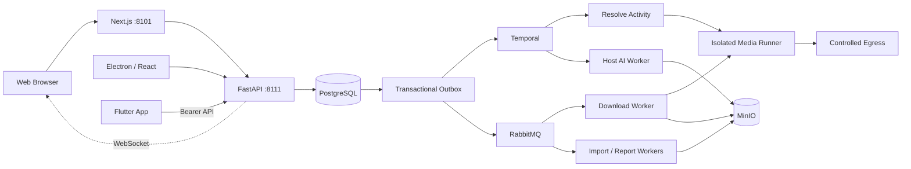

# FrameFetch

Content creation Skills for film, articles, WeChat Official Account content and Xiaohongshu cards are being redesigned from scratch in the [new PRD](docs/prd/PRD-内容创作Skill体系.md) and [execution plan](docs/plan/PLAN-内容创作Skill体系.md) (Chinese). The existing method and result catalogs below remain pending removal; they are not the new target. The new film, writing, editing, WeChat handoff and Xiaohongshu card workflows have not been implemented by this documentation change.

**An open-source, self-hosted video and screenplay workstation.** Bring in material, understand it, and produce analysis results you can export.

[](https://github.com/StephenQiu30/video-server/actions/workflows/ci.yml)
[](LICENSE)
[](https://github.com/StephenQiu30/video-server/releases)

[Overview](#what-is-framefetch) · [Workflow](#from-material-to-report) · [Video methods](#12-video-analysis-methods) · [Screenplay methods](#8-screenplay-analysis-methods) · [Clients](#one-workstation-multiple-clients) · [Quick start](#quick-start) · [Documentation](docs/design/README.md) · [简体中文](README.md)


> Shared Web/desktop pages captured from the current Electron Renderer. Records and analysis use demo data.

## What is FrameFetch?

FrameFetch brings media acquisition, video review, screenplay coverage and report preparation into one personal workstation for creators, content researchers and developers. Paste an authorized media link to obtain a single video, image gallery or bounded video collection according to the platform's actual capabilities, or import your own MP4 footage or screenplay. Video and screenplay inputs can then use a method, output language and focus to produce structured results with time or scene references and Markdown/DOCX exports. Galleries and video collections are delivered as ZIP files with an embedded manifest.

This repository provides the **FastAPI server, Next.js Web application and background processing components**. The [Electron desktop client](https://github.com/StephenQiu30/video-electron) and [Flutter App](https://github.com/StephenQiu30/video-app) connect to the same server and share accounts, material, jobs and reports. The operator controls the infrastructure, storage and model configuration.

### Five core features

- **Complete material intake**: obtain single videos, image galleries and bounded video collections according to the platform's actual capabilities. Original images or collection videos are delivered as ZIP files containing `manifest.json`; local MP4 files and DOCX, text-based PDF, TXT, Markdown and Fountain screenplays enter the same workspace.
- **Evidence-based review**: technical metadata, interval overviews and exact frames from complete video artifacts support consecutive shots, scenes, highlights and visual assets. Screenplay findings refer to normalized scenes for checking against the source.
- **Methods for real work**: 12 video methods cover breakdowns, narrative, editing, quality review and content preparation; 8 screenplay methods cover story, characters, dialogue, structure, continuity and Chinese/English rewriting.
- **Useful deliverables**: five structured result types and Markdown/DOCX exports support further editing in external tools and handoff. Article drafts, packaging copy and screenplay rewrites remain editable candidates for human review.
- **Shared clients and self-hosting**: browser, native desktop and mobile clients use one backend, persistent background jobs and centrally managed material and reports. The operator configures model services and maintains the deployment.

## Use cases

| Your task | How FrameFetch helps |
| --- | --- |
| Study or review finished videos | Director breakdowns, storyboard tables, narrative and editing-rhythm review connect production choices to specific time ranges |
| Check your own footage | Continuity/finished-video QA and opening-hook review produce findings you can verify and revise |
| Organize material and publication copy | Extract scenes, highlights and assets; reorganize video into an article draft or title, cover-text and publication-copy candidates |
| Review and revise screenplays | Keep originals and normalized text, then review story, characters, scenes, dialogue, structure and continuity |
| Build a personal toolchain | Extend providers, methods or clients through self-hosted storage, configurable models and OpenAPI |

## From material to report

1. **Bring it in**: paste one media URL or share text containing one URL for a video, gallery or bounded collection according to the platform's actual capabilities. You can also upload an MP4 or import one of five screenplay formats. Official-account articles provide source discovery only. Current discovered candidates expose no download formats; the UI directs you to official playback or authorized file import.
2. **Confirm**: inspect metadata, access decisions and actual formats. Choose video quality, container, codecs and audio, or check gallery/collection counts and confirm the ZIP download. Explicitly refresh expired results and reconfirm changed formats.
3. **Obtain**: download and import jobs run in the background with queue states, progress, cancellation, retry and history. Local video uses restricted multipart upload followed by Worker verification.
4. **Manage**: verified video artifacts provide details, previews and file delivery. Galleries and bounded collections deliver original-image/video ZIP files with `manifest.json` recording the title, media kind and item count. Screenplays retain originals and normalized scene text. All clients use the same server data.
5. **Analyze**: choose a Skill, Chinese or English output, and a focus for a video or screenplay. These inputs use their own tools, methods and result structures; analysis status is separate from acquisition status.
6. **Deliver**: review findings alongside time evidence or screenplay scenes, then export Markdown/DOCX. Report content and export status are separate, so export recovery reuses the existing analysis.

### Pages and daily management

The Web workspace includes inspection details, download history, personal activity records, video playback, screenplay reading, analysis/reports, provider status and account settings. `⌘K`/`Ctrl+K` opens quick actions. Light/dark themes, keyboard interactions and narrow-screen layouts support everyday use. WebSocket events update active jobs, with server resynchronization after reconnecting.

Administrators manage users, files, provider catalog entries and AI services, and read download/analysis statistics and operation logs. Material and reports persist; expiration of an access URL does not delete the stored file. Deletion and storage cleanup are explicit operations.

## How AI understands the material

**Video analysis starts with the complete media artifact.** FFmpeg/ffprobe reads technical metadata. Restricted CLI observation tools provide a whole-video or interval overview and exact frames; API model routes receive bounded, time-ordered JPEG evidence. Methods distinguish observed facts, interpretation and advice, using real edit boundaries and continuous visual beats to organize shots.

Results are validated against the selected contract before storage, including structure, output language and evidence fields. Visual video analysis additionally checks the complete duration, consecutive shot timeline and shot references; articles and general reports use time-range evidence, while screenplay results refer to normalized scenes. Structural validation does not replace human review. Reports retain scope and limitations for checking against the video or source text; long screenplays use bounded chunks and synthesis.

**Skills, result structures and engines have separate roles.** A Skill defines the method, a result contract defines the deliverable, and an engine calls the model. Each job stores an immutable instruction snapshot; completed steps can be reused after interruption, while calls with unknown outcomes are not automatically repeated. An AI failure does not change successfully obtained material.

Administrators can configure **Codex App Server, Claude CLI, DeepSeek, OpenRouter or OpenAI Chat Completions-compatible services**. Users choose the method, language and focus without configuring low-level provider parameters. See [AI analysis](docs/design/10-AI分析.md) and [Content Creation Skill PRD](docs/prd/PRD-内容创作Skill体系.md) (Chinese).

## 12 video analysis methods

| Method | Main use |
| --- | --- |
| Director breakdown | Review staging, framing, shot motivation and editing relationships, with production advice |
| Comprehensive analysis | Connect shot evidence, content segments, highlights, assets and priority revisions |
| Storyboard tables | Organize edit boundaries, start/end states, action, framing, lighting and continuity |
| Scene extraction | Group segments by space, events, narrative tasks and visual rules |
| Narrative structure review | Check progression, turns, fulfilled promises and causal clarity |
| Editing rhythm review | Review dwell time, information density, cut motivation and action connections |
| Highlights | Select candidate clips by visual impact, information turns, emotional changes and editability |
| Continuity and finished-video QA | Check subject state, screen direction, action, on-screen text and visible technical issues |
| Asset catalog | Group people, locations, objects, products, logos and on-screen text with appearance references |
| Article draft | Reorganize video into a title, lead, sections and closing for further editorial work |
| Short-video packaging | Produce title, cover-text, opening-hook and publication-copy candidates grounded in the material |
| Opening-hook review | Check attention anchors, promises and body connections in the first 3, 5 and 15 seconds |

## 8 screenplay analysis methods

| Method | Main use |
| --- | --- |
| Story coverage | Review story mechanisms, major issues and effective choices |
| Short-drama coverage | Review promises, character choices, local payoff and repeated mechanisms |
| Character and conflict review | Check goals, obstacles, tactics, choices and character change |
| Scene review | Check scene goals, beats, state changes and neighboring scenes |
| Dialogue review | Check intention, verbal tactics, character voice and information release |
| Structure review | Check overall progression, turns and rhythm |
| Continuity review | Check character knowledge, object states, chronology, space and causality across scenes |
| Chinese/English rewriting | Produce cross-language or same-language revision candidates while preserving scenes, characters and terminology |

## Five result types and two export formats

| Result type | Contents and use |
| --- | --- |
| Visual video analysis | Main findings, scenes, shot evidence, highlights, assets and revision advice for breakdowns and video review |
| Video article | Title, lead, sections, key points and closing, with editorial evidence and limitations |
| General structured report | Summary, sections, candidate items and time evidence for packaging and focused review |
| Screenplay analysis | Coverage findings, story overview, structure, characters, dialogue, scene appendix and revision advice |
| Screenplay rewrite | Target-language candidates and glossary for author review and further revision |

**Markdown** fits notes, knowledge bases and version control; **DOCX** fits Word editing, comments and handoff. Both exports come from the same structured result without another model call.

## One workstation, multiple clients

| Project | Role and features |
| --- | --- |
| **[video-server](https://github.com/StephenQiu30/video-server)** | FastAPI + Next.js: browser workspace, unified API, media processing, AI, storage, reports and administration |
| **[video-electron](https://github.com/StephenQiu30/video-electron)** | Electron client: bundled React pages reuse Web business source and connect to a self-hosted Server; native windows/menus, persistent per-server sessions and system save dialogs |
| **[video-app](https://github.com/StephenQiu30/video-app)** | Flutter iOS/Android client: native file selection, controlled job polling, playback, report reading, saving and sharing through the same Server |

Desktop and mobile are clients of the same workstation. The server and host AI Worker perform extraction, media processing and AI execution. Originals, normalized text and reports reside in the configured server storage; switching clients does not create another media pipeline or business database.

Electron reads pages and brand assets from its bundle and connects API/WebSocket requests to the configured Server. It needs no local Next.js process or separate database. The App uses native Flutter views and generated server contracts; it does not run an extractor or offline model on the phone.

## Public previews and versions

The three public previews connect to the same Server:

| Project | Current preview | Distribution |
| --- | --- | --- |
| Server / Web | [v0.3.0-beta.2](https://github.com/StephenQiu30/video-server/releases/tag/v0.3.0-beta.2) | Self-hosted source and Compose deployment |
| App | [v0.2.0-beta.1](https://github.com/StephenQiu30/video-app/releases/tag/v0.2.0-beta.1) | iOS/Android source; no attached APK, IPA or store package |
| Desktop | [v0.2.0-beta.1](https://github.com/StephenQiu30/video-electron/releases/tag/v0.2.0-beta.1) | macOS Apple Silicon DMG, Windows x64 installer and SHA-256 manifest |

All are Beta previews. Desktop installers are unsigned and the macOS build is not notarized; clean installation, upgrades and complete real-Server workflows require separate validation. Git tags identify release snapshots: embedded Server/API/Worker package versions remain `0.2.0`, App is `0.1.0+1`, and desktop packages are `0.2.0`. Use matching source and Server contracts when deploying; tag numbers alone do not establish compatibility.

This README describes the current main branch. For a fixed version, use its Release and tagged README for installation, upgrades and validation scope.

## Screenshots

**Job history.** View material, processing states and next actions, then return to details to continue.


**Video report.** Read findings, shots and time evidence by section, review the source, and export a report.


**Screenplay workspace.** Read normalized scenes and start focused coverage or rewriting.


These shared Web/desktop pages were captured from the current production Electron Renderer on 2026-10-03, using the official logo, shared business components and theme without redrawing the interface. Job records, City Walk analysis and Midnight Visitor screenplay text are demo data illustrating features and report structure, with no real accounts or private material. For client interfaces and builds, see the [App README](https://github.com/StephenQiu30/video-app#readme) and [desktop README](https://github.com/StephenQiu30/video-electron#readme).

## Quick start

Use `docker-compose.yml` locally and `docker-compose-prod.yml` in production. Deploy the Server, then connect Web, Electron or mobile clients. Platform identity follows the Registry declarations through the ordinary Chrome extension.

### Requirements

- Docker Engine and Docker Compose
- Existing PostgreSQL, RabbitMQ, Redis, MinIO and Temporal services; reuse their addresses and credentials
- Strong random secrets and a public origin before any internet-facing deployment

### Automatic local start (macOS)

```bash
git clone https://github.com/StephenQiu30/video-server.git
cd video-server
test -f .env || cp .env.example .env

# Configure .env to reuse existing PostgreSQL, RabbitMQ, Redis, MinIO and Temporal

# Start: the migrate container applies the idempotent backend/sql/schema.sql first
docker compose up -d --build --wait --remove-orphans
```

Open the [Web workspace](http://localhost:8101), [Swagger UI](http://localhost:8111/docs) or [OpenAPI](http://localhost:8111/openapi.json). For an empty user table, first create the administrator as described below, then sign in.

All containerized background loops run in the single `worker` container. Its `RABBITMQ_WORKER_USER` / `RABBITMQ_WORKER_PASS` account needs restricted permissions for current business queues in `RABBITMQ_VHOST`; see [design 13](docs/design/13-可靠性与运行.md).

The business worker connects to the existing Temporal service through `TEMPORAL_HOST` / `TEMPORAL_PORT`, defaulting to `host.docker.internal:7233`. Host CLI and AI workers use `TEMPORAL_ADDRESS`, defaulting to `127.0.0.1:7233`. The worker initializes `TEMPORAL_NAMESPACE` (default `framefetch`) when needed; the existing service owns its storage and backups.

For an empty user table, create the first administrator on the deployment host. The command prompts for a password, refuses to run once any user exists, and does not expose a remote bootstrap endpoint:

```bash
uv run --project backend python -m app.workers.bootstrap_admin \
  --env-file .env --username your-admin --email you@example.com
```

<details>
<summary>Platform identity setup and upgrades</summary>

### Identity and upgrades

Platform identity uses `framefetch-identity`, an MV3 extension loaded from the main checkout's `browser-extension/`, and a per-user `cookie-source` LaunchAgent. From the main checkout's `backend/`, run:

```bash
uv run python -m app.workers.identity.cli install
uv run python -m app.workers.identity.cli check
```

In Chrome 120+, enable developer mode and load that unpacked extension into the single ordinary Profile you use for platform sign-in. Do not load it from a worktree. After updates, run `install` again and reload the extension. Generated pairing configuration and manifest are ignored by Git; pairing configuration is private to the current user but cannot protect against malicious processes running as that same user.

Only the Runner receives `COOKIE_SOURCE_TOKEN`; the extension pairing key is separate. Cookie requests use the exact host/port/path proxy exception, with no redirects or upstream Clash routing. Installation, permissions and operational details are in the [Chinese runtime instructions](README.md#平台身份与升级); the protocol and acceptance boundaries are in [design 17 section 3.4](docs/design/17-解析引擎重建.md#34-身份层).

Before upgrading, pause admissions, drain media operations and back up the business database. Apply the current schema.sql, then rebuild the API, worker, session-runner and frontend together. Production:

```bash
docker compose --env-file .env.prod -f docker-compose-prod.yml up -d --build --wait --remove-orphans
```

```bash
curl --fail http://127.0.0.1:8111/health/live
curl --fail http://127.0.0.1:8111/health/ready
curl --fail --head http://127.0.0.1:8101/
```

Set `ANALYSIS_ENABLED=false` in `.env` when you only need downloads and screenplay imports. See [reliability and operations](docs/design/13-可靠性与运行.md) (Chinese) for startup, shutdown, existing infrastructure and recovery. After updating code, run `git pull --ff-only` and the same start command again: `docker compose restart` does not apply a new image or configuration.

</details>

### Optional AI worker

The AI worker runs on the host and is intentionally not part of the business Compose topology. The default route can reuse a signed-in Codex App Server; administrators may also configure supported model providers in the web application.

```bash
cd backend
uv sync --frozen --dev
uv run python -m app.workers.analysis.agent_cli doctor
uv run python -m app.workers.analysis.agent_cli install
uv run python -m app.workers.analysis.agent_cli status
```

When the business services use `.env.prod`, the host agent must read the same file:

```bash
uv run python -m app.workers.analysis.agent_cli doctor --env-file ../.env.prod
uv run python -m app.workers.analysis.agent_cli install --env-file ../.env.prod
```

Do not copy or mount Codex/Claude OAuth directories into containers. Before enabling an external model, complete a real analysis acceptance with authorized material and review the provider's terms and your organization's data policy.

## Architecture

Web, Electron and Flutter share one FastAPI server. Clients handle input, interaction and result presentation; the server handles identity, business state, media/document processing, storage and reports, while the host AI Worker runs model analysis.



| Technologies | Role and user value |
| --- | --- |
| Next.js, React, TypeScript, Tailwind CSS, Radix/shadcn | Browser workspace, accessible controls, responsive pages and report reading; Electron reuses business pages |
| Python, FastAPI, Pydantic, OpenAPI | Submit, query and cancel jobs, validate requests/results, and generate REST contracts and clients |
| PostgreSQL, SQLAlchemy, Transactional Outbox | Store facts and execution intent in one transaction; recover through persistent state |
| Temporal, RabbitMQ | Orchestrate inspection/Skills and execute downloads, imports, report publishing and live events outside HTTP |
| yt-dlp, FFmpeg/ffprobe, Playwright, isolated Runner | Adapt platform differences, observe/process media and verify complete files, separate from requests |
| MinIO, restricted multipart uploads, short-lived authorized URLs | Store originals, video and reports, transfer large files and authorize retrieval |
| Codex App Server, Claude CLI, HTTP model adapters | Reuse configured models or existing host login while keeping methods and output structure independent |
| Flutter, Riverpod, Dio, media_kit | Native mobile input, job states, playback, reports and system sharing; secure storage holds refresh credentials |
| Electron, React, controlled native capabilities | Native desktop windows, controlled file operations and a shared Server connection |
| Redis, Docker Compose, separate host AI Worker | Rate limiting, temporary runtime state, service deployment/recovery and clear media/AI responsibility |

Local Compose reuses existing PostgreSQL, RabbitMQ, Redis, MinIO and Temporal services; the AI Worker runs separately on the host. See [PROJECT.md](PROJECT.md) for structure/contracts and the [documentation index](docs/design/README.md) for maintained design (Chinese).

## Scope and deployment requirements

FrameFetch is in public preview. The 12 video and 8 screenplay methods form the built-in catalog; they do not establish real-model acceptance for every method. Provider registration and successful inspection do not establish complete-file delivery. CI covers deterministic engineering checks, while full cold-start acceptance remains incomplete. Physical-device/account workflows and complete desktop workflows against a real Server require each client's own acceptance evidence. Screenshots illustrate interfaces and result structures, without replacing that validation.

- Process authorized HTTP(S), non-DRM material. Registered integrations include YouTube, Bilibili, Douyin, TikTok, Xiaohongshu, Kuaishou and Weibo; actual links depend on content scope, identity, network and platform changes. WeChat Channels supports downloading official clear share files and requires an open, logged-in Yuanbao page; official-account articles provide source discovery. See [design 17](docs/design/17-解析引擎重建.md#8-平台能力与验证边界) for exact platform status and complete-file evidence.
- Source and build workflows are self-hosted. The operator provides servers, infrastructure, storage, network and models. External models may incur charges and receive the text or frames needed for analysis.
- Current capabilities cover intake, management, analysis and reports. Articles, packaging copy and screenplay rewrites are candidates for human review. ASR/OCR are not supported by the current implementation; Mandarin transcription is a proposed target in the new PRD. DRM decryption, live recording, unbounded playlists, collaborative editing and automatic platform publishing remain outside scope.
- Successful material and reports persist; plan capacity, backups and explicit cleanup. See the [Security Policy](SECURITY.md) and parsing design. Replace placeholder configuration and check network, storage and models before exposing a deployment.

## Development

The frontend requires Node.js `>=24.15 <25` and pnpm 12. The backend requires Python `>=3.12 <3.13` and [uv](https://docs.astral.sh/uv/).

```bash
cd backend
uv sync --frozen --dev
uv run --frozen ruff check app tests
uv run --frozen ruff format --check app tests
uv run --frozen mypy --strict app
uv run --frozen pytest -q

cd ../frontend
pnpm install --frozen-lockfile
pnpm format:check
pnpm lint
pnpm test
pnpm build
```

## Roadmap

Platform support and validation limits are described in [the parsing design](docs/design/17-解析引擎重建.md#8-平台能力与验证边界); other unfinished work is listed in [BACKLOG](BACKLOG.md) (Chinese); the proposed content creation Skill redesign is defined in the [new PRD](docs/prd/PRD-内容创作Skill体系.md), with work packages and acceptance checklists in the [execution plan](docs/plan/PLAN-内容创作Skill体系.md), and has not been implemented. Discuss priorities in [Issues](https://github.com/StephenQiu30/video-server/issues) — tasks labeled `good first issue` or `help wanted` are a good place to start.

## Contributing

Contributions to provider adapters, reliability, web and mobile UX, AI reports, tests and documentation are welcome. Before opening a pull request, read the [Contributing Guide](CONTRIBUTING.md), [Code of Conduct](CODE_OF_CONDUCT.md), [repository rules](AGENTS.md), [documentation index](docs/design/README.md), and [Security Policy](SECURITY.md).

Keep implementation, OpenAPI contracts, tests, operations documentation and acceptance evidence aligned. Prefer small, independently verifiable changes.

If FrameFetch helps your creative work, research or self-hosting setup, please give it a **Star** and watch [Releases](https://github.com/StephenQiu30/video-server/releases) for updates — it is the best way to keep the project maintained.

## Citation

To cite FrameFetch in papers, reports or course material, use “Cite this repository” in the GitHub sidebar or the root [`CITATION.cff`](CITATION.cff). See [Releases](https://github.com/StephenQiu30/video-server/releases) for version history.

## License

FrameFetch is available under the [MIT License](LICENSE). The software license does not grant rights to download, copy or analyze third-party media.

For public-site indexing and generative-search visibility, see [Web experience and SEO](docs/design/12-Web体验.md) (Chinese). Private self-hosted instances default to noindex; intentionally public sites must opt in with `SITE_INDEXABLE=true` and a stable `SITE_URL` at build and runtime.
