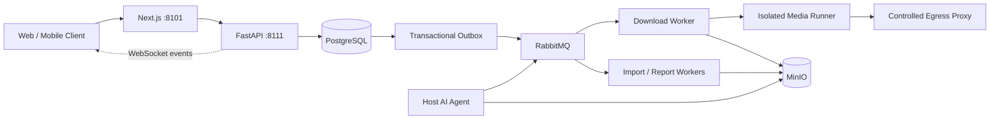

<div align="center">
  
  <h1>帧取 · FrameFetch</h1>
  <p><strong>开源、自托管的公开视频下载、剧本文档处理与 AI 分析工作流</strong></p>
  <p><em>Open-source, self-hosted media download, screenplay processing and AI video analysis workflow.</em></p>
  <p>
    <a href="https://github.com/StephenQiu30/video-server/actions/workflows/ci.yml"></a>
    <a href="https://github.com/StephenQiu30/video-server/releases"></a>
    <a href="https://github.com/StephenQiu30/video-server/stargazers"></a>
    <a href="LICENSE"></a>
    
    
    
  </p>
  <p>
    <a href="#最新动态">最新动态</a> ·
    <a href="#快速开始">快速开始</a> ·
    <a href="#适用场景">适用场景</a> ·
    <a href="#产品能力">产品能力</a> ·
    <a href="#常见问题">常见问题</a> ·
    <a href="#界面预览">界面预览</a> ·
    <a href="#架构">架构</a> ·
    <a href="README.en.md">English</a>
  </p>
</div>


> 截图由 `agent-browser` 在本地预览环境中采集；涉及媒体的界面使用仓库自带视觉回归素材，所有图片均不包含真实用户数据、凭据或第三方图片热链。

## 帧取是什么

帧取（FrameFetch）是一个面向创作者、内容研究者和开发者的开源媒体工作流。它把公开媒体链接、本地视频或剧本文档转换为可观察、可恢复的异步任务：解析来源、选择真实格式、隔离下载与校验、保存制品，并按需生成结构化 AI 分析报告。

项目不是规避平台限制的下载脚本。默认能力只处理用户有权使用、公开、免费且非 DRM 的 HTTP(S) 内容；受保护、会员、私密、购买或地域限制内容不属于项目目标。

## 最新动态

**未发布 · 登录态改为现读本机 Chrome**

- 移除 `./start`、会话数据库副本、`session-browser` 与保活状态机：每次解析时从你自己的 Chrome 现读登录态。
- 新增 `migrate` 容器应用数据库结构，冷启动只需 `docker compose up -d --wait`。
- TikTok 改走 yt-dlp 官方维护的提取器；金丝雀默认探测仓库自带的公开样例。

**[v0.2.0](https://github.com/StephenQiu30/video-server/releases/tag/v0.2.0) · 容器自持平台会话**

- 平台会话由 `session-broker` 与容器会话浏览器自持：冷启动恢复、保活、失效检测与自动轮换，普通用户只需粘贴链接。
- 在线解析统一走站点会话路线，移除匿名与访客执行路线，结果以真实文件验收为准。
- Web 体验：头像上传与个人资料、统一的解析结果双栏卡片、可恢复错误提示与 shadcn 组件整理。

从 v0.1.0 升级前请先阅读 [Release 说明](https://github.com/StephenQiu30/video-server/releases/tag/v0.2.0)中的不兼容变更。

## 适用场景

- **短视频与影视拆解**：导入自己的成片或已获授权的公开视频，生成分镜、场景时间轴与关键帧证据，复盘镜头节奏与叙事结构。
- **剧本与文案研究**：导入 Markdown、Fountain、TXT、PDF、DOCX 剧本文档，在同一工作区阅读、分析或改写，并导出 Markdown / DOCX 报告。
- **团队素材库**：在自己的服务器上集中保存经过格式、时长与 SHA-256 校验的媒体文件，按用户与角色管理任务和存储。
- **自托管视频下载器**：用 Web、API 或 iOS / Android 客户端提交授权的公开媒体链接，异步下载并实时查看进度，不依赖任何官方托管服务。
- **二次开发**：以 OpenAPI 为唯一契约，在 FastAPI、Next.js 与 Flutter 之上扩展新的 Provider、分析能力或客户端。

**English summary:** FrameFetch is an open-source, self-hosted video downloader and media workflow for authorized public content. It combines FastAPI, Next.js, PostgreSQL, RabbitMQ, MinIO, yt-dlp/FFmpeg adapters, screenplay ingestion and optional AI video analysis. See the [English README](README.en.md) for the complete overview.

## 视频解析与 AI 分析如何配合

1. 检查已获授权的公开媒体链接，或导入自己的本地视频、剧本文档。
2. 确认来源和格式，跟踪处理任务；媒体制品与 AI 分析分别记录状态。
3. 按需执行视频分镜、场景或剧本文档分析，结合时间轴与关键帧证据复核结果。
4. 导出 Markdown / DOCX 报告，用于内容研究、创作整理与团队审阅。

Web 实例提供公开页面：`/guide/` 使用指南、`/self-hosting/` 自托管部署指南、`/about/` 项目定位与边界，以及面向生成式搜索的 `/llms.txt`；完整实现与配置见下方能力表和[设计文档索引](docs/design/README.md)。模型可用性与输出内容取决于已配置的分析能力和 AI 服务。

### 常见问题

**帧取和 yt-dlp、FFmpeg 有什么关系？** yt-dlp 与 FFmpeg 是媒体适配和处理链路中的工具。FrameFetch 在其上提供 Web / API、用户与任务管理、隔离 Worker、制品存储、文档处理和可选 AI 分析，不保证所有提取器支持的平台在当前部署中都可用。

**开源免费是否包含模型与服务器费用？** MIT 许可证开放源代码；服务器、存储、流量和外部模型可能产生费用，不包含免费托管或模型额度。

**自托管是否代表所有数据仅在本地？** 数据保存在部署者配置的基础设施中；使用外部 AI Provider 时，分析所需内容会发送到该服务。启用前请确认素材授权与服务的数据处理约定。

**Web 和手机端在哪个仓库？** 本仓库维护 API、Next.js Web 和 Worker；[video-app](https://github.com/StephenQiu30/video-app) 是连接本服务的 Flutter iOS / Android 客户端，不在手机端运行离线 AI。

## 产品能力

| 能力 | 当前实现 |
| --- | --- |
| 公开媒体解析 | 从公开链接或单链接分享文案中识别来源、媒体信息和真实可用格式 |
| 可靠异步下载 | API → Transactional Outbox → RabbitMQ → Download Worker → 隔离 Media Runner |
| 制品校验与存储 | 通过重新解析、语义格式校验、FFmpeg/ffprobe、大小、时长和 SHA-256 校验后写入 MinIO |
| 实时任务状态 | WebSocket 增量事件、版本检查、断线重连与 resync；实时连接不作为任务事实源 |
| 剧本文档工作流 | 导入 Markdown、Fountain、TXT、PDF、DOCX，提供阅读、目录、分页和分析入口 |
| 可选 AI 分析 | 宿主机 Codex Agent 或管理员配置的模型 Provider；报告可导出 Markdown/DOCX |
| 运维与管理 | 用户与角色、Provider 状态、下载分析、持久文件分页和显式清理 |
| 原生移动端 | 独立的 [FrameFetch Flutter iOS/Android 客户端](https://github.com/StephenQiu30/video-app) |

### 为什么采用工作流架构

- **可恢复**：PostgreSQL 保存任务事实，Transactional Outbox 保证数据库状态与消息意图一致。
- **可隔离**：下载、媒体命令和 AI 长任务不在 HTTP 请求进程中执行；Runner 经过受控出口代理。
- **可验证**：Provider 返回值不会直接成为最终制品，Worker 会重新解析并验证媒体身份、格式和文件完整性。
- **可扩展**：Provider、Runner、应用用例、OpenAPI 客户端和前端 feature 组件保持清晰边界。
- **可自托管**：Docker Compose 只管理业务服务并复用已有基础环境，不依赖官方托管服务。

## 界面预览


<p align="center"><strong>登录后的媒体解析与真实格式选择工作区</strong></p>

<table>
  <tr>
    <td width="50%"></td>
    <td width="50%"></td>
  </tr>
  <tr>
    <td align="center"><strong>Provider 能力与验证状态</strong></td>
    <td align="center"><strong>账户登录与安全会话</strong></td>
  </tr>
</table>

主要 Web 路由包括媒体解析与下载、任务历史与详情、剧本文档阅读与分析、Provider 状态、账户设置，以及管理员用户、文件、分析和 AI Provider 管理。实际可用平台和状态以部署实例的 `/providers` 页面与 canary 结果为准。

## 快速开始

本机开发使用 `docker-compose.yml`，生产使用 `docker-compose-prod.yml`。固定公开平台走原生公开接口，其余平台使用你本机 Chrome 的登录态；Chrome 未登录时明确提示登录，不自动切换路线。提取器存在、Cookie 存在与服务健康均不代表媒体可下载，必须以真实文件结果验收。

### 前置条件

- Docker Engine 与 Docker Compose
- macOS 自动接入入口需要 uv、本机 Chrome 中已有的平台登录态及一次系统读取授权
- 本机已运行 PostgreSQL、RabbitMQ、Redis 和 MinIO，已有配置直接复用
- 用于生产部署时，需要自行提供强随机密钥和公开访问地址

### 本机启动（macOS，单人自用）

```bash
git clone https://github.com/StephenQiu30/video-server.git
cd video-server
test -f .env || cp .env.example .env

# 确认 .env 连接本机已运行的 PostgreSQL、RabbitMQ、Redis 与 MinIO

# 一次性：安装 Chrome 登录态服务（用户登录后自启、崩溃自动重启）
uv run --project backend python -m app.workers.session.chrome_agent install --env-file .env

# 启动：migrate 容器先应用幂等的 backend/sql/schema.sql，其余服务随后启动
docker compose up -d --build --wait
```

agent 安装后会执行来源检查；未登录站点可能让检查返回非零，这不等于系统服务安装失败。公开平台不依赖 Chrome 登录态；需要登录的平台按检查结果完成授权与登录。

全新空库还没有登录账号时，在部署机终端执行一次首管理员初始化（需使用可连接 PostgreSQL 的 `DATABASE_URL`，密码交互输入，不进入命令行历史）：

```bash
uv run --project backend python -m app.workers.bootstrap_admin \
  --env-file .env --username your-admin --email you@example.com
```

命令只在用户表为空时创建管理员；已有任何用户时拒绝，不开放 HTTP 初始化接口。若要让其他用户自行注册，先在 `.env` 配置真实 SMTP 并启用 `SMTP_ENABLED=true`。健康检查只证明服务可运行，不证明每个平台有真实媒体证据。

### Temporal 首次配置与重启

解析调度使用固定版本的单节点 Temporal Server，复用现有 PostgreSQL 实例中的 `framefetch_temporal` 和 `framefetch_temporal_visibility` 两个专用库。首次安装时由数据库管理员创建 `framefetch_temporal` 登录角色、交互设置强密码，再建立两个同属该角色的库；已存在时直接复用，不重置密码或重建库：

```bash
psql -d postgres -c 'CREATE ROLE framefetch_temporal LOGIN'
psql -d postgres -c '\password framefetch_temporal'
createdb -O framefetch_temporal framefetch_temporal
createdb -O framefetch_temporal framefetch_temporal_visibility
```

将同一个密码保存到部署环境文件的 `TEMPORAL_POSTGRES_PASSWORD`，文件权限设为 `0600`。`TEMPORAL_POSTGRES_USER` 默认 `framefetch_temporal`；容器使用已有的 `POSTGRES_HOST/PORT`。`temporal-schema` 使用对应版本官方工具幂等初始化，工作进程首次连接时幂等创建 `framefetch` 命名空间。普通 `docker compose up -d --build --wait` 重启复用配置与数据库，不重新生成密码。CLI／宿主 Worker 地址默认为 `127.0.0.1:17233`，容器内部为 `temporal:7233`；不会占用其他项目默认 7233 端口。

首次切换前停止 API 接单并排空解析任务，再配套发布 API、Outbox、下载 Worker 和 `migrate` 容器。`schema.sql` 检测到旧解析在途记录会拒绝移除旧租约列；切勿通过删记录绕过。更新使用 `up --build`，不能只 `start` 旧版已退出的迁移容器。回退也需先排空新执行并恢复匹配的结构备份，不允许两套解析执行者并存。

备份业务库时同步备份两个 Temporal 库，稳定环境密钥单独保管。该服务不设置公共访问，单节点停机期间任务暂停；端口健康不等于平台可以下载。下载、分析、导入及报告仍保留既有 RabbitMQ 链路，迁移边界见[工作流设计](docs/design/15-工作流与平台下载目标.md)。

### 平台登录态（需要登录的平台）

帧取是单人自用工具，**你日常使用的 Chrome 就是唯一的登录态来源**：每次解析前现读对应站点的 Cookie，用完即丢，不另存副本、不另开浏览器保活。重新登录后，agent 会在 20 秒内存缓存过期后读取新状态；平台是否接受该状态仍由实际解析与下载验证。broker 只负责按需中继，不扫描、预热或保存回写结果。

- 首次安装后运行 `uv run --project backend python -m app.workers.session.chrome_agent check --env-file .env` 查看各站点是否已登录；它会打印需要在“系统设置 → 隐私与安全性 → 完全磁盘访问权限”中添加的程序路径，并在钥匙串弹窗中对“Chrome Safe Storage”选择“始终允许”。
- 多个 Chrome Profile 登录了同一平台时，在 `.env` 的 `SITE_SESSION_SOURCE_PROFILES` 指定一个。
- 卸载：`uv run --project backend python -m app.workers.session.chrome_agent uninstall`。设计见[平台会话](docs/design/08-平台会话.md)。

生产配置使用独立的环境文件与 Compose 文件，同样需要本机 Chrome 登录态服务：

```bash
uv run --project backend python -m app.workers.session.chrome_agent install --env-file .env.prod
docker compose --env-file .env.prod -f docker-compose-prod.yml up -d --build --wait
```

启动后访问：

- Web 应用：<http://localhost:8101>
- Swagger UI：<http://localhost:8111/docs>
- OpenAPI：<http://localhost:8111/openapi.json>

健康检查：

```bash
curl --fail http://127.0.0.1:8111/health/live
curl --fail http://127.0.0.1:8111/health/ready
curl --fail --head http://127.0.0.1:8101/
```

只需要下载与剧本文档导入时，可在 `.env` 中设置 `ANALYSIS_ENABLED=false`。完整的启动、停止、已有基础环境复用和故障恢复方式见[可靠性与运行](docs/design/13-可靠性与运行.md)。更新代码时先执行 `git pull --ff-only`，再重新运行上面的统一启动命令；`docker compose restart` 不会重新评估 Provider 来源，也不会应用新镜像或环境配置。

### 启用 AI 分析

AI Worker 独立运行，不包含在业务 Compose 中。默认线路可以复用宿主机已登录的 Codex App Server；管理员也可在 Web 中配置受支持的模型 Provider。宿主机 Agent 的统一管理入口为：

```bash
cd backend
uv sync --frozen --dev
uv run python -m app.workers.analysis.agent_cli doctor
uv run python -m app.workers.analysis.agent_cli install
uv run python -m app.workers.analysis.agent_cli status
```

生产业务使用 `.env.prod` 时，宿主机 Agent 必须读取同一环境文件：

```bash
uv run python -m app.workers.analysis.agent_cli doctor --env-file ../.env.prod
uv run python -m app.workers.analysis.agent_cli install --env-file ../.env.prod
```

不要把 Codex/Claude OAuth 目录复制或挂载进容器。启用第三方模型前，请使用已获授权样本完成 canary，并确认模型服务条款和组织数据策略。

## 架构



| 层 | 技术 |
| --- | --- |
| Frontend | Next.js 16、React 19、TypeScript、Tailwind CSS、Radix UI |
| Backend | Python 3.12、FastAPI、SQLAlchemy、PostgreSQL |
| Async | Transactional Outbox、RabbitMQ、Redis、幂等 Worker 与 lease/heartbeat |
| Media | FFmpeg、ffprobe、yt-dlp 适配层、隔离 Runner、Squid egress proxy |
| Storage | MinIO 对象存储与短时预签名访问地址 |
| Contract | OpenAPI 是 Web、Flutter 与服务端之间的唯一接口契约 |

完整的系统设计收录在 [docs/design/README.md](docs/design/README.md)。

## 安全与合规边界

- 只处理你拥有相应权利的内容，并遵守内容来源、所在地和部署环境适用的法律与平台规则。
- Provider 只接受公开、免费、非 DRM 的 HTTP(S) 内容；私网 URL、任意 yt-dlp 参数和 shell 输入始终禁止。
- 普通业务请求不接收原始 Cookie。登录态只从本机 Chrome 按次读取，经密封信道交给 `session-runner`，明文只进入其 tmpfs，操作结束即销毁，不落库、不进入日志或其他 Worker。见[平台会话设计](docs/design/08-平台会话.md)。
- Edge Agent 只能传输用户已合法取得并明确选择的明文文件，不能读取平台会话、拦截流量、提取密钥或转换受保护媒体。
- 外部媒体访问必须经过阻断私网的出口代理；入口 URL 校验不能替代网络隔离。

发现安全问题时，请不要在公开 Issue 中披露利用细节、密钥或用户内容；按 [安全策略](SECURITY.md) 使用私有渠道报告。

## 当前限制

- 腾讯视频与优酷已增加可选个人会话下载路径，仅尝试获取账号可访问的完整非 DRM 内容；完整 VIP 下载尚待真实样本验证，参见[平台与 Provider 体系](docs/design/07-平台与Provider.md)与[平台会话设计](docs/design/08-平台会话.md)。
- 项目仍在持续演进，目前提供自托管源码和 Compose 运行方式，不承诺官方 SaaS、公共演示站或服务可用性 SLA。
- Provider 能力受来源页面和平台变化影响；平台名称不代表对所有内容、地区或账户权益都可用。
- AI 分析依赖独立宿主机 Agent 或部署方配置的模型服务，关闭 AI 不影响下载和文档导入。
- 预签名 URL 会过期，但最终制品不会因此自动删除；管理员仍需规划 MinIO 容量、备份和显式清理策略。
- 对外部署前必须检查 `.env.prod` 的实际配置，替换所有占位凭据，并完成网络、存储、Runner 和 Provider canary 验收。

## 本地开发

前端需要 Node.js `>=24.15 <25` 与 pnpm 12，后端需要 Python `>=3.12 <3.13` 与 [uv](https://docs.astral.sh/uv/)。代码级质量门禁：

```bash
cd backend
uv sync --frozen --dev
uv run --frozen ruff check app tests
uv run --frozen mypy --strict app
uv run --frozen pytest -q

cd ../frontend
pnpm install --frozen-lockfile
pnpm lint
pnpm test
pnpm build
```

仓库主要目录：

```text
backend/                 FastAPI、领域逻辑、Worker、Runner 与当前态 SQL
frontend/                Next.js App Router、业务组件、Hooks 与 OpenAPI 客户端
docs/                    系统设计文档与 README 截图资源
backend/Dockerfile       API、Worker、Runner 镜像
frontend/Dockerfile      Next.js 独立镜像
docker-compose-env.yml   GitHub CI 隔离测试夹具，不用于本机启动
docker-compose.yml       Web、API、Worker、Runner 与出口代理
docker-compose-prod.yml  生产业务差异
```

## 路线图

各领域的实现状态与技术债统一维护在[状态与待办](docs/design/14-状态与待办.md)，规划中的创作与发布流程见[内容创作与发布](docs/design/11-内容创作与发布.md)。欢迎在 [Issues](https://github.com/StephenQiu30/video-server/issues) 中讨论优先级，带有 `good first issue` / `help wanted` 标签的任务适合首次参与。

## 参与贡献

欢迎通过 Issue 或 Pull Request 参与 Provider 适配、可靠性、前端与移动端体验、AI 报告、测试和文档建设。开始前请阅读：

- [贡献指南](CONTRIBUTING.md)
- [社区行为准则](CODE_OF_CONDUCT.md)
- [仓库协作规范](AGENTS.md)
- [文档索引](docs/design/README.md)
- [安全策略](SECURITY.md)

提交变更时，请保持实现、OpenAPI 契约、测试、运行手册和验收证据一致，并只提交小而完整、可独立验证的改动。

如果帧取对你的创作、研究或自托管实践有帮助，欢迎点亮 **Star**，并关注 [Releases](https://github.com/StephenQiu30/video-server/releases) 获取版本更新；这也是项目持续维护的最大动力。

## 引用

在论文、报告或课程材料中使用帧取时，可点击仓库侧栏的 “Cite this repository”，或直接使用根目录的 [`CITATION.cff`](CITATION.cff)。版本变更见 [Releases](https://github.com/StephenQiu30/video-server/releases)。

## 许可证

FrameFetch 基于 [MIT License](LICENSE) 开源。MIT 许可证授予软件使用、修改和分发权，不代表授予任何第三方媒体内容的下载、复制或分析权。

公开网站的索引配置、生成式搜索可发现性与上线核查见 [Web 体验与 SEO](docs/design/12-Web体验.md)。个人自托管实例默认不开放索引。
