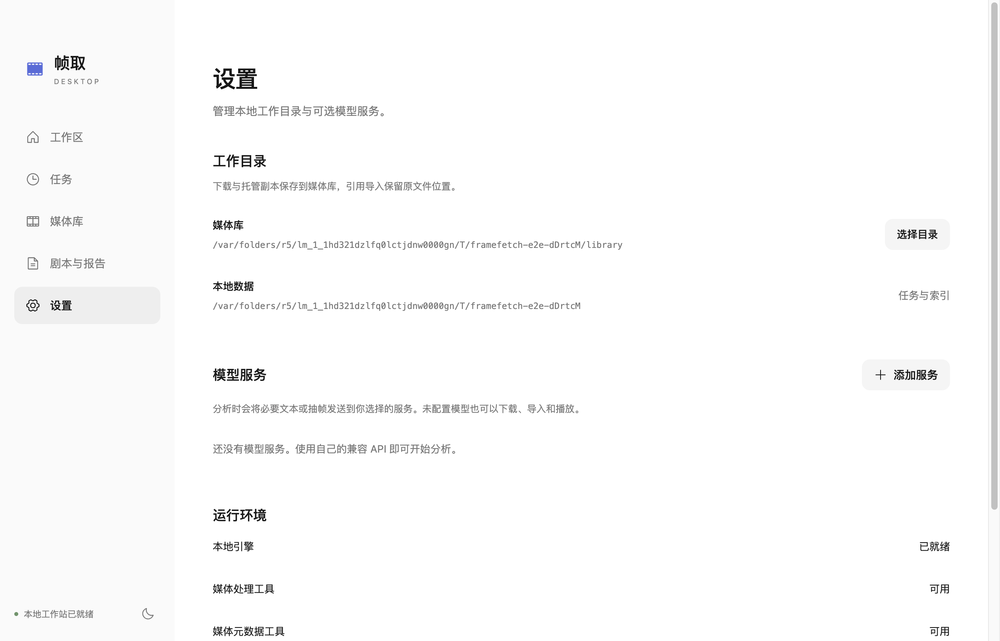
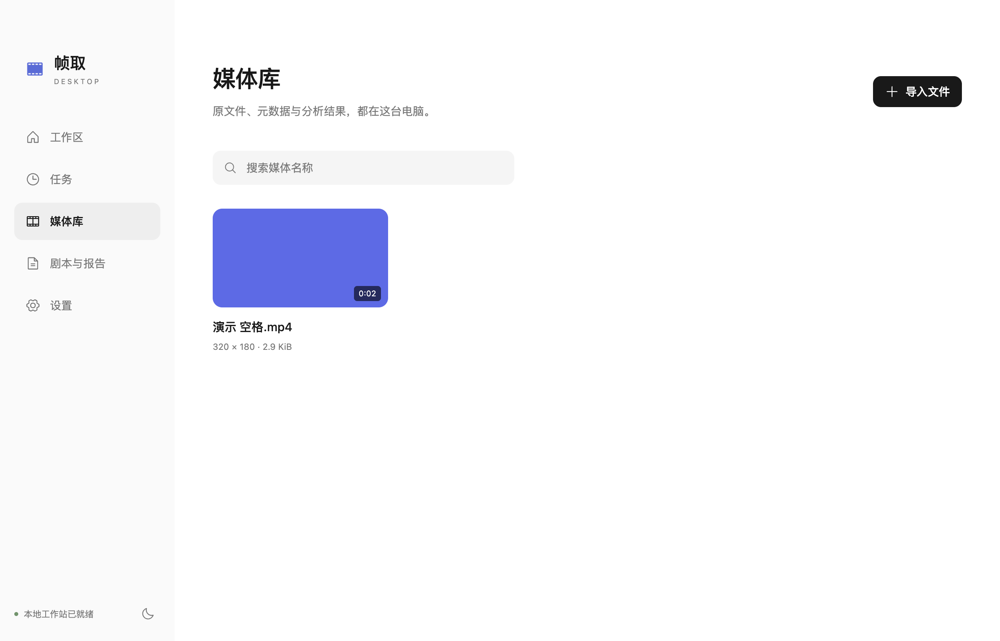
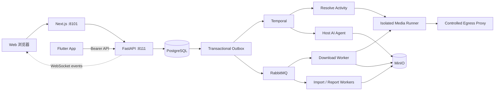

# 帧取 · FrameFetch

**开源、自托管的个人视频与剧本工作站。** 从一份素材，开始获取、理解与整理。

[](https://github.com/StephenQiu30/video-server/actions/workflows/ci.yml)
[](https://github.com/StephenQiu30/video-server/releases)
[](https://github.com/StephenQiu30/video-server/stargazers)
[](LICENSE)


[产品介绍](#帧取是什么) · [完整工作流](#从素材到报告) · [AI 能力](#ai-分析与报告) · [界面预览](#界面预览) · [快速开始](#快速开始) · [技术架构](#架构) · [English](README.en.md)


> 2026-10-02 当前源码的真实页面，使用隔离演示响应展示布局与流程；示例内容不作为真实下载或 AI 分析验收。页首 Logo 与 Flutter App 使用同一品牌资产。

## 帧取是什么

帧取（FrameFetch）是自行部署、供部署者使用的个人视频与剧本工作站，面向创作者、内容研究者和开发者。它把有权获取的视频链接、本地 MP4 和剧本文档接入同一工作流：获取并校验素材、跟踪后台任务、阅读结构化 AI 分析，再导出可继续编辑的报告。

本仓库提供 API、Next.js Web 和后台执行组件；[Flutter App](https://github.com/StephenQiu30/video-app) 连接同一后端。产品定位与范围见[设计 01](docs/design/01-产品定位与边界.md)。

## 适用场景

- **镜头与叙事复盘**：导入自己的成片或已获授权的视频，查看分镜、场景、高光与时间证据，复盘构图、剪辑节奏和叙事结构。
- **剧本审稿与改写**：阅读剧本文档，分析故事、人物、场景和对白，形成修改建议或中英改写候选。
- **素材与文章整理**：保存经校验的视频与文档，把视频重组为文章初稿，并导出 Markdown／DOCX 用于后续编辑。
- **开源二次开发**：以 OpenAPI 为唯一 REST 契约，扩展 Provider、分析方法或客户端。

## 从素材到报告

1. **输入素材**：粘贴授权的单条视频链接，上传本地 MP4，或导入 DOCX、可提取文字的 PDF、TXT、Markdown、Fountain 剧本文档。
2. **确认来源与格式**：检查媒体信息、访问决策和实际可用格式；仅允许下载的链接可创建下载任务，过期结果须重新解析。
3. **跟踪后台任务**：查看解析、下载或导入状态，按需取消、重试或找回历史记录；长任务不占用 HTTP 请求进程。
4. **保存校验后的素材**：视频经过媒体身份、格式、大小、时长和 SHA-256 校验；剧本保留原件与规范化文本。
5. **按需发起 AI 分析**：选择内置方法、输出语言和关注重点；分析独立记录状态，AI 失败不改变已成功的下载。
6. **复核与导出**：结合视频时间证据或剧本场景阅读结论，将报告导出为 Markdown／DOCX，继续编辑和使用。

Web 提供任务历史、详情、剧本阅读、Provider 状态与账户设置；管理员可管理用户、文件、AI 服务并查看下载／AI 统计及操作日志。网页任务状态通过 WebSocket 增量事件和断线 resync 更新，业务事实以 PostgreSQL 为准。成功后的素材与报告不会因访问 URL 过期而删除；文件清理是显式操作。

## AI 分析与报告

当前服务端代码目录内置 **12 种视频方法、8 种剧本方法**。Skill 决定分析重点，固定结果契约决定报告结构；方法目录数量不代表每种方法都已通过独立真实作品验收，独立桌面端有自己的首版方法集。

- **视频**：综合分析、分镜表制作、场景提炼、高光提炼、资产目录、导演拉片、成片叙事结构审阅、剪辑节奏审阅、连续性与成片 QA、公众号文章、短视频包装、开场钩子审查。
- **剧本**：故事审稿、短剧故事审稿、人物与冲突、场景、对白、结构、连续性审阅，以及中英改写。

| 结果形态 | 你可以读到什么 |
| --- | --- |
| 视频视觉分析 | 核心判断、场景、连续分镜、高光、视觉资产及时间证据 |
| 视频文章 | 标题、导语、章节正文、要点与结语；编辑证据和局限另列 |
| 通用结构化报告 | 摘要、分析章节、候选条目、时间证据与局限 |
| 剧本分析 | 故事概览、结构、人物、场景、对白与修改建议 |
| 剧本改写 | 目标语言的文本候选与术语表 |

### 如何执行与复核

- **观察与证据**：使用 FFmpeg／ffprobe 和受限视频观察工具；API 路线使用有界、按时间排序的画面证据。视频结论绑定时间范围，剧本结论关联规范化场景。当前不做 ASR／OCR，没有可靠音频时不编造对白或引语。
- **方法与结构**：每项任务固定 Skill 指令快照，模型结果在保存前进行严格 Schema、时间轴与证据校验；报告保留分析口径与局限。结构校验不能代替人工事实复核。
- **后台执行**：宿主 AI Worker 通过 Temporal `SkillWorkflow` 调度，步骤日志复用已完成的块；结果不明的模型调用不自动重发。Markdown／DOCX 报告由独立报告链路发布。
- **模型接入**：支持 Codex App Server、Claude CLI、DeepSeek、OpenRouter 和 OpenAI Chat Completions 兼容线路。管理员配置引擎与模型，普通用户选择 Skill、语言与关注重点；可用性取决于实际配置、模型能力和真实验收。

实现细节与验证边界见 [AI 分析](docs/design/10-AI分析.md)及 [Skill 体系与结果契约](docs/design/16-Skill体系与结果契约.md)。

## 使用方式与当前状态

| 产品形态 | 当前范围与状态 |
| --- | --- |
| Web／Server | 自托管源码与 Compose 运行方式；已实现解析、下载、导入、剧本、可选 AI、报告与管理链路。具体平台和模型仍以真实验收为准 |
| iOS／Android | 独立 [Flutter 客户端](https://github.com/StephenQiu30/video-app)，连接同一后端，提供原生文件选择、任务跟踪、播放、报告阅读与分享。当前从源码构建，无 App Store／Google Play 预构建包；真机与真实账号业务端到端仍待验收 |
| 独立桌面端 | `video-electron` **0.1.0 内部测试版已实现**。提供本地 MP4／剧本导入、媒体库与播放、链接解析／下载任务、取消与恢复、模型配置、5 种分析方法、Markdown／DOCX 报告；本机 macOS arm64 DMG 的安装态导入、播放、文档读取与重启持久化已验证 |

手机不运行媒体提取器、转码器或离线 AI；这些工作由部署者的服务端执行。Web 与手机的状态和文件以同一后端为准，App 当前使用受控轮询更新活动任务。

桌面端独立运行，安装包包含 Python 引擎、FFmpeg／ffprobe、yt-dlp 与 Deno，数据保存在本机 SQLite 和文件系统，无需部署本服务。已产出内部未签名 `FrameFetch-0.1.0-mac-arm64.dmg`；本地导入、播放、历史和已有报告可离线使用。其 5 种方法为综合分析、分镜、高光、视频转文章与剧本分析；真实平台下载、自备模型真实调用、Windows／Intel Mac 安装及正式签名公证仍待独立验收，不能沿用服务端证据。

**部署与费用**：MIT 许可证开放源代码；需要自行准备服务器、基础服务、存储和网络，外部模型也可能计费，不包含免费托管或模型额度。具体前置条件及命令见[快速开始](#快速开始)。

**数据流**：Web／App 的原件、规范化文本和报告保存在部署者配置的服务端基础设施中；独立桌面端保存在本机。启用外部 AI 时，分析所需文本或画面会发送到选定服务；自托管或本地工作区不代表所有处理均离线。

## 解析引擎

当前引擎通过 Registry 阶梯统一调用 HTTP 提取、证明准备与浏览器，使用受控出口和 Chrome 扩展身份来源。解析由单 Activity Temporal 工作流执行，下载由 RabbitMQ Worker 处理，最终制品经过完整性校验。yt-dlp 与 FFmpeg 是媒体适配和处理工具，帧取在其上提供输入、任务、隔离执行、存储、文档与分析工作流；提取器存在不保证当前部署可以下载。

项目只处理用户有权获取的 HTTP(S) 非 DRM 内容。Registry 独立声明 identity 与 content_scope，账号材料不扩张内容范围；不解密媒体或取得内容密钥。组件接线、元数据成功与完整文件交付是不同状态，实现状态、平台限制与真实证据只在[设计 17](docs/design/17-解析引擎重建.md)维护。

## 界面预览

### Web

页首与以下截图均采集于 **2026-10-02 当前源码的本地预览页面**，通过 `agent-browser` 配合隔离演示响应展示工作区、任务历史、AI 报告和剧本阅读；不包含真实用户数据、凭据或第三方图片热链。


**任务历史与处理状态。**


**结构化 AI 报告。** 报告内容来自演示响应，本组截图没有执行真实模型分析，也不替代 AI 产品验收。


**剧本文档阅读与分析入口。**

实际可用平台和状态以部署实例的 `/providers` 页面及真实完整文件验收为准。Web 还提供 `/guide/`、`/self-hosting/`、`/about/` 与 `/llms.txt`；完整设计见[文档索引](docs/design/README.md)。

### 独立桌面端

以下为 **0.1.0 内部未签名 macOS arm64 安装版**的真实截图（2026-10-02），来自 `video-electron/.artifacts/packaged-*.png` 原图，展示设置与本地媒体库。截图中的视频为第一方验证素材。



**本地目录与模型设置。**



**安装版的本地媒体库。**

## 快速开始

本机开发使用 `docker-compose.yml`，生产使用 `docker-compose-prod.yml`。公开账号平台先匿名解析，明确认证失败后按已批准范围复用当前 Chrome 会话；固定公开平台不读取材料。提取器存在、Cookie 存在与服务健康均不代表媒体可下载，必须以真实文件结果验收。

### 前置条件

- Docker Engine 与 Docker Compose
- 本机已运行 PostgreSQL、RabbitMQ、Redis、MinIO 和 Temporal，已有配置直接复用
- 用于生产部署时，需要自行提供强随机密钥和公开访问地址

### 本机启动（macOS，单人自用）

```bash
git clone https://github.com/StephenQiu30/video-server.git
cd video-server
test -f .env || cp .env.example .env

# 确认 .env 连接本机已运行的 PostgreSQL、RabbitMQ、Redis、MinIO 与 Temporal

# 启动：migrate 容器先应用幂等的 backend/sql/schema.sql，其余服务随后启动
docker compose up -d --build --wait --remove-orphans
```

所有容器化后台循环（Outbox 投递、解析与下载、导入、报告发布）运行在一个 `worker` 容器中，使用 `RABBITMQ_WORKER_USER` / `RABBITMQ_WORKER_PASS`。该账号须对 `RABBITMQ_VHOST` 中的当前业务队列有受限的 configure/write/read 权限；队列职责见[设计 13](docs/design/13-可靠性与运行.md)。平台身份安装见下文。

全新空库还没有登录账号时，在部署机终端执行一次首管理员初始化（需使用可连接 PostgreSQL 的 `DATABASE_URL`，密码交互输入，不进入命令行历史）：

```bash
uv run --project backend python -m app.workers.bootstrap_admin \
  --env-file .env --username your-admin --email you@example.com
```

命令只在用户表为空时创建管理员；已有任何用户时拒绝，不开放 HTTP 初始化接口。若要让其他用户自行注册，先在 `.env` 配置真实 SMTP 并启用 `SMTP_ENABLED=true`。健康检查只证明服务可运行，不证明每个平台有真实媒体证据。

### 复用已有 Temporal 服务

解析与 Skill 分析连接宿主机已运行的 Temporal。`docker-compose.yml`／`docker-compose-prod.yml` 只启动业务服务；容器 Worker 通过 `TEMPORAL_HOST`／`TEMPORAL_PORT` 连接已有服务，默认 `host.docker.internal:7233`。CLI 与宿主 AI Worker 使用 `TEMPORAL_ADDRESS`，默认 `127.0.0.1:7233`。已有部署使用其他地址时设置对应连接参数，工作进程首次连接时幂等创建 `TEMPORAL_NAMESPACE`（默认 `framefetch`）。

更新前停止 API 接单并排空解析任务，备份现有业务库，再配套发布 API、worker 和 `migrate` 容器。更新使用 `up --build`，不能只 `start` 旧版已退出的迁移容器。回退也需先排空新执行并恢复匹配的结构备份，不允许两套解析执行者并存。

Temporal 的存储与备份由现有服务管理，项目重启只重启业务容器。Temporal 停机期间任务暂停；端口健康不等于平台可以下载。报告发布、下载与导入长期使用 RabbitMQ，分工见[工作流设计](docs/design/15-工作流与平台下载目标.md)。

### 固定出口与 Clash 住宅节点

Runner、yt-dlp、媒体 HTTP/FFmpeg、浏览器与 IP 观测共用 EgressBinding 的代理地址。Squid 的 `3128` 监听固定为 `cn_residential`，`3129` 固定为 `global_residential`；宿主对应 `127.0.0.1:13128`、`127.0.0.1:13129`。平台选择由 Registry 决定，Generic 直链按 `.cn` 域名选择国内路由，其余走境外路由。

部署者应自行取得静态 ISP/住宅节点，在宿主 Clash/Mihomo 中定义两个固定 HTTP 入站，分别绑定国内家宽出口与境外住宅节点。不要使用自动测速、负载均衡或会自动切换节点的组；解析与下载必须使用同一节点。先导入供应商提供的住宅节点订阅，或按供应商协议新增节点并命名为 `GLOBAL-ISP`。例如 SOCKS5 住宅节点的宿主配置如下；地址、端口和凭据由供应商提供，示例值只是占位符，不能写入本仓库或 FrameFetch 环境变量：

```yaml
proxies:
  - name: GLOBAL-ISP
    type: socks5
    server: isp-global.example
    port: 1080
    username: 替换为供应商用户名
    password: 替换为供应商密码
```

协议字段见 [Mihomo SOCKS 官方文档](https://wiki.metacubex.one/en/config/proxies/socks/)。国内节点可同样命名为 `CN-ISP`；本机本身就是国内家宽时，使用 `DIRECT`。两个入站绑定如下：

```yaml
listeners:
  - name: framefetch-cn
    type: http
    listen: 0.0.0.0
    port: 17897
    proxy: CN-ISP
  - name: framefetch-global
    type: http
    listen: 0.0.0.0
    port: 17898
    proxy: GLOBAL-ISP
```

`proxy` 将该入站全部请求固定交给指定节点，包含媒体 CDN 和 IP 回显服务，避免按目标域名分流导致观测 IP 与媒体出口不一致。也可以使用入站专用 `rule` 与最终 `MATCH` 规则。字段含义见 [Mihomo Listener 官方文档](https://wiki.metacubex.one/en/config/inbound/listeners/)。上游连接优先解析 IPv4，避免容器没有 IPv6 路由时被宿主 AAAA 地址阻断；仅有 IPv6 时保留主机名解析。监听须允许 Docker Desktop 访问，并由宿主防火墙限制为本机/Docker 来源。

在部署环境文件中设置 `EGRESS_CN_UPSTREAM_HOST=host.docker.internal`、`EGRESS_CN_UPSTREAM_PORT=17897`、`EGRESS_GLOBAL_UPSTREAM_HOST=host.docker.internal`、`EGRESS_GLOBAL_UPSTREAM_PORT=17898`。如本机本身就是国内家宽，可将国内 Listener 的 `proxy` 设为 `DIRECT`；未设置国内上游时，Squid 保留现有直连，并标记 `egress_class=unknown`：宿主 TUN 可能按目标域名分流，不能把这一路径冒充固定住宅节点。`residential` 表示部署者对该固定节点的类别声明，并非 IP 回显服务认证。

没有境外住宅节点时，`EGRESS_GLOBAL_UPSTREAM_HOST` 保持空值，境外路由使用 `EGRESS_FALLBACK_UPSTREAM_HOST/PORT`（默认宿主 Clash `7897`），诊断标记 `egress_class=datacenter`。此状态仅供降级运行，YouTube 的住宅出口验收仍为阻塞。现有境外上游必须把该路由的全部流量（包括 IP 回显服务）固定到同一境外节点。

配置或 Clash 节点/规则改变后递增 `EGRESS_NODE_REVISION`，重建更新 `egress-proxy` 与 `session-runner`。Runner 计算有效路由配置的 SHA-256 修订摘要；下载前比较修订与观测 IP，变化时返回 `context_changed`，需要重新解析和确认。IP 回显按路由选择：国内默认 `https://ip.3322.net`，境外默认 `https://ipinfo.io/ip`，分别由 `RUNNER_CN_EGRESS_IP_ECHO_URL`、`RUNNER_GLOBAL_EGRESS_IP_ECHO_URL` 覆盖，服务须返回纯文本公网 IP。国内回显目标需保持在国内，避免宿主 Clash 按域名分流到境外节点而误报；回显仅代表该目标的观测，固定节点仍需上述 Listener 配置保证。缓存键包含路由、修订与回显地址；经同一路由请求，限时五秒、响应最多 128 字节、不跟随重定向，成功或失败均缓存十分钟。失败时 IP 为空，任务继续运行；不会用空值证明节点未改变。

### 平台身份与升级

宿主身份服务位于 `backend/app/workers/identity/`，扩展源码位于 `browser-extension/`，遵循[设计 17 第 3.4 节](docs/design/17-解析引擎重建.md#34-身份层)。普通用户 LaunchAgent 只监听 `127.0.0.1:19101`；WebSocket `/extension` 校验固定扩展 Origin 与双向 HMAC，`POST /cookies` 和固定 `POST /yuanbao-account` 只接受 Runner Bearer。扩展先认证服务端，再按声明来源读取当前普通 Profile 的非分区 Cookie，或限定元宝顶层页的必要账号材料；服务端每次请求实时取材料，5 秒上限并受操作截止时间约束，不建立材料库。无扩展连接、超时、无必要账号材料分别返回 `extension_disconnected`、`extension_timeout`、`credential_missing`，Runner 保留这些子因。视频号按历史元宝解析与微信官方 feed 链路恢复，当前只完成元宝材料路径的离线接线，真实账号恢复、解析请求与完整文件仍未验收，详见[第 8.5 节](docs/design/17-解析引擎重建.md#85-视频号元宝解析链路)。

从 `backend/` 执行一次安装：

```bash
uv run python -m app.workers.identity.cli install
uv run python -m app.workers.identity.cli check
```

`install` 生成独立配对密钥和 Runner Bearer，宿主配置默认为 `~/Library/Application Support/FrameFetch/identity.env`；也可用 `--env-file /绝对路径/identity.env` 指定已有独立 `0600` 身份配置，保留其 Runner Bearer 并补建配对密钥。已有安装升级会保留两份密钥，只更新项目目录内的生成文件并重启本服务。不得把项目 `.env` 当作宿主身份配置。安装注册 `gui/<uid>` 下的普通 LaunchAgent，不要求 Aqua 会话、钥匙串授权或完全磁盘访问；服务运行依赖此 checkout 的 backend 与 uv 虚拟环境，不要删除它们。`uninstall` 停止并移除本 LaunchAgent，保留配对文件以便重装。

在 Chrome 120+ 打开 `chrome://extensions`，开启开发者模式，选择“加载已解压的扩展程序”，目录为 **`video-server/browser-extension/`**（install 输出绝对路径）。只加载到日常登录的一个普通 Profile；扩展申请 cookies、alarms、scripting，host 权限限定 Registry 的 Cookie 域、明确声明的 `https://yuanbao.tencent.com/*` 和本机 WebSocket，不申请广泛 tabs 或历史权限。页面读取只使用固定 ISOLATED 顶层函数，不能执行任意脚本、访问其他页面或取得动态签名。加载后 `check` 报告实际连接状态与扩展版本；Chrome 停止或尚未加载时显示 `connected=false`、`version=null`。升级后从主工作区重新执行 `install`，再在扩展页点一次“重新加载”。不要从 git worktree 加载；install 自动定位主工作区，LaunchAgent 也使用主工作区的 backend。

扩展目录 `0700`、生成文件 `0600`，密钥和端口仅写入项目扩展目录的 `config.local.json`；它和生成的 `manifest.json` 均被 gitignore，安装会检查两者未被 Git 跟踪。源码只维护 `manifest.template.json`，不在 web_accessible_resources 中、不进入源码或发行包。**信任边界**：这些权限隔离网页与其他用户，不能隔离同一 macOS 用户下可读写该目录的恶意进程。扩展和 cookie-source 共享配对密钥；Runner Bearer 是另一份独立凭据，不能复用。双向 HMAC 防止无配对密钥的本机假服务骗取 Cookie；不会赋予内容导出权利或扩大 content_scope。

Compose 仅向 `session-runner` 注入宿主配置中相同的 `COOKIE_SOURCE_TOKEN`（通过调用 Compose 的进程环境传入，禁止输出令牌）；API、worker、egress-proxy 和 bgutil 不持有它。不要把整个宿主身份配置作为容器 env_file，配对密钥不进入任何容器。当前 Compose 与 squid 配套固定使用端口 `19101`，调整端口须同步精确代理 ACL。Runner 身份客户端显式使用受控代理，不使用环境代理、不跟随重定向；squid 只放行 `POST host.docker.internal:19101/cookies`，强制直连，不经过 Clash／住宅上游。其他宿主端口、私网和 IP 字面量仍被拒绝。身份传输是明文 HTTP，egress-proxy 属于敏感信任组件，配置关闭访问日志、缓存和响应体存储。安装只启动宿主服务，Runner 的配套令牌与重建按运行时锁协议在真实验收时确认。

扩展使用 20 秒心跳、30 秒 alarm 和上限 30 秒的指数退避，并同步注册启动事件。保活机制依据 [Chrome WebSocket 文档](https://developer.chrome.com/docs/extensions/how-to/web-platform/websockets)；真实关闭 DevTools、睡眠唤醒与各类重启恢复仍须实测。

Runner 身份调用、RunContext 材料所有权和私有 tmpfs 清理统一见设计 17 第 3.4–3.8 节。真实 Chrome 保活、重连与需要身份的完整文件验收状态见第 8 节。

升级前暂停接单并排空媒体操作，备份业务库，幂等执行当前 schema.sql，再配套重建 API、worker、session-runner 与前端。生产入口：

```bash
docker compose --env-file .env.prod -f docker-compose-prod.yml up -d --build --wait --remove-orphans
```

启动后访问：

- Web 应用：<http://localhost:8101>
- Swagger UI：<http://localhost:8111/docs>
- OpenAPI：<http://localhost:8111/openapi.json>

健康检查：

```bash
curl --fail http://127.0.0.1:8111/health/live
curl --fail http://127.0.0.1:8111/health/ready
curl --fail --head http://127.0.0.1:8101/
```

只需要下载与剧本文档导入时，可在 `.env` 中设置 `ANALYSIS_ENABLED=false`。完整的启动、停止、已有基础环境复用和故障恢复方式见[可靠性与运行](docs/design/13-可靠性与运行.md)。更新代码时先执行 `git pull --ff-only`，再按上面的命令构建启动 Compose；`docker compose restart` 不会应用新代码、镜像或环境配置。

### 启用 AI 分析

AI Worker 独立运行，不包含在业务 Compose 中。默认线路可以复用宿主机已登录的 Codex App Server；管理员也可在 Web 中配置受支持的模型 Provider。宿主机 Agent 的统一管理入口为：

```bash
cd backend
uv sync --frozen --dev
uv run python -m app.workers.analysis.agent_cli doctor
uv run python -m app.workers.analysis.agent_cli install
uv run python -m app.workers.analysis.agent_cli status
```

生产业务使用 `.env.prod` 时，宿主机 Agent 必须读取同一环境文件：

```bash
uv run python -m app.workers.analysis.agent_cli doctor --env-file ../.env.prod
uv run python -m app.workers.analysis.agent_cli install --env-file ../.env.prod
```

不要把 Codex/Claude OAuth 目录复制或挂载进容器。启用第三方模型前，请使用已获授权样本完成一次真实分析验收，并确认模型服务条款和组织数据策略。

## 架构

下图描述 Web／App 共用的服务端架构；独立 Electron 桌面端使用自己的本地引擎，不依赖这套服务。



| 技术 | 职责与用户价值 |
| --- | --- |
| Next.js、React、TypeScript、Tailwind CSS、Radix／shadcn | 提供浏览器工作区、可访问控件、任务跟踪与结构化结果阅读 |
| Python、FastAPI、Pydantic、OpenAPI | API 负责提交、查询与取消，生成统一 REST 契约，供 Web、App 和二次开发使用 |
| PostgreSQL、SQLAlchemy、Transactional Outbox | 持久保存任务事实，并在同一事务中记录投递意图；恢复不只依赖进程内存 |
| Temporal、RabbitMQ | Temporal 编排解析与 Skill 分析；RabbitMQ 执行下载、导入、报告发布与实时事件，避免同一业务双调度 |
| Redis | 保存限流计数、登录会话缓存与短期租约，不作为业务事实来源 |
| yt-dlp、FFmpeg／ffprobe、隔离 Runner、Squid | 适配媒体来源，探测与处理格式，校验最终文件；不可信媒体处理与请求进程隔离，并限制出网 |
| MinIO、受限分片上传、短时预签名 URL | 存储原件、制品和报告，支持大文件上传及按授权获取文件 |
| Flutter、Riverpod、Dio、media_kit／libmpv | iOS／Android 原生输入、状态展示和播放；系统安全存储保存刷新凭据，OpenAPI 生成客户端与服务端保持契约一致 |
| Electron、React、本地 Python 引擎、SQLite | 独立桌面工作区、原生文件授权、本地任务与报告；随包运行时无需用户另装 Python／FFmpeg 或数据库服务 |
| Docker Compose、独立宿主 AI Worker | 业务服务复用已有基础环境；宿主 AI 执行器与媒体任务按凭据、信任边界分离 |

完整的系统设计收录在 [docs/design/README.md](docs/design/README.md)。

## 安全与合规边界

- 只处理你拥有相应权利的内容，并遵守内容来源、所在地和部署环境适用的法律与平台规则。
- 内容范围与平台身份按设计 17 独立声明；私网 URL、任意 yt-dlp 参数和 shell 输入始终禁止。
- 普通业务请求不接收原始 Cookie。身份来源与传输见设计 17 第 3.4 节；设计 17 第 3.7 节的十二字段 ExecutionContext 不保存凭据。
- Edge Agent 只能传输用户已合法取得并明确选择的明文文件，不能读取平台会话、拦截流量、提取密钥或转换受保护媒体。
- 外部媒体访问必须经过阻断私网的出口代理；入口 URL 校验不能替代网络隔离。

发现安全问题时，请不要在公开 Issue 中披露利用细节、密钥或用户内容；按 [安全策略](SECURITY.md) 使用私有渠道报告。

## 当前限制

- Chrome 扩展身份层已接线；登录平台专项与全量矩阵状态以设计 17 第 8 节为准，不能由身份接线或元数据成功推断完整文件可用。
- 项目仍在持续演进，目前提供自托管源码和 Compose 运行方式，不承诺官方 SaaS、公共演示站或服务可用性 SLA。
- Provider 能力受来源页面和平台变化影响；平台名称不代表对所有内容、地区或账户权益都可用。
- AI 分析依赖独立宿主机 Agent 或部署方配置的模型服务，关闭 AI 不影响下载和文档导入。
- 不提供直播录制、无限播放列表、OCR／图片型 PDF、批量文件输入或在线协作编辑；创作与平台发布领域尚未实施，见[设计 11](docs/design/11-内容创作与发布.md)。
- 预签名 URL 会过期，但最终制品不会因此自动删除；管理员仍需规划 MinIO 容量、备份和显式清理策略。
- 对外部署前必须检查 `.env.prod` 的实际配置，替换所有占位凭据，并完成网络、存储、Runner 和真实文件验收。

## 本地开发

前端需要 Node.js `>=24.15 <25` 与 pnpm 12，后端需要 Python `>=3.12 <3.13` 与 [uv](https://docs.astral.sh/uv/)。代码级质量门禁：

```bash
cd backend
uv sync --frozen --dev
uv run --frozen ruff check app tests
uv run --frozen ruff format --check app tests
uv run --frozen mypy --strict app
uv run --frozen pytest -q

cd ../frontend
pnpm install --frozen-lockfile
pnpm format:check
pnpm lint
pnpm test
pnpm build
```

仓库主要目录：

```text
backend/                 FastAPI、领域逻辑、Worker、Runner 与当前态 SQL
frontend/                Next.js App Router、业务组件、Hooks 与 OpenAPI 客户端
docs/                    系统设计文档与 README 截图资源
backend/Dockerfile       API、Worker、Runner 镜像
frontend/Dockerfile      Next.js 独立镜像
docker-compose-env.yml   GitHub CI 隔离测试夹具，不用于本机启动
docker-compose.yml       Web、API、Worker、Runner 与出口代理
docker-compose-prod.yml  生产业务差异
```

## 路线图

平台支持与验证限制见[解析引擎](docs/design/17-解析引擎重建.md#8-平台能力与验证边界)，其他未完成工作见[BACKLOG](BACKLOG.md)，规划中的创作与发布流程见[内容创作与发布](docs/design/11-内容创作与发布.md)。欢迎在 [Issues](https://github.com/StephenQiu30/video-server/issues) 中讨论优先级，带有 `good first issue` / `help wanted` 标签的任务适合首次参与。

## 参与贡献

欢迎通过 Issue 或 Pull Request 参与 Provider 适配、可靠性、前端与移动端体验、AI 报告、测试和文档建设。开始前请阅读：

- [贡献指南](CONTRIBUTING.md)
- [社区行为准则](CODE_OF_CONDUCT.md)
- [仓库协作规范](AGENTS.md)
- [文档索引](docs/design/README.md)
- [安全策略](SECURITY.md)

提交变更时，请保持实现、OpenAPI 契约、测试、运行手册和验收证据一致，并只提交小而完整、可独立验证的改动。

如果帧取对你的创作、研究或自托管实践有帮助，欢迎点亮 **Star**，并关注 [Releases](https://github.com/StephenQiu30/video-server/releases) 获取版本更新；这也是项目持续维护的最大动力。

## 引用

在论文、报告或课程材料中使用帧取时，可点击仓库侧栏的 “Cite this repository”，或直接使用根目录的 [`CITATION.cff`](CITATION.cff)。版本变更见 [Releases](https://github.com/StephenQiu30/video-server/releases)。

## 许可证

FrameFetch 基于 [MIT License](LICENSE) 开源。MIT 许可证授予软件使用、修改和分发权，不代表授予任何第三方媒体内容的下载、复制或分析权。

公开网站的索引配置、生成式搜索可发现性与上线核查见 [Web 体验与 SEO](docs/design/12-Web体验.md)。个人自托管实例默认不开放索引。

冷启动矩阵的两种模式、运行时锁、样本证据与文件校验用法见 [Backend README](backend/README.md#冷启动矩阵设计-17)。
