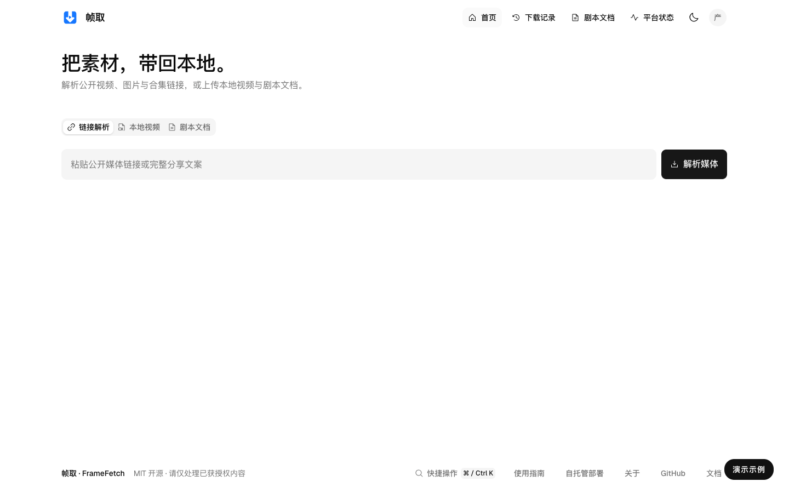
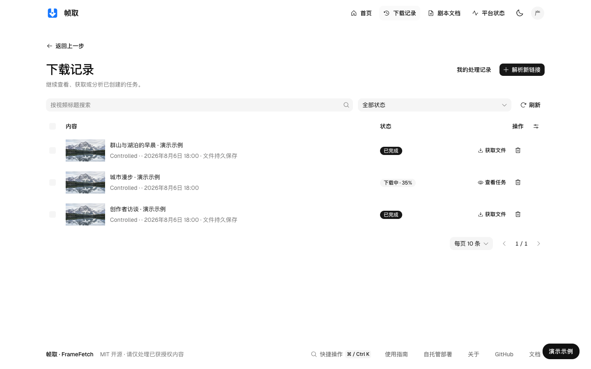
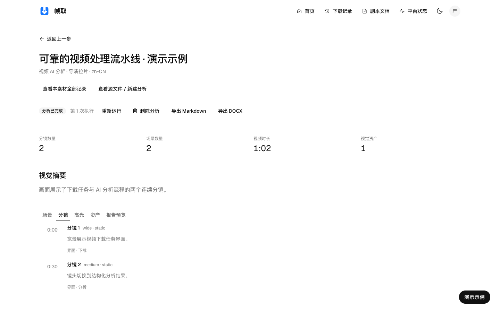
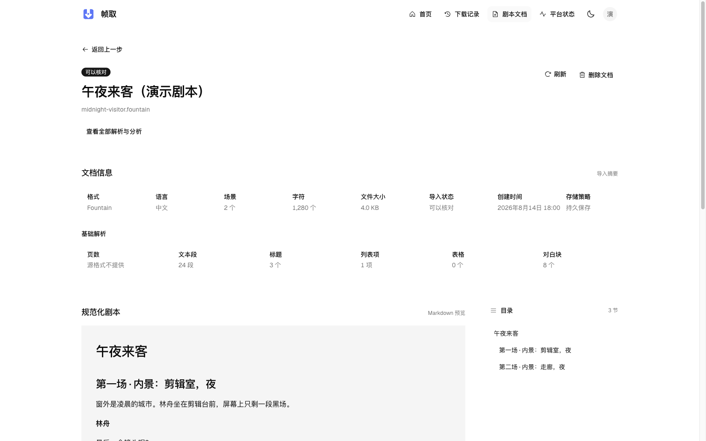
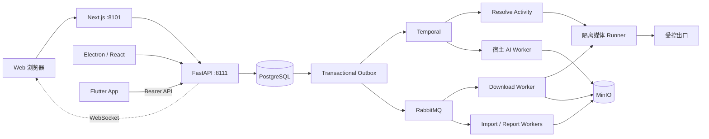

# 帧取 · FrameFetch

**开源、自托管的个人视频与剧本工作站。** 接入素材，理解内容，交付可继续编辑的报告。

[](https://github.com/StephenQiu30/video-server/actions/workflows/ci.yml)
[](LICENSE)
[](https://github.com/StephenQiu30/video-server/releases)

[产品介绍](#帧取是什么) · [完整工作流](#从素材到报告) · [视频分析](#12-种视频分析方法) · [剧本分析](#8-种剧本分析方法) · [各端与架构](#同一工作站多种使用方式) · [快速开始](#快速开始) · [文档](docs/design/README.md) · [English](README.en.md)



> Web 与桌面同源页面，本图由当前 Electron Renderer 捕获，记录和分析为演示数据。

## 帧取是什么

帧取（FrameFetch）面向创作者、内容研究者和开发者，把原本分散的素材获取、视频复盘、剧本审阅与报告整理连接起来。你可以粘贴有权获取的媒体链接，按平台实际能力保存单视频、图集或有限视频合集，也可以导入自己的 MP4 成片或剧本文档。视频和剧本获取后可选择分析方法、输出语言与关注重点，阅读带时间或场景依据的结构化结果，再导出 Markdown／DOCX；图集与视频合集以 ZIP 和内置清单交付。

本仓库提供 **FastAPI 服务端、Next.js Web 和后台处理组件**。[Electron 桌面端](https://github.com/StephenQiu30/video-electron) 与 [Flutter App](https://github.com/StephenQiu30/video-app) 连接同一服务，共享账户、素材、任务和报告。产品按个人自托管工作站设计，部署者控制基础设施、文件存储和模型配置。

### 五个核心特点

- **素材入口完整**：按平台实际能力接入单视频、图集与有限视频合集；原图或合集视频以包含 `manifest.json` 的 ZIP 交付。本地 MP4 以及 DOCX、文字型 PDF、TXT、Markdown、Fountain 剧本文档进入同一工作区。
- **分析有明确依据**：从完整视频制品取得技术参数、时间段概览与关键帧，组织连续分镜、场景、高光和视觉资产；剧本分析关联规范化场景，结论可回到原文复核。
- **方法对应真实工作**：12 种视频方法覆盖拉片、叙事、剪辑、质量审查与内容整理；8 种剧本方法覆盖故事、人物、对白、结构、连续性与中英改写。
- **交付物可以继续使用**：五种结构化结果形态，以及 Markdown／DOCX 双格式报告；文章、包装文案与剧本改写提供可编辑候选，便于人工修订和交接。
- **各端协同、自行部署**：浏览器、原生桌面和手机使用同一后端；后台任务持久化，原件与报告集中管理，部署者可配置模型服务并维护运行环境。

## 适用场景

| 你的任务 | 帧取如何帮助 |
| --- | --- |
| 学习或复盘成片 | 导演拉片、分镜表、叙事结构和剪辑节奏审阅，结合具体时间段理解制作选择 |
| 检查自己的视频 | 连续性与成片 QA、开场钩子审查，形成可复核的修改建议 |
| 整理素材与传播内容 | 提炼场景、高光和资产，将视频重组为文章初稿或标题、封面文字与发布文案候选 |
| 审阅与修订剧本 | 保留原文件和规范化文本，按故事、人物、场景、对白、结构与连续性阅读审稿结果 |
| 建立个人工具链 | 使用自托管存储、可配置模型服务与 OpenAPI，扩展 Provider、方法或客户端 |

## 从素材到报告

1. **接入**：粘贴单条媒体链接或含单条链接的分享文案，按平台实际能力处理视频、图集或有限视频合集；也可上传 MP4，或导入五种格式的剧本文档。公众号文章仅做来源发现；当前候选不提供下载格式，页面提示官方播放或合法文件导入。
2. **确认**：链接解析展示媒体信息、访问决策和真实格式；视频按画质、容器、编码与音轨选择输出，图集与合集核对条目数量并确认 ZIP 下载。过期解析结果可以显式刷新，格式变化时重新确认。
3. **获取**：下载与导入在后台执行，页面显示排队、进度与结果，支持取消、重试和历史找回。本地视频采用受限分片上传，完成后由 Worker 复验。
4. **管理**：视频保存为经校验的制品，提供详情、预览与文件交付；图集和有限视频合集交付原图／视频 ZIP，包内 `manifest.json` 记录标题、媒体类型与条目数量；剧本保存原件与规范化场景文本。任务、文件与报告在各端使用同一服务数据。
5. **分析**：对视频或剧本选择 Skill、中文或英文输出及关注重点。两类输入分别使用适合的工具、方法和结果结构，分析状态独立于素材获取状态。
6. **交付**：结合时间证据或剧本场景阅读结论，导出 Markdown／DOCX 继续编辑。报告正文与导出状态分开，导出恢复复用已有分析结果。

### 页面与日常管理

Web 工作区提供解析详情、下载记录、个人处理记录、视频播放、剧本阅读、分析与报告、平台状态及账户设置。快捷操作支持 `⌘K`／`Ctrl+K`；页面提供明暗主题、键盘操作与适配窄屏的布局。活动任务通过 WebSocket 事件更新，重连时重新同步服务端事实。

管理员可以管理用户、文件、平台目录和 AI 服务，查看下载／AI 统计与系统操作日志。文件和报告持久保存，短时访问地址过期不会删除文件；删除和容量清理是显式操作。

## AI 如何理解素材

**视频分析从完整媒体开始。** FFmpeg／ffprobe 读取技术信息，CLI 分析工具提供全片或指定区间的概览及精确时间点画面；API 模型线路接收有界、按时间排序的 JPEG 证据。分析方法要求区分画面事实、解释和建议，以真实剪辑边界与连续视觉节拍组织分镜。

模型结果保存前按所选结果契约校验结构、输出语言与证据字段。视频视觉分析还检查完整时长、连续分镜时间轴及分镜引用；文章和通用报告使用时间段证据，剧本结果关联规范化场景。结构校验不能代替人工核实。报告保留分析口径与局限，供你结合原片或原文复核；长剧本文档按受限分块和汇总处理。

**Skill、结果结构和模型引擎各司其职。** Skill 定义分析方法，结果契约定义交付物，引擎负责模型调用。每项任务保存不可变的方法指令快照；已完成分析步骤可在恢复时复用，结果不明的调用不会自动重发。下载成功和 AI 结果分别记录，AI 失败不会改变已经取得的素材。

管理员可配置 **Codex App Server、Claude CLI、DeepSeek、OpenRouter、OpenAI Chat Completions 兼容服务**。普通用户选择方法、输出语言和分析重点，无需配置底层模型参数。设计与当前限制见 [AI 分析](docs/design/10-AI分析.md)与 [Skill 体系](docs/design/16-Skill体系与结果契约.md)。

## 12 种视频分析方法

| 方法 | 主要用途 |
| --- | --- |
| 导演拉片 | 逐分镜复盘调度、构图、镜头动机与剪辑关系，提出制作建议 |
| 综合分析 | 连接镜头事实、内容段落、高光、资产和优先修改方向 |
| 分镜表制作 | 整理剪辑边界、起止状态、主体动作、构图、光色与连续性 |
| 场景提炼 | 归并场景段落，说明空间、主体事件、叙事任务与视觉规则 |
| 成片叙事结构审阅 | 检查段落推进、转折、内容兑现和因果可读性 |
| 剪辑节奏审阅 | 检查停留、信息密度、切点动机和动作衔接 |
| 高光提炼 | 根据视觉冲击、信息转折、情绪变化和可剪辑性筛选候选片段 |
| 连续性与成片 QA | 检查主体状态、空间方向、动作衔接、画面文字和明显技术瑕疵 |
| 资产目录 | 归并人物、地点、物件、产品、Logo 与画面文字，关联出现时间 |
| 公众号文章 | 将视频重组为标题、导语、章节正文与结语组成的文章初稿 |
| 短视频包装 | 生成与现有素材对应的标题、封面文字、开头钩子和发布文案候选 |
| 开场钩子审查 | 检查前 3、5、15 秒的注意力锚点、内容承诺与正文衔接 |

## 8 种剧本分析方法

| 方法 | 主要用途 |
| --- | --- |
| 剧本故事审稿 | 完整审阅故事机制、主要问题和有效之处 |
| 短剧故事审稿 | 检查故事承诺、人物选择、局部回报与重复机制 |
| 剧本人物与冲突审阅 | 检查目标、阻力、策略、选择与人物变化 |
| 剧本场景审阅 | 检查场景目标、节拍、状态变化与相邻场景衔接 |
| 剧本对白审阅 | 检查说话目的、言语策略、人物声音与信息释放 |
| 剧本结构审阅 | 检查全局推进、转折与整体节奏 |
| 剧本连续性审阅 | 核对跨场景人物知识、物件状态、时空顺序与因果 |
| 剧本中英改写 | 生成中文／英文跨语言改写或同语言润色候选，维护人物、场景和术语一致性 |

## 五种结果形态与双格式导出

| 结果形态 | 内容与使用方式 |
| --- | --- |
| 视频视觉分析 | 核心判断、场景、逐镜证据、高光、视觉资产与修改建议，适合拉片和成片审阅 |
| 视频文章 | 标题、导语、章节、要点与结语，保留编辑依据和局限，适合二次编辑 |
| 通用结构化报告 | 摘要、分析章节、候选条目与时间证据，适合包装与专项分析 |
| 剧本分析 | 审稿结论、故事概览、结构、人物、对白、逐场附录与修改建议 |
| 剧本改写 | 目标语言文本候选与术语表，供作者检查和继续修订 |

**Markdown** 适合笔记、知识库和版本管理；**DOCX** 适合 Word 编辑、批注与交接。两种格式由同一结构化结果生成，不需要重新调用模型。

## 同一工作站，多种使用方式

| 项目 | 角色与特点 |
| --- | --- |
| **[video-server](https://github.com/StephenQiu30/video-server)** | FastAPI + Next.js：浏览器工作区、统一接口、媒体处理、AI、存储、报告与管理 |
| **[video-electron](https://github.com/StephenQiu30/video-electron)** | Electron 桌面客户端：随包 React 页面复用 Web 业务源码，连接自托管 Server；提供原生窗口、菜单、按服务地址隔离的持久会话和系统文件保存对话框 |
| **[video-app](https://github.com/StephenQiu30/video-app)** | Flutter iOS／Android 客户端：原生文件选择、受控任务轮询、视频播放、报告阅读、保存与分享，连接同一 Server |

桌面端和 App 是同一工作站的客户端，媒体提取、处理和 AI 执行由服务端及宿主 AI Worker 承担。原件、规范化文本和报告保存在部署者配置的服务端存储中，切换客户端无需建立另一套媒体任务或业务库。

Electron 从安装包读取页面和品牌资源，API 与 WebSocket 连接配置的 Server；桌面端无需本机 Next.js 进程或独立数据库。App 使用原生 Flutter 界面和服务端生成契约，手机上不运行媒体提取器或离线模型。

## 公开预览与版本

三个仓库的公开预览连接同一 Server：

| 项目 | 当前预览 | 发行内容 |
| --- | --- | --- |
| Server / Web | [v0.3.0-beta.1](https://github.com/StephenQiu30/video-server/releases/tag/v0.3.0-beta.1) | 自托管源码与 Compose 部署方式 |
| App | [v0.2.0-beta.1](https://github.com/StephenQiu30/video-app/releases/tag/v0.2.0-beta.1) | iOS／Android 源码；未附 APK、IPA 或商店安装包 |
| Desktop | [v0.2.0-beta.1](https://github.com/StephenQiu30/video-electron/releases/tag/v0.2.0-beta.1) | macOS Apple Silicon DMG、Windows x64 安装包与 SHA-256 清单 |

这些版本均为 Beta 预览。桌面安装包未签名，macOS 未公证；干净安装、升级与真实 Server 完整业务需要独立验证。Git tag 标识发行快照：当前预览内嵌 Server/API/Worker 包版本仍为 `0.2.0`，App 为 `0.1.0+1`，桌面包为 `0.2.0`。部署相关组件时使用匹配源码与服务端契约，不能仅凭 tag 数字判断兼容性。

README 描述当前主分支；固定版本的安装、升级步骤和验证范围以对应 Release 与标签下 README 为准。

## 界面预览

**任务历史。** 查看素材、任务状态和后续操作，从历史回到详情继续处理。



**视频报告。** 按章节阅读核心判断、分镜与时间证据，回看原片并导出报告。



**剧本工作区。** 阅读规范化场景、查阅文档并按重点发起审稿或改写。



以上为 Web 与桌面同源页面，图片由 2026-10-03 当前生产构建的 Electron Renderer 捕获，使用正式 Logo、共享业务组件与主题，未重绘页面。任务记录、城市漫步分析和午夜来客剧本文字均为演示数据，用于说明功能与报告结构，不含真实账户或私人素材。各端界面与构建说明分别见 [App README](https://github.com/StephenQiu30/video-app#readme) 和 [桌面端 README](https://github.com/StephenQiu30/video-electron#readme)。

## 快速开始

本机使用 `docker-compose.yml`，生产使用 `docker-compose-prod.yml`。先部署 Server，再让浏览器、Electron 或 App 连接。平台身份按 Registry 声明从普通 Chrome 扩展取得，接入方法见下文。

### 前置条件

- Docker Engine 与 Docker Compose
- 本机已运行 PostgreSQL、RabbitMQ、Redis、MinIO 和 Temporal，已有配置直接复用
- 用于生产部署时，需要自行提供强随机密钥和公开访问地址

### 本机启动（macOS，单人自用）

```bash
git clone https://github.com/StephenQiu30/video-server.git
cd video-server
test -f .env || cp .env.example .env

# 确认 .env 连接本机已运行的 PostgreSQL、RabbitMQ、Redis、MinIO 与 Temporal

# 启动：migrate 容器先应用幂等的 backend/sql/schema.sql，其余服务随后启动
docker compose up -d --build --wait --remove-orphans
```

启动后访问 [Web 工作区](http://localhost:8101)、[Swagger UI](http://localhost:8111/docs) 或 [OpenAPI](http://localhost:8111/openapi.json)。全新空库须先按下文创建首管理员，再登录使用。

所有容器化后台循环（Outbox 投递、解析与下载、导入、报告发布）运行在一个 `worker` 容器中，使用 `RABBITMQ_WORKER_USER` / `RABBITMQ_WORKER_PASS`。该账号须对 `RABBITMQ_VHOST` 中的当前业务队列有受限的 configure/write/read 权限；队列职责见[设计 13](docs/design/13-可靠性与运行.md)。平台身份安装见下文。

全新空库还没有登录账号时，在部署机终端执行一次首管理员初始化（需使用可连接 PostgreSQL 的 `DATABASE_URL`，密码交互输入，不进入命令行历史）：

```bash
uv run --project backend python -m app.workers.bootstrap_admin \
  --env-file .env --username your-admin --email you@example.com
```

命令只在用户表为空时创建管理员；已有任何用户时拒绝，不开放 HTTP 初始化接口。若要让其他用户自行注册，先在 `.env` 配置真实 SMTP 并启用 `SMTP_ENABLED=true`。健康检查只证明服务可运行，不证明每个平台有真实媒体证据。

<details>
<summary>Temporal、固定出口与住宅节点配置</summary>

### 复用已有 Temporal 服务

解析与 Skill 分析连接宿主机已运行的 Temporal。`docker-compose.yml`／`docker-compose-prod.yml` 只启动业务服务；容器 Worker 通过 `TEMPORAL_HOST`／`TEMPORAL_PORT` 连接已有服务，默认 `host.docker.internal:7233`。CLI 与宿主 AI Worker 使用 `TEMPORAL_ADDRESS`，默认 `127.0.0.1:7233`。已有部署使用其他地址时设置对应连接参数，工作进程首次连接时幂等创建 `TEMPORAL_NAMESPACE`（默认 `framefetch`）。

更新前停止 API 接单并排空解析任务，备份现有业务库，再配套发布 API、worker 和 `migrate` 容器。更新使用 `up --build`，不能只 `start` 旧版已退出的迁移容器。回退也需先排空新执行并恢复匹配的结构备份，不允许两套解析执行者并存。

Temporal 的存储与备份由现有服务管理，项目重启只重启业务容器。Temporal 停机期间任务暂停；端口健康不等于平台可以下载。报告发布、下载与导入长期使用 RabbitMQ，分工见[工作流设计](docs/design/15-工作流与平台下载目标.md)。

### 固定出口与 Clash 住宅节点

Runner、yt-dlp、媒体 HTTP/FFmpeg、浏览器与 IP 观测共用 EgressBinding 的代理地址。Squid 的 `3128` 监听固定为 `cn_residential`，`3129` 固定为 `global_residential`；宿主对应 `127.0.0.1:13128`、`127.0.0.1:13129`。平台选择由 Registry 决定，Generic 直链按 `.cn` 域名选择国内路由，其余走境外路由。

部署者应自行取得静态 ISP/住宅节点，在宿主 Clash/Mihomo 中定义两个固定 HTTP 入站，分别绑定国内家宽出口与境外住宅节点。不要使用自动测速、负载均衡或会自动切换节点的组；解析与下载必须使用同一节点。先导入供应商提供的住宅节点订阅，或按供应商协议新增节点并命名为 `GLOBAL-ISP`。例如 SOCKS5 住宅节点的宿主配置如下；地址、端口和凭据由供应商提供，示例值只是占位符，不能写入本仓库或 FrameFetch 环境变量：

```yaml
proxies:
  - name: GLOBAL-ISP
    type: socks5
    server: isp-global.example
    port: 1080
    username: 替换为供应商用户名
    password: 替换为供应商密码
```

协议字段见 [Mihomo SOCKS 官方文档](https://wiki.metacubex.one/en/config/proxies/socks/)。国内节点可同样命名为 `CN-ISP`；本机本身就是国内家宽时，使用 `DIRECT`。两个入站绑定如下：

```yaml
listeners:
  - name: framefetch-cn
    type: http
    listen: 0.0.0.0
    port: 17897
    proxy: CN-ISP
  - name: framefetch-global
    type: http
    listen: 0.0.0.0
    port: 17898
    proxy: GLOBAL-ISP
```

`proxy` 将该入站全部请求固定交给指定节点，包含媒体 CDN 和 IP 回显服务，避免按目标域名分流导致观测 IP 与媒体出口不一致。也可以使用入站专用 `rule` 与最终 `MATCH` 规则。字段含义见 [Mihomo Listener 官方文档](https://wiki.metacubex.one/en/config/inbound/listeners/)。上游连接优先解析 IPv4，避免容器没有 IPv6 路由时被宿主 AAAA 地址阻断；仅有 IPv6 时保留主机名解析。监听须允许 Docker Desktop 访问，并由宿主防火墙限制为本机/Docker 来源。

在部署环境文件中设置 `EGRESS_CN_UPSTREAM_HOST=host.docker.internal`、`EGRESS_CN_UPSTREAM_PORT=17897`、`EGRESS_GLOBAL_UPSTREAM_HOST=host.docker.internal`、`EGRESS_GLOBAL_UPSTREAM_PORT=17898`。如本机本身就是国内家宽，可将国内 Listener 的 `proxy` 设为 `DIRECT`；未设置国内上游时，Squid 保留现有直连，并标记 `egress_class=unknown`：宿主 TUN 可能按目标域名分流，不能把这一路径冒充固定住宅节点。`residential` 表示部署者对该固定节点的类别声明，并非 IP 回显服务认证。

没有境外住宅节点时，`EGRESS_GLOBAL_UPSTREAM_HOST` 保持空值，境外路由使用 `EGRESS_FALLBACK_UPSTREAM_HOST/PORT`（默认宿主 Clash `7897`），诊断标记 `egress_class=datacenter`。此状态仅供降级运行，YouTube 的住宅出口验收仍为阻塞。现有境外上游必须把该路由的全部流量（包括 IP 回显服务）固定到同一境外节点。

配置或 Clash 节点/规则改变后递增 `EGRESS_NODE_REVISION`，重建更新 `egress-proxy` 与 `session-runner`。Runner 计算有效路由配置的 SHA-256 修订摘要；下载前比较修订与观测 IP，变化时返回 `context_changed`，需要重新解析和确认。IP 回显按路由选择：国内默认 `https://ip.3322.net`，境外默认 `https://ipinfo.io/ip`，分别由 `RUNNER_CN_EGRESS_IP_ECHO_URL`、`RUNNER_GLOBAL_EGRESS_IP_ECHO_URL` 覆盖，服务须返回纯文本公网 IP。国内回显目标需保持在国内，避免宿主 Clash 按域名分流到境外节点而误报；回显仅代表该目标的观测，固定节点仍需上述 Listener 配置保证。缓存键包含路由、修订与回显地址；经同一路由请求，限时五秒、响应最多 128 字节、不跟随重定向，成功或失败均缓存十分钟。失败时 IP 为空，任务继续运行；不会用空值证明节点未改变。

</details>

<details>
<summary>平台身份安装、权限与升级</summary>

### 平台身份与升级

宿主身份服务位于 `backend/app/workers/identity/`，扩展源码位于 `browser-extension/`，遵循[设计 17 第 3.4 节](docs/design/17-解析引擎重建.md#34-身份层)。普通用户 LaunchAgent 只监听 `127.0.0.1:19101`；WebSocket `/extension` 校验固定扩展 Origin 与双向 HMAC，`POST /cookies` 和固定 `POST /yuanbao-parse` 只接受 Runner Bearer。扩展先认证服务端，再按声明来源读取当前普通 Profile 的非分区 Cookie，或在已有已登录元宝顶层页执行固定原生解析请求；Cookie 获取上限 5 秒，元宝解析上限 30 秒，均受操作截止时间约束，不建立材料库。无扩展连接、超时、无必要账号材料分别返回 `extension_disconnected`、`extension_timeout`、`credential_missing`，Runner 保留这些子因。视频号的原生请求桥已接入，专属解析与下载状态见[第 8.5 节](docs/design/17-解析引擎重建.md#85-视频号元宝解析链路)。

从 `backend/` 执行一次安装：

```bash
uv run python -m app.workers.identity.cli install
uv run python -m app.workers.identity.cli check
```

`install` 生成独立配对密钥和 Runner Bearer，宿主配置默认为 `~/Library/Application Support/FrameFetch/identity.env`；也可用 `--env-file /绝对路径/identity.env` 指定已有独立 `0600` 身份配置，保留其 Runner Bearer 并补建配对密钥。已有安装升级会保留两份密钥，只更新项目目录内的生成文件并重启本服务。不得把项目 `.env` 当作宿主身份配置。安装注册 `gui/<uid>` 下的普通 LaunchAgent，不要求 Aqua 会话、钥匙串授权或完全磁盘访问；服务运行依赖此 checkout 的 backend 与 uv 虚拟环境，不要删除它们。`uninstall` 停止并移除本 LaunchAgent，保留配对文件以便重装。

在 Chrome 120+ 打开 `chrome://extensions`，开启开发者模式，选择“加载已解压的扩展程序”，目录为 **`video-server/browser-extension/`**（install 输出绝对路径）。只加载到日常登录的一个普通 Profile；扩展申请 cookies、alarms、scripting，host 权限限定 Registry 的 Cookie 域、明确声明的 `https://yuanbao.tencent.com/*` 和本机 WebSocket，不申请广泛 tabs 或历史权限。视频号只使用内置 MAIN 顶层函数调用页面唯一原生 HTTP 客户端的固定解析接口；凭据和动态认证头留在页面，不开放任意脚本或接口。加载后 `check` 报告实际连接状态与扩展版本；Chrome 停止或尚未加载时显示 `connected=false`、`version=null`。升级后从主工作区重新执行 `install`，再在扩展页点一次“重新加载”。不要从 git worktree 加载；install 自动定位主工作区，LaunchAgent 也使用主工作区的 backend。

扩展目录 `0700`、生成文件 `0600`，密钥和端口仅写入项目扩展目录的 `config.local.json`；它和生成的 `manifest.json` 均被 gitignore，安装会检查两者未被 Git 跟踪。源码只维护 `manifest.template.json`，不在 web_accessible_resources 中、不进入源码或发行包。**信任边界**：这些权限隔离网页与其他用户，不能隔离同一 macOS 用户下可读写该目录的恶意进程。扩展和 cookie-source 共享配对密钥；Runner Bearer 是另一份独立凭据，不能复用。双向 HMAC 防止无配对密钥的本机假服务骗取 Cookie；不会赋予内容导出权利或扩大 content_scope。

Compose 仅向 `session-runner` 注入宿主配置中相同的 `COOKIE_SOURCE_TOKEN`（通过调用 Compose 的进程环境传入，禁止输出令牌）；API、worker、egress-proxy 和 bgutil 不持有它。不要把整个宿主身份配置作为容器 env_file，配对密钥不进入任何容器。当前 Compose 与 squid 配套固定使用端口 `19101`，调整端口须同步精确代理 ACL。Runner 身份客户端显式使用受控代理，不使用环境代理、不跟随重定向；squid 只放行该宿主端口的 `POST /cookies` 和 `POST /yuanbao-parse`，强制直连，不经过 Clash／住宅上游。其他宿主端口、私网和 IP 字面量仍被拒绝。身份传输是明文 HTTP，egress-proxy 属于敏感信任组件，配置关闭访问日志、缓存和响应体存储。安装只启动宿主服务，Runner 的配套令牌与重建按运行时锁协议在真实验收时确认。

扩展使用 20 秒心跳、30 秒 alarm 和上限 30 秒的指数退避，并同步注册启动事件。保活机制依据 [Chrome WebSocket 文档](https://developer.chrome.com/docs/extensions/how-to/web-platform/websockets)；真实关闭 DevTools、睡眠唤醒与各类重启恢复仍须实测。

Runner 身份调用、RunContext 材料所有权和私有 tmpfs 清理统一见设计 17 第 3.4–3.8 节。真实 Chrome 保活、重连与需要身份的完整文件验收状态见第 8 节。

升级前暂停接单并排空媒体操作，备份业务库，幂等执行当前 schema.sql，再配套重建 API、worker、session-runner 与前端。生产入口：

```bash
docker compose --env-file .env.prod -f docker-compose-prod.yml up -d --build --wait --remove-orphans
```

健康检查：

```bash
curl --fail http://127.0.0.1:8111/health/live
curl --fail http://127.0.0.1:8111/health/ready
curl --fail --head http://127.0.0.1:8101/
```

只需要下载与剧本文档导入时，可在 `.env` 中设置 `ANALYSIS_ENABLED=false`。完整的启动、停止、已有基础环境复用和故障恢复方式见[可靠性与运行](docs/design/13-可靠性与运行.md)。更新代码时先执行 `git pull --ff-only`，再按上面的命令构建启动 Compose；`docker compose restart` 不会应用新代码、镜像或环境配置。

</details>

### 启用 AI 分析

AI Worker 独立运行，不包含在业务 Compose 中。默认线路可以复用宿主机已登录的 Codex App Server；管理员也可在 Web 中配置受支持的模型 Provider。宿主机 Agent 的统一管理入口为：

```bash
cd backend
uv sync --frozen --dev
uv run python -m app.workers.analysis.agent_cli doctor
uv run python -m app.workers.analysis.agent_cli install
uv run python -m app.workers.analysis.agent_cli status
```

生产业务使用 `.env.prod` 时，宿主机 Agent 必须读取同一环境文件：

```bash
uv run python -m app.workers.analysis.agent_cli doctor --env-file ../.env.prod
uv run python -m app.workers.analysis.agent_cli install --env-file ../.env.prod
```

不要把 Codex/Claude OAuth 目录复制或挂载进容器。启用第三方模型前，请使用已获授权样本完成一次真实分析验收，并确认模型服务条款和组织数据策略。

## 架构

Web、Electron 和 Flutter App 共享同一 FastAPI 服务。客户端负责输入、交互与结果呈现；服务端负责身份、业务状态、媒体和文档处理、存储与报告，宿主 AI Worker 执行模型分析。



| 技术 | 职责与用户价值 |
| --- | --- |
| Next.js、React、TypeScript、Tailwind CSS、Radix／shadcn | 浏览器工作区、可访问控件、响应式页面和结构化报告阅读；Electron 复用业务页面 |
| Python、FastAPI、Pydantic、OpenAPI | 提交、查询与取消任务，校验请求与结果，自动生成 REST 契约和客户端 |
| PostgreSQL、SQLAlchemy、Transactional Outbox | 在同一事务保存业务事实与执行意图，后台恢复依据持久状态 |
| Temporal、RabbitMQ | Temporal 编排解析与 Skill；RabbitMQ 处理下载、导入、报告发布和实时事件；长任务不阻塞 HTTP |
| yt-dlp、FFmpeg／ffprobe、Playwright、隔离 Runner | 适配平台差异、观察与处理媒体、核对完整文件；隔离媒体处理与请求进程 |
| MinIO、受限分片上传、短时授权地址 | 存储原件、视频与报告，支持大文件传输和授权取回 |
| Codex App Server、Claude CLI、HTTP 模型适配器 | 复用自备模型或已有宿主登录；方法与结果结构保持独立 |
| Flutter、Riverpod、Dio、media_kit | 原生移动输入、任务状态、播放、报告和系统分享；刷新凭据使用系统安全存储 |
| Electron、React、受控原生能力 | 原生桌面窗口、受控的文件操作与统一 Server 接入 |
| Redis、Docker Compose、独立宿主 AI Worker | 限流和短期运行状态，业务服务部署与恢复，媒体/AI职责和凭据边界清晰 |

本机 Compose 复用已运行的 PostgreSQL、RabbitMQ、Redis、MinIO 和 Temporal；AI Worker 独立在宿主机运行。目录与生成契约规则见 [PROJECT.md](PROJECT.md)，完整设计见 [文档索引](docs/design/README.md)。

## 使用范围与部署要求

当前为公开预览阶段。12 种视频与 8 种剧本方法是内置方法目录，不代表每种方法均已完成真实模型验收；平台注册和解析成功不代表完整文件下载通过。当前 CI 覆盖确定性的工程检查，全量冷启动验收仍未完成；App 真机与真实账号闭环、桌面真实 Server 完整业务按各端验收说明独立验证。截图用于展示界面与结果结构，不替代这些验收。

- 处理你有权获取和分析的 HTTP(S) 非 DRM 素材。平台接入包括 YouTube、哔哩哔哩、抖音、TikTok、小红书、快手、微博等；具体链接受内容范围、账号、网络和平台变化影响。视频号支持下载微信官方非加密分享文件，需要保持已登录元宝页面打开；公众号文章提供来源发现。准确平台状态与完整文件证据见 [设计 17](docs/design/17-解析引擎重建.md#8-平台能力与验证边界)。
- 提供自托管源码与构建方式。服务器、基础服务、存储、网络和模型由部署者准备，外部模型可能计费；启用外部 AI 会向选定服务发送分析所需的文本或画面。
- 当前能力覆盖素材获取、管理、分析和报告。文章、包装与剧本改写是候选内容，需要人工检查；不提供 ASR／OCR、DRM 解密、直播录制、无限播放列表、在线协作编辑或自动平台发布。
- 成功素材和报告持久保存，管理员应规划容量、备份与显式清理。详细安全要求见 [安全策略](SECURITY.md)与解析设计；对外部署前替换占位配置并核对网络、存储与模型服务。

## 本地开发

前端需要 Node.js `>=24.15 <25` 与 pnpm 12，后端需要 Python `>=3.12 <3.13` 与 [uv](https://docs.astral.sh/uv/)。代码级质量门禁：

```bash
cd backend
uv sync --frozen --dev
uv run --frozen ruff check app tests
uv run --frozen ruff format --check app tests
uv run --frozen mypy --strict app
uv run --frozen pytest -q

cd ../frontend
pnpm install --frozen-lockfile
pnpm format:check
pnpm lint
pnpm test
pnpm build
```

仓库主要目录：

```text
backend/                 FastAPI、领域逻辑、Worker、Runner 与当前态 SQL
frontend/                Next.js App Router、业务组件、Hooks 与 OpenAPI 客户端
docs/                    系统设计文档与 README 截图资源
backend/Dockerfile       API、Worker、Runner 镜像
frontend/Dockerfile      Next.js 独立镜像
docker-compose-env.yml   GitHub CI 隔离测试夹具，不用于本机启动
docker-compose.yml       Web、API、Worker、Runner 与出口代理
docker-compose-prod.yml  生产业务差异
```

## 路线图

平台支持与验证限制见[解析引擎](docs/design/17-解析引擎重建.md#8-平台能力与验证边界)，其他未完成工作见[BACKLOG](BACKLOG.md)，规划中的创作与发布流程见[内容创作与发布](docs/design/11-内容创作与发布.md)。欢迎在 [Issues](https://github.com/StephenQiu30/video-server/issues) 中讨论优先级，带有 `good first issue` / `help wanted` 标签的任务适合首次参与。

## 参与贡献

欢迎通过 Issue 或 Pull Request 参与 Provider 适配、可靠性、前端与移动端体验、AI 报告、测试和文档建设。开始前请阅读：

- [贡献指南](CONTRIBUTING.md)
- [社区行为准则](CODE_OF_CONDUCT.md)
- [仓库协作规范](AGENTS.md)
- [文档索引](docs/design/README.md)
- [安全策略](SECURITY.md)

提交变更时，请保持实现、OpenAPI 契约、测试、运行手册和验收证据一致，并只提交小而完整、可独立验证的改动。

如果帧取对你的创作、研究或自托管实践有帮助，欢迎点亮 **Star**，并关注 [Releases](https://github.com/StephenQiu30/video-server/releases) 获取版本更新；这也是项目持续维护的最大动力。

## 引用

在论文、报告或课程材料中使用帧取时，可点击仓库侧栏的 “Cite this repository”，或直接使用根目录的 [`CITATION.cff`](CITATION.cff)。版本变更见 [Releases](https://github.com/StephenQiu30/video-server/releases)。

## 许可证

FrameFetch 基于 [MIT License](LICENSE) 开源。MIT 许可证授予软件使用、修改和分发权，不代表授予任何第三方媒体内容的下载、复制或分析权。

公开网站的索引配置、生成式搜索可发现性与上线核查见 [Web 体验与 SEO](docs/design/12-Web体验.md)。个人自托管实例默认不开放索引。

冷启动矩阵的两种模式、运行时锁、样本证据与文件校验用法见 [Backend README](backend/README.md#冷启动矩阵设计-17)。
