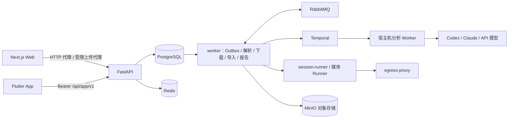

# 总体架构

下图描述当前实现。产品目标是个人工作站，当前进程数量和中间件不是未来设计的前置约束；后续简化必须同时覆盖任务持久化、取消、重启恢复与实际启动流程。

Temporal 与 RabbitMQ 按职责并存：Temporal 负责解析和 Skill 这两条分别需要取消与分步断点的编排，报告发布、下载、导入等一次性幂等任务与实时事件继续使用 RabbitMQ；同一业务只有一个执行所有者，迁入 Temporal 的链路删除对应旧消费者与重试调度。平台获取能力优先于编排迁移；具体职责与验收边界见[工作流与平台下载目标](15-工作流与平台下载目标.md)。

解析引擎重建统一见[设计 17](17-解析引擎重建.md)。Registry 声明阶梯、出口、identity 与 content_scope；PostgreSQL／Temporal／RabbitMQ 保持业务状态所有权。

- **前端**：Next.js standalone（8101），承担页面、安全头、普通 HTTP 代理与 `/storage-upload` 受限上传代理；WebSocket Upgrade 由部署入口直接交给 API。
- **API**：FastAPI（8111），负责认证授权、业务用例、状态与配额；HTTP 进程只提交、查询、取消，不执行长时间媒体或 AI 工作。
- **持久化**：PostgreSQL 是业务事实唯一来源，结构只由幂等的 `backend/sql/schema.sql` 维护（当前态，无迁移框架）；Redis 只保存限流计数、登录会话缓存与短期租约；MinIO 保存制品、上传 quarantine 与报告。
- **异步**：事务内写业务状态与 Outbox，由 worker 内的投递循环启动 Temporal 工作流或发布到 RabbitMQ；RabbitMQ 消费者使用租约、心跳、幂等键与死信队列，恢复依赖数据库而非内存。
- **部署**：根目录 `docker-compose.yml`／`docker-compose-prod.yml` 只启动业务容器，复用宿主机已有 PostgreSQL、RabbitMQ、Redis、MinIO；隔离的基础设施夹具仅用于 GitHub CI。按信任边界只保留三类应用进程：`api` 处理请求，`worker` 在一个进程内分别监督 Outbox 投递、解析与下载、导入和报告发布（单个循环失败只重启它自己），`session-runner` 执行不可信媒体处理。其余容器是隔离或外部依赖：`frontend`、`egress-proxy`（Runner 唯一出网）、`youtube-pot-provider`、`temporal`，以及一次性的 `migrate`、`temporal-schema`。Runner 只有一个实例；共享工作卷由镜像预建属主，不再需要初始化容器。AI 分析 Worker 是宿主机进程，不进入 Compose；身份来源是宿主 cookie-source 与普通 Chrome 扩展，Cookie 只进入 Runner 临时材料。

## 后端分层

`api → services → repositories → models` 为主依赖方向，`integrations` 承载外部系统适配，`workers` 承载消费与独立 Runner。业务规则就近放在 `services/<业务>/`；HTTP schema、ORM 模型、内部业务类型各自独立。详细目录规范见 PROJECT.md，架构测试强制根目录与依赖方向。

## 解析引擎

出口、证明、浏览器、身份、执行上下文及冷启动验收统一引用[设计 17](17-解析引擎重建.md)，不在本页复制实现阶段。
