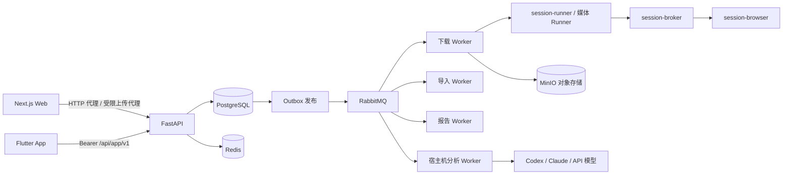

# 总体架构

- **前端**：Next.js standalone（8101），承担页面、安全头、普通 HTTP 代理与 `/storage-upload` 受限上传代理；WebSocket Upgrade 由部署入口直接交给 API。
- **API**：FastAPI（8111），负责认证授权、业务用例、状态与配额；HTTP 进程只提交、查询、取消，不执行长时间媒体或 AI 工作。
- **持久化**：PostgreSQL 是业务事实唯一来源，结构只由幂等的 `backend/sql/schema.sql` 维护（当前态，无迁移框架）；Redis 只保存限流计数、登录会话缓存与短期租约；MinIO 保存制品、上传 quarantine 与报告。
- **异步**：事务内写业务状态与 Outbox，独立 Outbox 进程发布到 RabbitMQ；Worker 使用租约、心跳、幂等键与死信队列，恢复依赖数据库而非内存。
- **部署**：根目录 `docker-compose.yml`／`docker-compose-prod.yml` 只启动业务容器，复用宿主机已有 PostgreSQL、RabbitMQ、Redis、MinIO；隔离的基础设施夹具仅用于 GitHub CI。标准角色：`frontend`、`api`、`outbox`、`worker-download`、`worker-import`、`worker-report`、`provider-canary`、`egress-proxy`、`provider-lease-redis`、`session-broker`、`session-browser`、`session-runner`、`youtube-pot-provider`。AI 分析 Worker 是可信宿主机进程，不进入 Compose。

## 后端分层

`api → services → repositories → models` 为主依赖方向，`integrations` 承载外部系统适配，`workers` 承载消费与独立 Runner。业务规则就近放在 `services/<业务>/`；HTTP schema、ORM 模型、内部业务类型各自独立。详细目录规范见 PROJECT.md，架构测试强制根目录与依赖方向。
