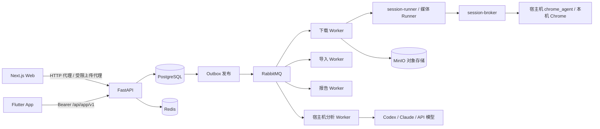

# 总体架构

下图描述当前实现。产品目标是个人工作站，当前进程数量和中间件不是未来设计的前置约束；后续简化必须同时覆盖任务持久化、取消、重启恢复与实际启动流程。本轮先收敛平台会话职责，不宣称整体部署已完成简化。

Temporal 与 RabbitMQ 按职责并存：Temporal 负责解析和 Skill 这两条需要持久等待与分步断点的编排，下载、导入等一次性幂等任务与实时事件继续使用 RabbitMQ；同一业务只有一个执行所有者，迁入 Temporal 的链路删除对应旧消费者与重试调度。平台获取能力优先于编排迁移；具体目标、未实施边界和替换顺序见[工作流与平台下载目标](15-工作流与平台下载目标.md)。

- **前端**：Next.js standalone（8101），承担页面、安全头、普通 HTTP 代理与 `/storage-upload` 受限上传代理；WebSocket Upgrade 由部署入口直接交给 API。
- **API**：FastAPI（8111），负责认证授权、业务用例、状态与配额；HTTP 进程只提交、查询、取消，不执行长时间媒体或 AI 工作。
- **持久化**：PostgreSQL 是业务事实唯一来源，结构只由幂等的 `backend/sql/schema.sql` 维护（当前态，无迁移框架）；Redis 只保存限流计数、登录会话缓存与短期租约；MinIO 保存制品、上传 quarantine 与报告。
- **异步**：事务内写业务状态与 Outbox，独立 Outbox 进程发布到 RabbitMQ；Worker 使用租约、心跳、幂等键与死信队列，恢复依赖数据库而非内存。
- **部署**：根目录 `docker-compose.yml`／`docker-compose-prod.yml` 只启动业务容器，复用宿主机已有 PostgreSQL、RabbitMQ、Redis、MinIO；隔离的基础设施夹具仅用于 GitHub CI。标准角色：`frontend`、`api`、`outbox`、`worker-download`、`worker-import`、`worker-report`、`provider-canary`、`egress-proxy`、`provider-lease-redis`、`migrate`（一次性应用 schema）、`session-broker`、`session-runner`、`youtube-pot-provider`。AI 分析 Worker 与 Chrome 登录态服务 `chrome_agent` 是可信宿主机进程，不进入 Compose。

## 平台会话职责

平台会话只有按需状态查询和单次租约两种操作：宿主机提供来源，broker 做无状态中继，Runner 在操作期间使用并清理临时材料。broker 不维护后台扫描、预热或会话副本；Runner 不回传无人消费的 Cookie 轮换和失败报告。平台故障由实际操作的错误返回，不能在业务操作成功后再增加一条上报成功的依赖。具体边界见[平台会话](08-平台会话.md)。

## 后端分层

`api → services → repositories → models` 为主依赖方向，`integrations` 承载外部系统适配，`workers` 承载消费与独立 Runner。业务规则就近放在 `services/<业务>/`；HTTP schema、ORM 模型、内部业务类型各自独立。详细目录规范见 PROJECT.md，架构测试强制根目录与依赖方向。
