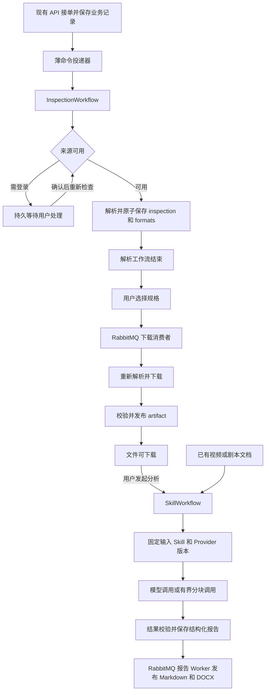

# 个人工作站的工作流与平台下载目标

本文区分当前实现与迁移目标。解析与 Skill 分析已分别由 InspectionWorkflow、SkillWorkflow 在持久化 Temporal Server 上调度；报告发布、下载与导入按职责保留在 RabbitMQ；专用持久浏览器来源已接入。浏览器扩展与 Native Messaging 桥接方案已否决。平台范围以已登记的 23 个 Profile 为本轮基线；登记和固定样本存在不代表下载已验收。

## 决策与优先级

Temporal 与 RabbitMQ 按职责长期并存，不以清退 RabbitMQ 为目标。Temporal 只编排需要持久等待或分步断点的两条链：解析（登录等待、可靠取消）和 Skill 调用（分块断点、计费不确定保护）；报告发布、下载、导入这类“投递一次、幂等执行”的任务继续由 RabbitMQ 消费者配合租约、心跳与 DLQ 执行，实时事件 fan-out 也保留在 RabbitMQ。同一业务只能有一个执行所有者；需要 Temporal 的命令由 Outbox 直接启动 Workflow，不经 RabbitMQ 中转再启动。采用 Python Temporal SDK；先验证一条公开路线与一条会话路线，再分段迁移，不等待全部平台完成才开始。Temporal 解决任务恢复、等待、取消和步骤重试；提取器、合法内容来源、登录态、页面上下文与媒体完整性仍由平台适配器负责。不能用工作流完成状态替代真实文件，也不能承诺任意平台的任意视频永远可下载。

实施顺序为运行底座、解析、Skill 分析、对应旧调度清退；每阶段有独立验收与回退边界。当前已删除解析的 RabbitMQ consumer 分支、消息适配、数据库租约心跳与 sweeper；接单／取消继续使用原 Outbox，业务库保留原子结果提交和迟到结果拦截。Skill 分析已删除 RabbitMQ 分析队列、消费者、消息适配和恢复扫描（排队重投、租约回收、到期重试重投），宿主 AI Worker 不再连接 RabbitMQ。报告发布原计划并入 SkillWorkflow，实施时确认它已与模型调用解耦（结果先原子入库，再由报告 Worker 以确定对象 key 幂等上传，失败不重调模型），迁移没有额外收益，因此保留 RabbitMQ。Provider 冻结与整体冷启动仍待实施，不把单段迁移视为全部完成。

## 媒体重设计的收敛决策

本节取代增加本地执行数据库的提议。保留现有 Python、FastAPI、Pydantic、Playwright browser 依赖组、yt-dlp／可信插件、FFmpeg 和业务基础设施；不新增 SQLite、文件任务账本、通用 Agent 框架、多引擎竞速或自动备用解析服务。AI Key、模型调度及报告持久化不随媒体改造迁移。

只保留实际需要的模式：

| 模式 | 当前落点与目的 | 不增加的结构 |
| --- | --- | --- |
| Registry + 声明式配置 | `ProviderProfile` 汇集访问策略、URL、能力、账号要求与引擎参数；启动时校验冲突 | 第二份公开平台集合、独立站点声明表、动态插件市场 |
| Strategy | URL 归一化、运行参数和错误规则用函数表达；账号条件组合进 Profile | 每个平台一套 Service／Repository、嵌套继承 |
| Adapter | 固定版本 yt-dlp 与可信插件把上游差异转换成现有媒体类型 | 平行 DTO、每个平台不同业务 API |
| 公共 Pipeline | 复用识别、准入、上下文固定、解析、选择、下载与校验顺序 | 每个平台一个 Workflow、通用流程 DSL 或可任意执行的步骤图 |

第一段已实现 Registry 策略收敛：删除固定公开集合和平行账号策略表；API、Runner、状态、探针共用平台声明；默认 23 平台原执行范围保持不变。后续按真实样本逐个启用同平台的不同能力，不能因为提取器声明支持匿名就直接变更产品访问路线。

### 状态与重启职责（目标，尚未接通）

- PostgreSQL 保存任务状态、业务尝试、稳定 operation ID、generation／fence、截止时间和已接受产物引用；沿用现有表与 Repository，只有缺少且必要的字段才扩展 `schema.sql`。
- Temporal 保存解析的等待和重试；RabbitMQ 下载消费者继续使用现有租约／心跳。采集进程不直接访问数据库、不调度业务重试。
- 采集进程只管理当前子进程、Profile 锁和请求去重内存。每次启动生成新的 runtime instance ID，Worker 的执行请求绑定该 ID 与已有业务 fence；旧实例的迟到请求不能在新实例启动任务。
- 进程重启不等于任务可以重发：先确认旧进程组已终止、旧租约不能再执行或提交，再由原业务所有者开启尝试；无法证明旧执行结束时保持结果不明，不能声称恰好执行一次。
- 已由业务库接受的产物引用可重新核对磁盘文件与摘要后交付；尚未登记或无法确认的文件只作为有界孤儿文件清理，文件存在不决定任务成功。磁盘上的浏览器 Profile 和媒体文件不承担任务账本职责。
- 现有 HMAC、超时、取消、进程监督、配额和文件验证优先复用。仅在跨宿主传输确有需要时演进产物接口，不预建通用远程控制框架、配对平台和证书管理系统。自有路径、类与模块直接按职责命名，例如 `/internal/inspect`、`/internal/download`，不引入代际前缀或平行兼容实现。

### 实施顺序与当前落点

专用浏览器与等待／恢复已接通。受控实测中，macOS 外层网络沙箱导致 Chromium 内层沙箱初始化失败，因此媒体执行保留在既有容器；继续复用共享制品卷，不引入宿主文件传输协议。来源直接密封到 Runner，中继仅作签名转发。其余状态重启和真实平台验收目标仍按下述顺序完成。

1. 验证专用持久浏览器的真实登录、平台可用性与宿主进程／强制出网隔离；复用现有 Playwright，不通过复制日常 Chrome 数据库实现。
2. 将既有媒体执行器接入采集运行时，公开内容不启动账号浏览器；连接 Worker 文件交付，验收取消、断连和重启。
3. 接入来源 generation、原任务用户等待／恢复，替换旧来源；同时删除 Chrome 数据库读取、中继、旧部署参数及失效测试，不保留双份实现。
4. 逐平台完成 metadata、完整文件与生命周期验证；23 平台全部保留验收项，真实未通过不得标记完成。

每段是独立可验证的提交；只删除已有替代调用方并完成验证的执行链，不能先删除生产入口再留下尚未接通的接口骨架。

## 平台适配器是下载能力的边界

沿用并收敛现有 Provider Registry，避免另建一个同职责注册中心。每个平台的声明应包含：可接受 URL／内容类型、批准的访问模式、凭据要求、获取方式、结果验证器、版本和验收样本。

| 契约 | 结果与约束 |
| --- | --- |
| `recognize(input_ref)` | 规范化平台、内容身份、媒体类型；解析分享短链也必须执行逐跳 URL 与出口校验 |
| `inspect(source_ref, access_ref)` | 返回明确的访问结论和语义格式清单；无凭据、内容不存在、暂时故障与适配器漂移分别报告 |
| `download(source_ref, selection, access_ref, operation_id)` | 下载前重新解析短期地址，核对内容身份、账号来源和所选规格；输出临时制品引用，不返回原始 Cookie／签名媒体 URL |
| `validate(artifact_ref, expectation)` | 校验完整时长、流、大小、容器、可解码性和内容身份；缺少可证实的完整性预期时不宣称完整下载 |

获取方式在平台声明中确定：优先正式下载／导出接口；有明确支持的公开或授权媒体使用固定版本 yt-dlp 与可信插件；确实依赖页面上下文的，另做经验证的平台适配器。浏览器中能够播放不等于提取器可以下载，Cookie 也不包含平台所需的所有状态。不给 AI 自动执行任意脚本或猜测下载地址的权限。

当前固定公开与登录路线在迁移前保持原行为。目标允许同一平台声明经过分别验收的公开／账号能力，但必须在执行前根据内容与用户意图选择并固定；失败不能静默切换账号、出口或访问模式。通用提取器只处理已经批准的域与内容，不作为未知站点的无限兜底。

## 本轮平台覆盖与验证重点

下表根据当前 Registry、访问策略和固定诊断样本整理；所有 23 个平台都登记了 metadata／media 样本，但这些是覆盖清单，不代表 Temporal 已接管或全部下载成功。本规划不新增真实平台验收证据。平台当前可用性必须在目标机器、当前版本与实际账号环境重新确认。

| 平台 | 当前路线 | 首要验证点 |
| --- | --- | --- |
| 哔哩哔哩 | 公开 | 音视频合并、时长、短链及试看识别；账号画质属于未来独立能力 |
| TikTok、快手、微博 | 公开 | 官方分享地址与短链、作品身份、公开媒体地址有效期 |
| Vimeo、Twitch、Kick | 公开 | 单视频／回放范围、分片完整性；不扩展直播录制 |
| Snapchat Spotlight、LinkedIn、Telegram、Tumblr、红果短剧官方分享 | 公开 | 单条已支持内容、合法重定向、媒体类型与完整时长；不扩展频道或整剧批量抓取 |
| YouTube | 登录 | 会话可读、客户端／EJS／PO Token 版本组合、真实音视频流与出口一致性；Token 不是账号或出口挑战的通用修复 |
| 抖音、小红书 | 登录 | 账号身份、会话失效与平台验证区分、单视频格式及原始时长 |
| X、Instagram、Facebook、Reddit、Pinterest | 登录 | 每个平台自己的凭据与内容准入规则；逐平台验证重启后的完整媒体 |
| 微信视频号 | 登录，当前经元宝接入 | 单独验证内容身份映射、页面依赖和未加密媒体结果；当前代码接入不能视为稳定官方导出承诺 |
| 腾讯视频、优酷 | 个人账号路线 | 完整非 DRM 单视频、试看与正片区分；没有通过真实文件验收前保持实验状态 |

Peertube 实例白名单、Generic 和已明确退出的平台不计入这 23 个平台；若扩展范围，必须单独满足相同契约和证据要求。

下载验收与 AI 分析验收分开。平台状态至少区分“已接入、来源待处理、样本下载通过、当前失败”；不能要求 AI 分析成功才显示一个下载能力，也不能让分析失败撤销已有下载成功。

## 凭据来源和持久化

三类材料分别管理，不再把所有 Secret 当作同一种会话：

| 材料 | 唯一持久来源 | 使用与恢复 |
| --- | --- | --- |
| 平台登录态 | 平台专用持久浏览器 Profile | 通过已锁定 Playwright 受支持接口按需使用；不复制日常 Chrome，不另建 Cookie 数据库 |
| AI API Key／现有配置密钥 | 沿用现有记录绑定加密字段与类型化环境配置 | 不随媒体改造迁移；普通 API、采集进程与日志不得取得明文 |
| 本应用安装身份与通信密钥 | 沿用现有稳定配置来源 | 重启只读取，禁止因读失败自动生成新密钥覆盖旧身份；不预建跨设备配对服务 |

当前账号来源使用平台专用持久浏览器；日常 Chrome 数据库读取已删除，需要用户在专用浏览器首次登录。已有 AI 加密字段和密钥不变；已有数据但根密钥缺失时进入明确恢复状态，不能伪装成新安装。

验证必须由实际提供凭据的运行进程执行，覆盖首次登录、重复使用、重启和会话失效；终端能读取 Cookie 或健康接口可用不能替代实际解析和下载。专用浏览器与原任务恢复已接入，真实平台可用性仍需逐项验收。

用 `source_id + generation` 标识绑定的来源：切换 Profile 或不能确认账号连续性时改变 generation 并要求重新解析。普通 Cookie 轮换不必等同于账号变化；需要账号隔离的平台通过其批准的身份检查确认同一主体，无法确认时保守失效。现有固定 `seed_revision=1` 不能承担这一职责。

不在后台运行 Cookie 保活任务。每次操作保持所需的 User-Agent、客户端和出口一致；需要浏览器特定状态的平台不能仅靠复制 Cookie 宣称兼容。等待用户期间不持有临时材料、下载进程或账号执行锁。

## 当前链路与迁移边界

下表同时记录已迁移边界和后续拆分对象：

| 现有实现 | 当前职责 | Temporal 迁移方式 |
| --- | --- | --- |
| `workers/download/workflows.py`、`activities.py`、`repositories/downloads/intent_repository.py` | 已迁移解析调度；原 `IntentExecution` 已删除 | Temporal 管理重试和取消；Repository 保留接单、权限、执行代和 inspection 原子提交 |
| `services/download_execution/service.py`、`monitor.py`、`transitions.py` | 下载执行、租约监控、恢复与文件发布 | 不迁移，保留 RabbitMQ 消费、租约与 DLQ；保留 Runner 重解析、文件校验和制品发布语义 |
| `workers/analysis/workflows.py`、`activities.py`、`services/analysis_execution/` | 已迁移分析调度；输入准备、模型调用、校验与结果入库 | 每个 Activity 是运行的一次业务尝试；模型调用经步骤日志执行，替补 Activity 接管同一运行时不重复调用 |
| `screenplay_executor.py`、`screenplay_rewrite_executor.py` | 长剧本分块分析／汇总、词表／分块改写 | 每个真实模型请求是一个步骤日志单元，块结果独立保存；保留已有场景边界和字数预算 |
| `workers/report/publisher.py`、`repositories/analysis/repository_publish.py` | 结构化报告入库、Markdown/DOCX 异步发布 | 不迁移，保留 RabbitMQ；结果入库与导出已解耦，发布失败不重调模型 |
| `workers/*/consumer.py`、`sweeper.py`、`integrations/messaging/` | RabbitMQ 消费、投递恢复与租约扫描 | 已删除解析、分析部分；报告、下载、导入、DLQ 与实时事件保留；禁止同一任务由两套调度执行 |

`services/analysis/skills/`、AI API／CLI 适配器、平台 Registry、Runner、结果解析器、对象存储、业务 Repository 都是复用对象。Skill 是受信版本化指令与结果契约，不是一个新的 Agent 进程。无需每个 Skill、平台或模型各写一套 Workflow。

## 两个工作流与返回契约

| Workflow | 稳定标识 | Activity 边界与返回 |
| --- | --- | --- |
| `InspectionWorkflow` | `inspect/<intent_id>/<generation>` | 来源检查、解析并提交；返回 `inspection_id`，不返回签名媒体地址 |
| `SkillWorkflow` | `skill/<analysis_id>/<run_no>` | 每个 `run_skill` Activity 执行一次业务尝试：模型步骤、校验并原子保存报告；返回运行状态（`publishing`／`failed`／`cancelled` 等）与重试时间，不返回模型输出 |

这是目标内部契约；HTTP 仍以现有业务 ID 和生成 OpenAPI 查询，不向产品用户暴露 Temporal Run ID。现有 `analysis_runs.id` 是业务运行 ID，与 Temporal 自己的 Run ID 分开保存。

解析到 `ready` 即结束 Workflow。用户选择格式由现有 inspection 有效期和交接事务管理，不创建一直等待点击的父工作流。inspection 过期或来源变化时，对同一意图开启新 generation 重解析；不得默默替换规格或下载账号。下载和分析相互独立，删除／取消一个分析不会撤销成功的视频制品。

微信公众号多候选发现沿用现有候选选择接口，选定内容后才进入解析，不在本期另建通用抓取工作流。本地视频／剧本文档导入仍由已有链路完成，成功制品同样可进入 SkillWorkflow。

## Skill 执行与断点

当前实现以 `analysis_runs` 为业务运行，Workflow 只携带 `job_id / run_id / run_no`：

- **业务尝试**：`run_skill` 通过 `claim_run` 绑定运行；排队或到期重试开启新尝试（计入 `max_attempts`），可重试失败写入 `retry_wait` 与 `retry_at`，由 Workflow 持久计时器等待后再执行下一次 Activity，不再有数据库扫描重投。
- **替补接管**：Activity 心跳 30 秒失联或进程退出后，Temporal 以替补 Activity 接管同一运行，沿用原尝试次数，并以新的 `lease_owner` 拒绝旧执行者迟到写入。Activity 自身最多 3 次；耗尽后 `finish_skill` 只关闭运行，不调用模型。
- **步骤日志**：每次模型调用对应 `analysis_step_results` 中唯一的 `run_id + step_key`（`video`、`screenplay`、`chunk-NNN`、`synthesis`、`glossary-NNN`、`rewrite-NNN`）。调用前写入 `started`，结果通过严格解析后写入 `succeeded`；恢复时同输入摘要（不含工作目录路径）的已完成步骤直接复用，长剧本块间重启不重跑。模型返回错误或解析失败证明调用结果已知，删除该行后按原分类重试。
- **结果未知**：发现遗留 `started` 行说明调用可能已发出却没有结果，运行以 `analysis_outcome_unknown` 终止且不可自动重试，用户明确重新分析会产生新的 `run_no` 并提示可能重复计费。
- **保留期**：报告保存进入 `publishing`，或运行失败、取消、删除后清除该运行的步骤日志；步骤内容只在运行期间存在于业务库，不进入 Temporal History 和普通日志。

仍待实施的目标：

- 首次尝试固定 Provider Profile／配置版本并在恢复时校验；目前每次尝试读取当前活动 Provider，已完成步骤按输入摘要复用。
- 模型返回的超时、CLI 失败、无效输出仍按原有分类自动重试；按“不确定计费不自动重调”收紧超时类错误需单独确认。
- 供应商幂等键／结果查询、基于冻结计划的剧本分块预算与跨尝试总调用次数上限。

API 型分析可复用已保存证据；CLI 型分析仍在受限工作区中使用既有媒体工具，不强行改为逐帧工作流。工作目录每次尝试可重建，不作为断点。

结构化结果与导出文件状态分开展示：报告正文可读、导出失败时显示“导出待恢复”，不得显示模型分析失败或重新计费。导出由 RabbitMQ 报告 Worker 按报告版本幂等发布与恢复，失败只重试导出。

## 执行、业务记录与幂等

Temporal 拥有执行调度、计时器和重试状态；PostgreSQL 拥有授权、输入快照、业务运行、制品、报告及展示投影。数据库保留业务约束，不再通过后台扫描独立决定重跑已迁移的任务。

1. API 在一个事务中写业务记录、配额和待投递命令；提交后返回 `202`。继续使用现有 Outbox 存储并改造投递目标，不同时建立第二套持久投递系统。
2. 薄 dispatcher 以确定 Workflow ID 启动；启动成功但确认丢失时查询相同 ID 并核对业务绑定，不生成随机 ID。运行中 ID 冲突选择 `FAIL`，已关闭 ID 选择 `REJECT_DUPLICATE`；捕获已启动结果后核对业务绑定并确认原命令，而不是重跑。Temporal History 超过保留期后也由数据库唯一约束防止重复提交复活旧任务。
3. 已完成 Activity 被 replay 时复用其记录结果；尚未确认完成的 Activity 可能再次执行。制品／报告发布保持唯一约束与幂等写入，不能把 Workflow 去重误当成外部副作用恰好一次。
4. 保留执行代、版本 CAS 和必要的操作 fence。Activity 超时不代表旧外部进程已经终止；迟到结果、取消后的上传和旧版本投影必须拒绝。删除旧“任务租约调度”不等于删除 Runner 操作期限、账号互斥或文件保留锁。
5. 关键阶段由 Activity 提交业务投影，写失败时重试同一幂等提交。少量对账仅修复投影／未确认命令，不能重新调用平台或模型；页面读取 PG，不依赖 Worker 在线处理 Query。

模型调用设置更严格的规则：调用前持久记录步骤与请求身份，完成后先保存结果，再回复 Temporal。供应商支持幂等键／结果查询才自动按其契约恢复。已发出请求但没有可信结果，或者崩溃后无法确定是否发出时，标为 `outcome_unknown`；首次版本模型 Activity `maximum_attempts=1`，通过只读结果核对恢复，不能因超时自动发起第二次计费。允许自动重试的 429 等情形必须能证明未产生业务执行。新的人工重跑明确提示可能重复费用。

这意味着 Temporal 主要消除“程序忘了走到哪一步”的问题；平台风控、无权限下载、密钥丢失和不可对账的模型收费仍需各自解决。

## 超时、等待与取消

解析的原任务等待／恢复现已接通：账号来源缺失、失效或暂不可读进入 `action_required`，释放 Activity、进程和账号锁。`/api/download-intents/{intent_id}/resume` 绑定本次 `authorization_id`，经业务事务与 Outbox 投递 Workflow Update；重复提交只接受一次，旧等待 ID 不得恢复新的等待。等待不消耗 180 秒执行预算，24 小时总等待期限不因再次等待延长。前端提供继续／取消，并能从历史记录恢复原任务。此处是代码与受控集成验证状态，真实平台登录仍需在来源替换后验收。

以下是实施起点，需在阶段验收中测量；所有步骤受业务总预算约束，不能靠多次 Activity 重试扩大原限额。

| 操作 | 初始策略 |
| --- | --- |
| 解析 | 沿用有效执行预算 180 秒、最多 3 次；每次调用不超过剩余预算，保留总队列截止语义；因新引入登录等待而暂停／恢复的预算必须显式区分 |
| 等待登录／授权 | `workflow.wait_condition` 配合持久计时器，默认最多 24 小时；释放 Activity、进程、Cookie 与账号执行锁，超时后用户显式重新运行 |
| 下载（RabbitMQ 链路，不属于 Temporal） | 沿用现有最大 7,200 秒与文件大小上限；可确认可恢复的传输故障才重试，剩余预算累计扣除 |
| 模型调用 | 沿用当前配置默认 900 秒；长剧本所有块和汇总共享运行预算，次数与费用单独约束，不给每块重新分配无限总预算 |
| 短 DB／存储提交 | 显式 `start_to_close` 和累计 `schedule_to_close`；有界重试，预算耗尽保留可诊断状态 |
| 长 Activity | 约每 5 秒 heartbeat，初始 heartbeat timeout 30 秒；另保留业务无进展时限和子进程硬期限 |

暂时故障、429 按剩余预算与 Retry-After 退避；缺登录、凭据失效进入待处理；删除、不支持、DRM 或完整性不可证明等明确终态不重试。平台挑战不循环换账号、换出口。HTTP／LLM 客户端关闭同级整请求自动重试；下载器必要的分片重试保留并计入总预算。

恢复命令经过 API 鉴权并持久入 Outbox，再投递带稳定 command ID 的 Workflow Update。Update 只确认接收恢复请求，随后 Activity 重新验证来源；不把前端“我已登录”视为就绪证明。Worker 离线时命令留在待投递，UI 不长时间阻塞 HTTP。首期不增加通用 Signal 总线或 token 流式协议。

取消先在业务事务置取消标记、递增 fence 并记录取消命令，然后发送 Temporal cancellation。Activity 用显式等待清理完成的取消策略传播到 Runner／CLI 进程组，有限等待后强制终止。网络分区或强杀时由本地操作期限与启动残留清理兜底，无法确认停止时标识“取消处理中”，不直接宣称已释放全部资源。清理有单独短时限，不能无限阻塞取消。

## 适合个人工作站的拓扑

采用自托管单节点 Temporal Server，复用已有 PostgreSQL 实例，分离 `temporal` 与 `temporal_visibility` 数据库和账号。使用官方 schema 工具随固定 Server 版本升级；项目 `schema.sql` 仍只管理业务库。单节点目标是故障恢复，不是高可用承诺；宿主机停机期间任务暂停，恢复后继续。稳定部署不采用 `temporal server start-dev`，该命令只用于测试。正式服务使用官方 Server 镜像，不新增 Elasticsearch、Kubernetes 或云账号。

| 进程／队列 | 职责与初始并发 |
| --- | --- |
| 现有 FastAPI 与 Outbox | 接单、查询、权限、业务事务；Outbox 按事件类型路由：解析／Skill 命令直接启动或取消 Workflow，其余事件发布到 RabbitMQ，跨进程 claim 防重 |
| 一个媒体 Worker 进程 | 承载 `ff-inspect`（解析 Activity 2 槽）SDK Worker，同时保留 RabbitMQ 下载消费者；长下载不占满解析槽 |
| 一个宿主 Skill Worker 进程 | `ff-skill`，Activity 串行 1 槽，含模型步骤与结果校验；不连接 RabbitMQ；保留宿主 Codex／Claude 登录环境 |
| 原有隔离 Runner、来源组件、egress | 保留现有平台与凭据隔离，Temporal Worker 发起执行，Runner 不接触业务库和 AI 凭据 |
| Temporal Server 与可选 Web UI | 负责持久调度和排障；本机限制网络访问，UI 按需启动，不作为产品页面或凭据管理界面 |

两个 Task Queue 是逻辑队列，不是新服务。首期固定单实例槽位是容量方案；若将来扩容 Worker，应重新验证全局／站点并发，不能认为每 Worker 限额就是全局限额。保留现有必要账号互斥，避免只靠队列划分改变会话并发行为。

宿主 Skill Worker 不因某一个 Provider 未登录而退出：启动只检查必要运行资源，每次任务再读取被冻结的 Provider 配置，失败给对应任务待处理状态。Temporal 未就绪时仍可查看历史、报告和已有文件；接单只在业务数据库和有界积压配额允许时返回排队，不能伪报已执行。首次安装、缺少已有根密钥和普通重启分别处理；本规划不引入浏览器桥接。

部署验收须包含稳定密钥、已有数据库备份／恢复和磁盘空间策略。Temporal History 是含业务元数据的持久数据，保留时间先设 7 天；PG 业务报告长期保存策略独立。删除业务输入后，History 中不得残留可读取原内容的签名凭据。

## 代码落点与删减清单

遵循 PROJECT.md 的现有层次，不新增 `workflow_engine`、通用 DAG、万能 Job／DTO 或第二套 Skill Registry。

- `workers/download/workflows.py`、`activities.py`：解析 Workflow 与 Activity；`main.py` 同时注册解析 SDK Worker 与 RabbitMQ 下载消费者。
- `workers/analysis/workflows.py`、`activities.py`：SkillWorkflow 与运行／收尾 Activity；原 `screenplay_*` 中纯分块、合并、校验逻辑继续复用，模型调用经 `AnalysisLeaseMonitor.step` 写步骤日志。
- `integrations/temporal_client.py`：连接与命令投递适配；类型化配置仍放 `core/config.py`，生命周期装配进入现有 `core`。
- `repositories/downloads`、`repositories/analysis`：接单、快照、步骤完成、发布和状态投影。对长剧本新增必要的 `analysis_step_results` 持久记录，唯一键为运行＋步骤；不复刻 Temporal 全部事件或 attempt 日志。
- 业务表保存 Workflow 绑定、执行代与取消版本；新增列、索引和约束统一落到 `backend/sql/schema.sql`。对外 API 变化按既有 OpenAPI 生成链同步。

| 可以清退 | 清退条件 |
| --- | --- |
| 已迁移解析／分析的 RabbitMQ consumer、message 适配和绑定 | 旧队列排空，新投递只到 Temporal；同类任务恢复、取消和迟到结果验收通过 |
| 上述链路对应的 sweeper、DB 任务租约心跳、重试时间调度、DLQ 重放入口 | Temporal 已成为该链路唯一执行所有者；下载／导入的同类机制保留；保留业务 CAS、清理及必要的操作互斥 |

不清退：RabbitMQ 依赖与服务配置、下载／导入／报告消费者与报告 Worker、DLQ 重放、实时事件 fan-out 以及 Outbox 的 RabbitMQ 发布路径。它们是长期保留的职责，不是待迁移的遗留代码。

Redis 的限流、账号互斥等职责独立于 Temporal，在有明确替代前保留。取消／失联进程清理、文件回收、媒体完整性和权限检查不是冗余调度，不能一并删除。

## 分阶段实施与验收

| 阶段 | 独立交付 | 必须通过的门禁 |
| --- | --- | --- |
| 0：运行底座 | 固定 SDK／Server 版本，持久存储、稳定配置、薄投递与业务绑定；先用受控 Activity 验证 | Server／Worker 重启恢复；接单后进程退出不丢任务；启动确认丢失不重复执行；数据库恢复演练；API 历史读取不依赖 Temporal 在线 |
| 1：链接解析 | 将 download intent 调度切至 InspectionWorkflow，保留现有 inspection／formats API | 公开样本和会话样本；重复接单、解析取消、来源失效、等待登录跨重启、格式过期刷新；agent-browser 真实页面显示结果 |
| 2：Skill 分析 | 视频、剧本分析、剧本改写三个模式共用 SkillWorkflow 与步骤日志 | 每个模式至少一个真实模型结果；块间重启不重跑已保存步骤；中断调用不自动重调；Provider／Skill 变更不改变在途计划（Provider 冻结待实施） |
| 3：清退与冷启动 | 删除已替代的分析 consumer、sweeper 与队列，收敛配置和启动入口 | 已有任务排空记录、全量技术检查、桌面与390px页面验证；冷启动后真实解析（Temporal）→下载（RabbitMQ）→Skill（Temporal）→报告（RabbitMQ）闭环 |

每次切换以一种业务为单位：暂停该类新接单，排空或明确取消旧执行，确认唯一执行者后切换，不长期保留双引擎开关。发现故障时先停止新接单、排空／取消新引擎任务再回退，禁止让旧消费者接管同一在途 Temporal 操作。数据库中的历史业务记录和成功制品保留，不通过删库回退。

升级默认采用暂停接单并排空后发布，适合个人工作站；等待授权的运行无法排空时必须保持兼容定义或使用显式 Workflow 类型版本／patch，并运行脱敏 History replay。暂不引入复杂 Worker Versioning 发布体系、Child Workflow 树、Nexus、多租户公平队列、Continue-As-New 或公共预览流式组件。

## 测试与完成标准

- 单元／Workflow 测试：纯规则、Activity 幂等、Update 去重、取消、错误分类、预算；涉及长等待使用时间快进，覆盖所有入口的 sandbox 导入与历史 replay。
- 真实集成：已有 PostgreSQL／对象存储＋测试 Temporal，主动制造进程退出、RPC 回执丢失、写成功回执失败、旧 Activity 迟到、账号失效和模型结果未知。持久恢复必须重启真实 Server 验证，时间快进或 mock 不替代它。
- 产品验收：使用 agent-browser 独立测试账户，从解析、规格选择、下载、Skill 选择到结构化报告和导出文件；桌面／390px、正常路径与一个可恢复失败路径。真实模型调用遵守当前明确的费用与服务授权；不足则保留未验收，不用 fixture 冒充。
- 隐私与资源：History、异常、Update、heartbeat、Search Attributes 只有 ID／状态／版本，不含 Cookie、Key、原 URL、签名地址、媒体、完整 Prompt 或原始输出。验证取消后无进程／临时凭据残留，暂存结果和失联工作目录有界回收。
- 提交检查：后端 Ruff／mypy／pytest，前端 format／lint／tests／build；接口变化运行 OpenAPI 检查，部署变化验证两套 Compose、业务镜像和同提交 CI。

阶段 0～3 和真实闭环通过才可称本次 Temporal 迁移完成。平台登记数量、健康检查、受控模型或 CI 均不等于“全部平台可下载”；每个平台仍需要各自实际账号、目标内容和最终文件证据。

## 官方依据

本文的拓扑、并发、预算和迁移顺序是面向个人工作站的工程选择，以下仅支撑 Temporal 机制，不代表产品验收：

- [Python SDK](https://github.com/temporalio/sdk-python)：Workflow／Activity、sandbox、heartbeat、取消与 replay。
- [消息交互](https://docs.temporal.io/develop/python/workflows/message-passing)：Query 只读、Update 接收与返回、离线 Worker 影响。
- [Activity 执行与幂等](https://github.com/temporalio/documentation/blob/main/docs/encyclopedia/activities/activity-definition.mdx)：重试不能替代副作用幂等。
- [Python 测试](https://docs.temporal.io/develop/python/best-practices/testing-suite)：本地环境、时间快进和历史重放。
- [自托管部署](https://github.com/temporalio/documentation/blob/main/docs/production-deployment/self-hosted-guide/deployment.mdx)与[PostgreSQL Visibility](https://github.com/temporalio/documentation/blob/main/docs/production-deployment/self-hosted-guide/visibility/postgresql.mdx)：正式 Server 和持久存储。
