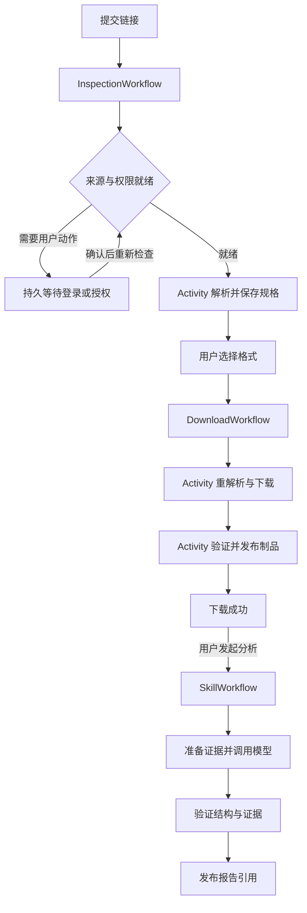

# 个人工作站的工作流与平台下载目标

本文是待实施的目标设计。当前运行链仍为 RabbitMQ／Worker／Runner；Temporal、浏览器扩展和新的凭据存储均未接入。平台范围以已登记的 23 个 Profile 为本轮基线；登记和固定样本存在不代表下载已验收。

## 决策与优先级

采用 Python Temporal SDK 编排解析、下载和 Skill 调用，但先完成平台获取能力。Temporal 解决任务恢复、等待、取消和步骤重试；提取器、合法内容来源、登录态、页面上下文与媒体完整性仍由平台适配器负责。不能用工作流完成状态替代真实文件，也不能承诺任意平台的任意视频永远可下载。

按依赖顺序交付：

1. 明确每个平台的内容范围与获取方式，选定可重复验证的真实样本，先直接验证适配器产出完整文件。
2. 解决凭据来源、失效恢复和账号切换；选一个固定公开平台与一个登录平台完成重启验证。
3. 将这两条已验证的解析／下载链交给 Temporal，验证中断、重试、取消与重复提交后再扩展其余平台。
4. 把 Skill 调用、结果验证与报告发布迁入独立工作流，随后移除已被替代的队列和恢复代码。

## 平台适配器是下载能力的边界

沿用并收敛现有 Provider Registry，避免另建一个同职责注册中心。每个平台的声明应包含：可接受 URL／内容类型、批准的访问模式、凭据要求、获取方式、结果验证器、版本和验收样本。

| 契约 | 结果与约束 |
| --- | --- |
| `recognize(input_ref)` | 规范化平台、内容身份、媒体类型；解析分享短链也必须执行逐跳 URL 与出口校验 |
| `inspect(source_ref, access_ref)` | 返回明确的访问结论和语义格式清单；无凭据、内容不存在、暂时故障与适配器漂移分别报告 |
| `download(source_ref, selection, access_ref, operation_id)` | 下载前重新解析短期地址，核对内容身份、账号来源和所选规格；输出临时制品引用，不返回原始 Cookie／签名媒体 URL |
| `validate(artifact_ref, expectation)` | 校验完整时长、流、大小、容器、可解码性和内容身份；缺少可证实的完整性预期时不宣称完整下载 |

获取方式在平台声明中确定：优先正式下载／导出接口；有明确支持的公开或授权媒体使用固定版本 yt-dlp 与可信插件；确实依赖页面上下文的，另做经验证的平台适配器。浏览器中能够播放不等于提取器可以下载，Cookie 也不包含平台所需的所有状态。不给 AI 自动执行任意脚本或猜测下载地址的权限。

当前固定公开与登录路线在迁移前保持原行为。目标允许同一平台声明经过分别验收的公开／账号能力，但必须在执行前根据内容与用户意图选择并固定；失败不能静默切换账号、出口或访问模式。通用提取器只处理已经批准的域与内容，不作为未知站点的无限兜底。

## 本轮平台覆盖与验证重点

下表根据当前 Registry、访问策略和固定诊断样本整理；所有 23 个平台都登记了 metadata／media 样本，但本轮没有执行真实下载，所以不提供未经验证的成功率。平台当前可用性必须在目标机器、当前版本与实际账号环境重新确认。

| 平台 | 当前路线 | 首要验证点 |
| --- | --- | --- |
| 哔哩哔哩 | 公开 | 音视频合并、时长、短链及试看识别；账号画质属于未来独立能力 |
| TikTok、快手、微博 | 公开 | 官方分享地址与短链、作品身份、公开媒体地址有效期 |
| Vimeo、Twitch、Kick | 公开 | 单视频／回放范围、分片完整性；不扩展直播录制 |
| Snapchat Spotlight、LinkedIn、Telegram、Tumblr、红果短剧官方分享 | 公开 | 单条已支持内容、合法重定向、媒体类型与完整时长；不扩展频道或整剧批量抓取 |
| YouTube | 登录 | 会话可读、客户端／EJS／PO Token 版本组合、真实音视频流与出口一致性；Token 不是账号或出口挑战的通用修复 |
| 抖音、小红书 | 登录 | 账号身份、会话失效与平台验证区分、单视频格式及原始时长 |
| X、Instagram、Facebook、Reddit、Pinterest | 登录 | 每个平台自己的凭据与内容准入规则；逐平台验证重启后的完整媒体 |
| 微信视频号 | 登录，当前经元宝接入 | 单独验证内容身份映射、页面依赖和未加密媒体结果；当前代码接入不能视为稳定官方导出承诺 |
| 腾讯视频、优酷 | 个人账号路线 | 完整非 DRM 单视频、试看与正片区分；没有通过真实文件验收前保持实验状态 |

Peertube 实例白名单、Generic 和已明确退出的平台不计入这 23 个平台；若扩展范围，必须单独满足相同契约和证据要求。

下载验收与 AI 分析验收分开。平台状态至少区分“已接入、来源待处理、样本下载通过、当前失败”；不能要求 AI 分析成功才显示一个下载能力，也不能让分析失败撤销已有下载成功。

## 凭据来源和持久化

三类材料分别管理，不再把所有 Secret 当作同一种会话：

| 材料 | 唯一持久来源 | 使用与恢复 |
| --- | --- | --- |
| 平台登录态 | 用户选定的浏览器 Profile | 通过浏览器受支持的接口按需取得；临时密封给 Runner，不再持久化 Cookie 副本 |
| AI／正式平台 API Key、OAuth refresh token | 本机 OS 凭据存储，业务库仅保存引用与版本 | 用户首次配置，只有批准的 Worker 按任务读取；OAuth 仅使用供应商正式刷新机制 |
| 本应用安装身份、加密根密钥及通道配对材料 | 稳定安装目录与 OS 凭据存储 | 安装时只创建一次；重启只读取，禁止因读失败或文件缺失自动生成新密钥覆盖旧身份 |

当前实现仍使用 Chrome 数据库读取与现有加密数据库字段；上述持久来源改变要有导出／迁移／恢复流程，不能直接删除旧密文。已有数据但根密钥缺失时进入明确恢复状态，不能伪装成新安装。

浏览器来源建议采用本项目扩展 + Native Messaging。这是工程判断：让浏览器提供 Cookie 数据，可以减少直接依赖 Cookie 数据库布局和 OS 解密细节的代码，但不保证通过站点风控。Chrome 官方要求 `cookies` 与指定站点 host 权限；分区 Cookie 需显式处理，不能扁平合并。参考 [Cookies API](https://developer.chrome.com/docs/extensions/reference/api/cookies)。

扩展仅申请用户启用站点的权限，固定扩展身份；Native host 校验扩展来源，消息包含请求 ID、站点、时限和有限大小，禁止网页任意命令。使用长连接并在断连后重新建立，不依赖扩展后台永远存活；浏览器关闭／权限撤销时进入待处理状态，不能从旧缓存伪造就绪。参考 [Native Messaging](https://developer.chrome.com/docs/extensions/develop/concepts/native-messaging)。安装扩展和首次平台登录仍需用户操作，无法合理承诺零人工干预。

用 `source_id + generation` 标识绑定的来源：切换 Profile、重新配对或不能确认账号连续性时改变 generation 并要求重新解析。普通 Cookie 轮换不必等同于账号变化；需要账号隔离的平台通过其批准的身份检查确认同一主体，无法确认时保守失效。现有固定 `seed_revision=1` 不能承担这一职责。

Cookie 的变更事件只用于失效缓存，不在后台运行保活任务。每次操作保持所需的 User-Agent、客户端和出口一致；需要浏览器特定状态的平台不能仅靠复制 Cookie 宣称兼容。等待用户期间不持有临时材料、下载进程或账号执行锁。

## Temporal 工作流

三个 Workflow 已足够，不为每个平台、每个 Skill 或每个 HTTP 请求创建一套工作流定义。平台差异放在适配器，Skill 差异放在受信目录和结果契约。

- Workflow 只编排确定性状态与计时；网络、数据库、浏览器、文件、FFmpeg 和 LLM 均在 Activity 中执行。采用独立 Workflow／Activity 模块，避免 replay 时产生外部副作用。
- 解析输出为 `inspection_id`，下载输出为 `artifact_id`，Skill 输出为 `report_version_id`。用户通过现有 API 查询业务结果，不依赖 Temporal Web UI。
- 登录恢复、选择格式与人工重试经鉴权 API 发起 Update，携带幂等命令 ID 与期望业务版本；返回接受结果，真正完成与否由任务状态表示。来源变化通知可用 Signal，但不能仅凭通知认定来源已验证。
- 等待使用 `workflow.wait_condition` 与有界计时器，不占用 Activity。默认建议解析有效执行预算仍为 180 秒／最多 3 次，用户处理窗口单独设置，例如 24 小时；过期后显式重试创建新执行代，不复用旧直链。
- 下载是独立 Workflow；后续 Skill 失败或取消不会修改下载成功和制品状态。

这些是项目目标决策；SDK 的 Workflow、Activity、重试与消息语义以 [Temporal Python SDK](https://github.com/temporalio/sdk-python) 为准。

## 结果、幂等与恢复

Temporal 保证可恢复编排，不保证外部副作用恰好执行一次。Activity 在执行成功但回执丢失时仍可能重试。

- Workflow ID 由持久业务 ID 与执行代派生，例如 `download/<job_id>/<generation>`；普通网络重试使用同一 ID，显式重新执行才产生新 generation。同一业务命令不能产生两个有效下载。
- API 事务保存业务请求和待启动命令；一个薄 dispatcher 用稳定 ID 幂等启动 Workflow。Temporal 暂不可达时保留 queued 并显示原因。保留这段事务投递保证，不能用“写数据库后顺手启动工作流”制造丢任务窗口。
- Temporal 是执行调度的事实来源，PostgreSQL 是用户、制品、报告与业务查询的事实来源；业务投影按版本幂等更新。投影修复只能重新同步状态，不能再次发起媒体下载。
- Activity 使用稳定 `operation_id` 查已完成结果，尝试目录独立。制品使用确定的目标标识、校验摘要和数据库唯一约束发布；完成标记与业务成功在事务中提交，失联重试先验证已有制品再决定是否重做。
- 长下载持续 heartbeat，只记录阶段、进度和临时操作引用。重试从已校验 checkpoint 恢复的前提是内容、规格、来源代和工作文件匹配；否则重新获取，不把部分文件当成成功。
- 取消须传播到 Runner 和整个媒体进程组，再清理临时凭据与文件；迟到结果通过业务状态版本拒绝发布。Worker 被强制终止时使用操作期限和启动清理处理残留，不能仅靠 `finally`。
- 进程存活不等于有效进展：解析、下载与模型调用分别设单次、累计和无进展时限；heartbeat 不能延长无限卡住的外部操作。

## 错误与重试

| 结果 | 调度动作 |
| --- | --- |
| 短暂网络中断、明确可重试的 5xx | Activity 在累计预算内退避重试 |
| 429／明确 Retry-After | 站点／来源冷却后再调度，不叠加客户端整任务重试 |
| 未登录、凭据失效、浏览器权限被撤销 | 本次 Activity 不重试；Workflow 等待用户动作后重新校验 |
| 平台挑战或明确阻断 | 停止同站点重试放大，显示可行动原因；不能循环换账号或出口 |
| 不存在、已删除、不支持的内容或受保护媒体 | 明确终态，不重试 |
| 提取器结构漂移 | 标为适配器故障，修复并验证版本后显式重试 |
| 下载后完整性失败 | 不发布制品；仅在能确定是可恢复传输问题时有界重做 |
| 模型请求已发出但是否计费／完成未知 | 优先查询供应商请求 ID；不支持对账时明确标记不确定，不承诺不会重复计费 |

Temporal 管整步骤重试；HTTP／LLM SDK 关闭同级自动重试。下载器的分片重试可保留，但须限次、计入同一总时限，不能与 Activity 和旧消息队列形成倍增。当前不同 Profile 的 `inspection_attempts`、`yt_dlp_retry_count` 需逐一纳入迁移验收。

## Skill 调用与返回

沿用已发布的受信 Skill 目录，不为 Temporal 增加一套 Skill 解析器或任意工具协议。一次 Skill 请求固定：

`run_id + skill_id + skill_revision + input_ref + input_digest + provider_profile_revision + result_contract_version`

Activity 顺序为准备证据、调用模型、验证结果、发布报告。模型只接触被授权的输入和工具；临时 Prompt、图片及原始响应留在受控执行区。返回稳定的结果引用、结果契约版本、用量和归类错误，前端通过现有 OpenAPI 获取结构化报告。

不能把每个 token 或 Prompt 段落拆成 Activity。需要工具循环时限定轮数、时间和成本；默认单次模型调用是一个 Activity，只有确有恢复边界的多步工具动作才拆分。结构化结果或证据验证失败时不发布成功，默认最多一次明确的格式修复，仍失败则保留归类原因。用户配置的分析预算不得被后台无限重试绕过。

同一幂等 Skill 运行只能发布一个报告版本；模型已经完成但 Activity 回执丢失时优先读取已保存结果。自动重试可能再次调用外部模型，因此本地去重不能替代供应商的幂等或请求查询保证。

## History 与凭据边界

工作流输入、Activity 返回、Signal／Update、heartbeat、异常 details 和 Search Attributes 都按会被持久化处理。只传资源 ID、非敏感状态与版本，不传 Cookie、API Key、OAuth token、原始来源 URL、预签名地址、媒体字节、完整 Prompt 或模型原始输出。需要临时 URL 时在 Activity 内即时解析，在返回前移除。

大结果继续存现有制品／报告存储，使用无授权能力的资源 ID 作为引用，读取时重新鉴权；不能把带签名的下载链接当资源 ID。对仍需保护的 payload 使用有版本的 Codec，但加密不能成为把原始凭据放入 History 的理由。暂不把 SDK 的实验性 External Storage 能力作为工作站启动依赖。

## 部署与删减

个人工作站目标采用一个受监督的宿主执行入口、两个逻辑执行队列（媒体、Skill），限制各自并发；提取器仍在隔离 Runner 中执行。一个平台不增加一组独立服务。浏览器桥接可由同一安装器管理，但凭据来源与不可信媒体执行必须保留权限边界。

Temporal 自托管建议使用正式 Server 和现有 PostgreSQL 实例中的独立 Temporal／Visibility 数据库，按匹配版本管理其 schema；不添加 Elasticsearch 或 Kubernetes。此选择服务于个人低并发和本地运行，需要承担数据库备份、版本升级与恢复验证。SQL Visibility 支持见[官方说明](https://docs.temporal.io/self-hosted-guide/visibility)。若选择托管服务，则需接受网络依赖与成本；本轮不创建云资源。

`temporal server start-dev` 仅用于开发与测试，不作为日常持久任务的可靠运行方案。正式部署依据 [Temporal 部署指南](https://docs.temporal.io/production-deployment) 和[自托管部署](https://docs.temporal.io/self-hosted-guide/deployment)。

迁移某类任务前停止该类新接单，排空或明确取消在途任务，再切换唯一执行所有者，不让 RabbitMQ 与 Temporal 同时执行同一任务。依次移除该类消费者、整任务重试、DLX 重放和执行租约扫描；保留业务幂等约束、薄启动 dispatcher 和文件回收。所有消费者迁完才能删除 RabbitMQ 及其发布器。Redis 的限流等独立职责在替代前保留，不把引入 Temporal 等同于可以直接删库。

会话 broker 的独立部署、宿主 Chrome agent 与 AI agent 在凭据边界验证后再合并生命周期；本轮不增加第二个 Cookie 持久来源。升级工作流前排空旧执行并运行 history replay 测试；无法排空的持久等待任务必须使用兼容的 Workflow 版本或 Worker Versioning，不能直接用新代码重放旧历史。

## 完成标准

每个平台必须分别留下：明确内容范围、metadata 样本、完整媒体文件、内容身份与 ffprobe 结果、冷重启后再次下载，以及失败分类。正常样本之外覆盖该平台适用的短链、过期地址、分离音视频和试看等边界。临时制品与凭据不得进入 Git。

工作流验收覆盖：重复提交、启动 RPC 回执丢失、Activity 完成回执丢失、下载中断、Worker 重启、取消后迟到结果、等待登录跨重启、凭据代变化、模型不确定计费、结果验证失败和旧历史 replay。技术测试通过只证明这些控制流程；“全部 23 个平台当前可下载”必须另有逐平台真实文件证据，失败或缺样本的平台明确保留未完成状态。
