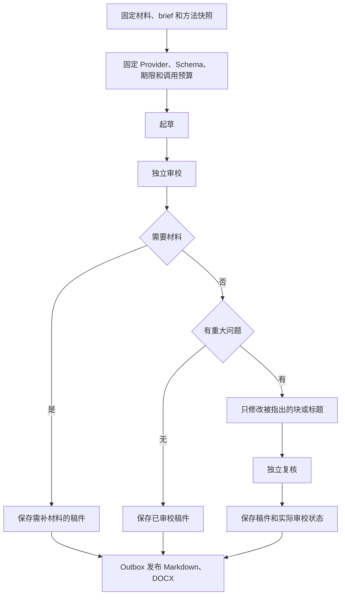

# 内容能力、Skill 与执行 Harness

本页维护帧取 AI 内容能力的已实现边界与后续重建规格。目标是从用户已有材料交付可直接使用、可导出后继续编辑的文章、帖子、文档与专业审阅结果。Skill 提供方法，Harness 负责材料、计划、工具、审校、版本与恢复。产品入口和结果契约按任务重设计，现有二十个 Skill 与五种契约不作为必须保留的目标结构。

本文区分已实现、此次方法接入和待实现目标。现有执行事实见[AI 分析](10-AI分析.md)；Temporal／RabbitMQ 所有权与恢复规范见[工作流](15-工作流与平台下载目标.md)；成品包与公众号交接见[内容创作与发布](11-内容创作与发布.md)。系统设计只在这些主题文档维护。

## 1. 产品决策与证据

### 优先交付的工作

首批用户是已有视频、笔记或草稿、需要在公众号表达内容的部署者本人。第一条重建用例为“已有文字材料 → 公众号文章 → 阅读与回查 → 导出与渠道交接”。视频可以成为材料之一，但画面观察不能替代语音内容。短帖和说明文档共用材料、自动审校与报告历史能力，专业视频／剧本任务按自己的用途保留。

选文字材料作为首批入口，是为了先验证写作与交付，避免让 ASR、图片和平台账号接入同时决定首条用例是否成功。可靠转写、配图和公众号草稿交接逐步接入。首批不扩张为互联网写作平台，不引入协作编辑或通用 Agent 工作台。

这项优先级来自本次用户反馈和代码约束，尚无使用频率、访谈或商业需求数据。“更多 Skill 就会改善成稿”是待验证假设，方法数量不作为产品指标。

### 已核对的实现问题

下表保留 a46f8f3f 时的诊断证据；对应修复和验收见第 4–9 节。调查未读取私人生产报告或账号凭据。

| 证据 | 使用影响 | 重建决定 |
| --- | --- | --- |
| [契约注册](../../backend/app/services/analysis/rules/contracts.py)将输入限制为 video／screenplay；文章绑定 VIDEO | 普通文稿、笔记、多份资料无法成为文章任务的一等输入 | 增加任务绑定的材料集合和普通文字输入，不用长自由 Prompt 代替 |
| [文章模型](../../backend/app/services/analysis/rules/result_models.py)要求章节、视频 evidence、导语、结尾和要点非空 | 短帖、无小标题文章、说明文档被迫套同一结构 | 重建内容成品契约，章节与结尾按实际文体决定 |
| 同一视觉模型绑定完整分镜、场景、高光、资产和非空 recommended_extensions | 资产整理或专项审阅也要交付无关栏目 | 任务只提交需要的交付物，允许无修改项、无配图 |
| [加载器](../../backend/app/services/analysis/skills/loader.py)一次性编译上游模块、正文和 references | 取证、专业分析、表达、文件工作流容易混入同一上下文 | 固定完整方法版本，按阶段装载所需片段 |
| [视频执行器](../../backend/app/services/analysis_execution/video_executor.py)只有一个 video 模型步骤 | JSON 有效不能证明观点成立或文稿可用 | 接入独立审校与一次有界修订，不依赖生成时自评 |
| [步骤监控](../../backend/app/services/analysis_execution/monitor.py)收到普通异常后释放 started 记录 | 请求发出后的超时可能被重新计费 | 多阶段上线前收紧未知结果分类，并冻结 Provider、Prompt、Schema 和预算 |
| Web 文章已分正文／回查；[App](../../../video-app/lib/features/analysis/presentation/video_article_result_view.dart)仍连续混排证据与正文，[Electron](../../../video-electron/src/renderer/frontend/components/analysis/analysis-article-result-view.tsx)正文含证据、结尾在要点页 | Web 改好不代表三端成品一致 | 同一后端内容契约、三端同一成品标准，分别验证 |
| 写作规则曾把所有文体视作报告，并残留“首要风险”必填式自检 | 文章变成结论清单，无问题素材也可能凑缺点 | 此次已修正共享写作规则；目标按文体维护审校标准 |

“AI 感重”具体拆为：信息空泛、无依据推断、模板栏目、无效重复、编辑过程残留、作者声音被统一。它们可通过材料、稿件和用户修改核对；不使用 AI 概率检测器判定质量。

### PM 方法与研究边界

本地 pm-toolkit 2.1.0 可用的相关方法是 grammar-check：先确定目的、读者与语气，再按位置、问题、修正、理由检查逻辑和行文。该包不提供战略规划、写作引擎或 Temporal 编排。产品取舍补充采用已安装的 pm-product-strategy:product-strategy、pm-product-discovery:opportunity-solution-tree／identify-assumptions-existing，需求组织参考 pm-execution:create-prd。自部署个人工具不套用销售增长、市场份额与护城河结论。

## 2. 用户任务与方法库

用户先选要完成的工作，再选必要的用途和关注项。领域方法在后台组合，普通用户不用理解二十个方法名。管理员维护固定版本的方法包，用户不能上传脚本或任意 Skill。

| 一级任务 | 主要交付 | 原 Skill 的处置 |
| --- | --- | --- |
| 写文章与文档 | 公众号文章、说明文档、教程；正文与回查独立 | video-to-article 整体重写为多材料写作；视频仅为一种来源 |
| 制作传播内容 | 短帖、开头、标题和候选片段组成对应方案 | 合并 highlights、opening-hook-review、short-video-packaging 的入口；方法按需保留 |
| 审阅成片 | 核心判断、需要修改的地方、保留理由与源位置 | comprehensive 重写；director-breakdown、narrative-structure-review、editing-rhythm-review、continuity-quality-review 成为关注项 |
| 拆解与整理素材 | 分镜表、场景表或资产目录 | 合并 visual-shots、scene-extraction、asset-catalog 的入口，按所选交付物独立返回 |
| 审阅剧本 | 优先修改与逐场定位，可选人物／对白／结构等专项 | screenplay-analysis、drama、character、scene、dialogue、structure、continuity 七项合并入口；保留专业方法 |
| 改写与翻译 | 可编辑文本候选、源版本对照、术语一致性 | 保留 screenplay-rewrite 的用途，重建 brief 和验收 |

这是整体重建的目标入口，当前保留二十个既有 Skill，并新增三个普通内容 Skill。不能只改显示名或添加六个按钮就宣称迁移完成。文章、帖子和说明文档也不会按一个通用长文模板输出。

方法包按职责分为材料观察、领域判断、写作、审校、视觉策划和渠道排版。领域研究保留有用方法，淘汰重复的全文常驻指令；Humanizer 只提供审校线索，不强制所有句子“口语化”。作者提供的自有范文用于表达偏好，不允许据此虚构亲历或借用他人的身份。

## 3. baoyu-skills 引入决策

固定审查版本为 [1567581c26ec29f4216c6e6835415bf30343b0e3](https://github.com/JimLiu/baoyu-skills/tree/1567581c26ec29f4216c6e6835415bf30343b0e3)。审查了 Skill Markdown 与相关脚本，未安装整包、执行上游脚本、调用图像供应商或写入公众号。根 [LICENSE](https://github.com/JimLiu/baoyu-skills/blob/1567581c26ec29f4216c6e6835415bf30343b0e3/LICENSE) 为 MIT。

### 能力的实际用途

| 上游能力 | 核对结果 | 项目采用方式 |
| --- | --- | --- |
| [format-markdown](https://github.com/JimLiu/baoyu-skills/blob/1567581c26ec29f4216c6e6835415bf30343b0e3/skills/baoyu-format-markdown/SKILL.md) | 核心规则保持原文，主要整理排版；不是从材料创作文章的引擎 | 借鉴读者视角和清楚标题；写作、审校与排版分别承担职责 |
| [markdown-to-html](https://github.com/JimLiu/baoyu-skills/blob/1567581c26ec29f4216c6e6835415bf30343b0e3/skills/baoyu-markdown-to-html/SKILL.md) | 提供公众号主题和 inline CSS；复杂图表转换含额外工具或网络依赖 | 仅参考公众号内部排版方法；不提供 HTML 文件导出，不把整个 CLI 定义为离线纯函数 |
| [post-to-wechat](https://github.com/JimLiu/baoyu-skills/blob/1567581c26ec29f4216c6e6835415bf30343b0e3/skills/baoyu-post-to-wechat/SKILL.md) | 从已有正文准备 HTML、素材与公众号草稿 | 参考渠道字段与操作拆分，连接器由项目实现；成功写入草稿不表示公开发布 |
| [cover-image](https://github.com/JimLiu/baoyu-skills/blob/1567581c26ec29f4216c6e6835415bf30343b0e3/skills/baoyu-cover-image/SKILL.md) | 将封面画面、色彩、文字和情绪拆成制作规格 | 后续按文稿、账号品牌和预算生成资产，允许无生成封面 |
| [article-illustrator](https://github.com/JimLiu/baoyu-skills/blob/1567581c26ec29f4216c6e6835415bf30343b0e3/skills/baoyu-article-illustrator/SKILL.md) | 先判断图片解释什么，再决定位置 | 借鉴信息目的与位置策划；不强制每节有图，生成插画不冒充资料证据 |
| [diagram](https://github.com/JimLiu/baoyu-skills/blob/1567581c26ec29f4216c6e6835415bf30343b0e3/skills/baoyu-diagram/SKILL.md) | 根据流程、交互、结构、机制选图型；当前文档包含外部字体导入 | 借鉴图型选择，项目控制中文字体、样式、SVG 检查与转换，不直接照搬 |
| [slide-deck](https://github.com/JimLiu/baoyu-skills/blob/1567581c26ec29f4216c6e6835415bf30343b0e3/skills/baoyu-slide-deck/SKILL.md) | 逐页制作图像并合并成演示文件 | 暂后置；整页 PNG 不能宣称为可编辑文本和图形的 PPTX |

这些是源代码和文档审查结论，不是产品实测成绩。更完整的技能库不能弥补材料不足、语音不可读、事实绑定或成品契约缺口。

### 不能直接照搬的行为

- [公众号 API 脚本](https://github.com/JimLiu/baoyu-skills/blob/1567581c26ec29f4216c6e6835415bf30343b0e3/skills/baoyu-post-to-wechat/scripts/wechat-api.ts)调用素材上传与 draft/add；没有调用公开发布接口。平台草稿与公开发布必须分别命名和授权。
- [浏览器保存路径](https://github.com/JimLiu/baoyu-skills/blob/1567581c26ec29f4216c6e6835415bf30343b0e3/skills/baoyu-post-to-wechat/scripts/wechat-article.ts#L1085)没有按 submit 参数包住保存动作；不能把默认不传 submit 当作纯预览。项目不执行这一脚本。
- 上游平台脚本包含账号登录、浏览器／剪贴板操作以及可选的二维码外发行为。它们不属于本次引用内容方法获得的执行权限。
- [演示文件脚本](https://github.com/JimLiu/baoyu-skills/blob/1567581c26ec29f4216c6e6835415bf30343b0e3/skills/baoyu-slide-deck/scripts/merge-to-pptx.ts)会将生成提示词放进备注；本项目成品不包含 Prompt、工作说明或账号配置。
- [渲染代码许可证](https://github.com/JimLiu/baoyu-skills/blob/1567581c26ec29f4216c6e6835415bf30343b0e3/packages/baoyu-md/src/LICENSE)另标注 doocs/md 与 WTFPL 来源。未来若引入代码，逐文件登记许可证和依赖，不能只沿用根 MIT 标签。

### 此次已实际接入

通过现有项目导入器保存原始 title-formulas.md 和 MIT LICENSE，固定文件 SHA-256，仅编译其 Straightforward Style 章节为 baoyu-article-title，由 video-to-article 使用。描述型标题说明对象与范围，判断型标题直接表达正文支持的结论。钩子公式、强制前五字冲突、否定优先等章节不进入运行指令。

来源、原文与章节选择见 [manifest](../../backend/app/services/analysis/skills/modules/manifest.json)、[NOTICE](../../backend/app/services/analysis/skills/NOTICE.md)与[上游模块说明](../../backend/app/services/analysis/skills/modules/README.md)。当前共十五个源模块，文章、帖子、说明文档均按阶段采用已审查方法。普通文稿的项目实现见后文；图片与公众号连接器仍待实现。

### 维护规则

第三方方法固定完整 commit、文件路径、许可证、SHA-256 和选用章节；原文不改，项目自己的适配要求写在产品 Skill。只选能直接服务当前任务的章节。需要额外写“忽略其中流程”才能使用的章节不装载。现有导入器只保存受审查 Markdown，拒绝不受许可的来源与软链接；静态注入扫描是审查线索。

上游脚本不通过 Skill 文本自动取得执行能力。运行集成如确有必要，在 integrations 中独立审查参数、依赖、凭据、外部副作用、超时与结果核对。运行时不从 GitHub 更新方法，不读取上游 Home 配置，不安装插件。升级需重新审查和真实用例比较。

## 4. 已实现的文字材料与内容契约

普通文字已成为独立输入 `content`，不需要伪造视频或上传剧本。`POST /api/content/analyses` 接收 1–8 份粘贴材料、用途 `article/post/guide`、写作目的、可选读者与表达偏好。每份原文最多 40,000 字符，合计最多 160,000 UTF-8 字节；至少一份标为事实材料。作者范文只用于表达，不得支持事实和亲历。原文和 brief 的完整摘要固定在任务中，原文在任务创建后保持固定。

唯一模型定义见 [content_document.py](../../backend/app/services/analysis/rules/content_document.py)，FastAPI 直接生成 OpenAPI，不维护另一份 JSON 契约。正文是有限的段落、二／三级标题、列表、引语块，块 ID 唯一；帖子可以没有标题，文章和说明文档需要标题。最多 120 块、200,000 字节，不要求固定章节、导语、要点或结语。

`evidence_index` 将正文块绑定到材料及 2,000 字符的原文片段，引用必须是片段中的精确原文；作者范文不能被引用为事实。这个校验能证明引用存在，不能证明作者材料真实，也不能机械证明每个句子都获得支持。语义核对由独立审校承担。

`review_history` 保存位置、问题、修正和严重度，`review_status` 分为通过、发现问题、需要材料。模型填写“通过”不能绕过 findings 校验。缺材料和仍有重大问题的稿件可以只读保存供回查，但必须在正文之外提示，不能以任务已产出文件代替可采用判断。

现阶段材料入口仅支持可读文字。视频、剧本、字幕、网页、图片参与同一材料集合仍是后续能力：沿用各自权威来源和处理流程，不靠用户自由 Prompt 或模型猜测补齐。

## 5. 已实现的执行 Harness

[ContentExecutor](../../backend/app/services/analysis_execution/content_executor.py) 在现有 `SkillWorkflow` 的 Activity 中执行，应用控制有限阶段：

文章、帖子和说明文档通常为两次应用级模型调用；出现重大问题最多增加一次修订和一次复核，总上限四次。没有开放式循环、自动扩预算、复杂提纲步骤或联网研究。材料不足在语义审校后停止，不靠基础设施重试改写。

起草与审校分别装载产品 Skill 的 Draft／Review 部分及必要方法模块。审校只读取 brief、材料和草稿，不读取写作者的自评。修订只能修改被 blocking／major findings 指出的块或标题；其他块的文字和顺序必须相同，否则拒绝结果。自动修订保留未受问题影响的表达，不重写整篇。

当前有 23 个产品 Skill、6 种结果契约：保留既有视频和剧本任务，新增普通文章、帖子、说明文档三种文字 Skill。六类一级任务的全面整合仍是目标，不能据此宣称旧视觉／剧本能力已经全部重建。

## 6. 函数边界与工具能力

[ContentFunctions](../../backend/app/services/analysis_execution/content_functions.py) 已实现任务内材料函数：

| 函数 | 输入和返回 | 当前执行方式 |
| --- | --- | --- |
| list_materials | 当前固定集合 → 材料名称、用途、登记片段 ID | 应用确定性调度 |
| read_material | material_id、segment_id → 精确原文片段 | 严格参数校验；每阶段最多 88 次读取 |
| review／revise | 固定材料、草稿和审校 → findings／有限新草稿 | 有预算的模型阶段，每次走 journal |
| 保存结果／渲染成品 | 已生成的有限正文 → 不可变报告／文件 | 应用事务与报告 Worker；发布不调用模型 |

材料 ID 与片段 ID 必须属于当前固定集合。没有路径、其他任务、Shell、任意 URL、账号或发布参数。应用按已登记片段调用读取函数后，将返回值交给模型。这是受控函数调度，**当前不是 Provider 原生动态 function calling 循环**；JSON mode 也不会获得任意工具能力。

既有 CLI 视频观察工具仍支持有界 probe／overview／frame。API 视频 Provider 使用受限采样，没有动态观察工具循环。以后增加 Provider 原生读取工具时，必须逐轮 journal、统计模型与工具预算、验证请求和返回绑定；不能在一次 journal 步骤里暗中无限调用模型。

模型请求使用兼容 Structured Outputs 的 `anyOf`，客户端 OpenAPI 继续保留 `oneOf` 与 discriminator，转换发生在模型边界。[OpenAI 结构化输出文档](https://developers.openai.com/api/docs/guides/structured-outputs)说明该接口只支持 JSON Schema 子集；JSON 正确只是结构门槛，不是文稿质量证明。

## 7. 持久预算、恢复与所有权

普通内容运行在首次付费调用前，将材料、方法、阶段 Prompt、Schema、语言、Provider／模型／配置摘要、调用上限、工具上限和截止时间固定到 PostgreSQL `analysis_runs.execution_binding`。密钥不进入绑定。当前这一完整冻结仅用于新增内容路径；既有视频、剧本仍需逐步迁移。

`model_calls_used` 与 started 步骤创建在同一事务中占用预算。每次发送检查运行 owner、attempt、lease、取消、删除、输入摘要、剩余次数和持久截止时间。接管不会刷新 deadline，回放已保存结果不会再次占次数；Provider 配置改变时失败关闭，不继续使用旧配置密钥。明确未执行的拒绝可以释放占位；普通异常、超时或断连不能证明未执行。

| 中断 | 当前行为 |
| --- | --- |
| 模型结果已收到 | 先保存原返回，再校验；坏结果仍消耗次数，不删掉后重生成 |
| 请求发出后结果未知 | 终止自动重调，保留结果未知状态；用户明确重跑形成新运行版本 |
| 已保存步骤后 Worker 退出 | 同一步及同一摘要回放，无第二次模型调用 |
| 用户取消／旧 owner／lease 过期 | 拒绝迟到写入，停止后续阶段 |
| 内容已保存，文件失败 | 只恢复报告发布，不再生成正文 |
| 审校需要材料 | 保存稿件及缺口，补充材料以新任务进入，不改变旧输入 |

Temporal 只编排解析与 Skill 两条工作流。模型与业务原文保存 PostgreSQL，Workflow History 只携带任务引用和小状态。报告发布继续使用 PostgreSQL + Outbox + RabbitMQ；没有增加第二调度器或新基础服务。[Temporal 错误处理规范](https://docs.temporal.io/develop/python/best-practices/error-handling)不替代项目的模型幂等机制，也不保证供应商恰好一次。

当前调用次数指应用请求次数。CLI 内部轮次、实际 Token、价格和供应商计费不可见时不承诺精确费用封顶。

## 8. 只读结果、报告历史与成品

Web `/content` 提供材料、目的、文章／帖子／说明文档选择；结果页先展示读者正文，材料引用、原文、审校和旧版本分别展开。导出 Markdown、DOCX 只包含正文，没有编辑摘要、附录、Prompt、时间码清单或发布前删除提醒。正常引语和必要事实限制应自然融入文稿。

所有分析结果页只读，不提供正文编辑、保存人工稿或作者改稿流程。材料有错或缺失时补充材料并新建创作任务；关注重点或表达要求改变时也以新输入创建任务。同一输入的显式重跑继续形成独立运行和报告，不覆盖历史结果。小范围文本调整通过导出的 Markdown／Word 或后续公众号编辑器完成。人工修订写接口及其用例、请求模型和生成客户端已删除。

`GET .../source` 与 `GET .../versions` 只读查询账号所有且未删除的任务；报告历史最多返回 50 份已发布报告，按 run_no 排序，不依赖可能相同的时间戳。已有人工稿及原自动稿继续可读，历史身份明确标注，原审校不冒充对人工稿的确认；文件与数据不会因移除编辑能力而删除。manual_edit 只在保留数据与统计排除中使用，没有新增入口。

Electron 同步 Web 组件，增加相同内容入口和结果路径。App 已同步新结果、历史契约和生成阶段，提供阅读、私有审校／引用展开和现有 Markdown／DOCX 导出；App 原生材料创建和报告历史阅读尚未接入，不以只读兼容宣称全流程一致。

成品只提供 Markdown 与可编辑 Word 文档，不提供 HTML 文件导出。真实公众号编辑器交接、图片上传和账号草稿写入另行规划与验收。已存历史文件的对象记录仅用于所有权与删除生命周期，不恢复已移除的导出入口。

## 9. 验收与后续工作

质量按用途、具体信息、事实支持、作者声音、结构和编辑残留评估，不采用 AI 概率检测器。审校无重大问题允许空 findings；结果页不展示空审校栏目。评审区分表达偏好与事实错误。先建立有授权样例及评审记录，再决定接受率、首次可用率等指标目标，当前没有可用性比例或运营效果数据。

| 验收层 | 可执行证据 | 结论边界 |
| --- | --- | --- |
| 结构、权限与恢复 | 内容契约／精确引用／有限修订单测；真实 PostgreSQL 准入、预算、取消、版本、两种制品 | 能证明确定性约束，不能证明写作质量 |
| Temporal | 真实 Temporal + PostgreSQL 起草／审校、历史重放、未知调用与不重复模型执行 | 不替代供应商实测 |
| Web | 真实登录材料提交、生成、只读报告历史、两种下载；桌面／390px、明暗主题 | 单次文章成功不能覆盖全部题材与文体 |
| App／Electron | 生成契约、类型／静态检查、单测与构建，独立 UI／原生验收 | 测试夹具不能代替真实设备鉴权与文件导出 |

后续顺序以可使用结果为目标：先扩大真实文章、短帖、说明文档及中英文样本；再增加可读剧本、可靠字幕／转写、参考网页和真实资料图的材料绑定；随后完成视觉规格和版本化资产；最后实现用户明确触发的公众号草稿连接器。每项先更新本主题的实际边界，再实现必要协议，不通过堆 Skill 数量或添加通用 Agent 控制台宣称完成。

2026-10-04 实测：现有 Codex Provider（gpt-6-sol）分别完成文章、无标题短帖和说明文档，三次任务均为起草与审校两次调用。文章审校指出“杯盖旋到不再转动”可能扩张原意；该样本的原稿与既存历史保存稿继续只读回查，报告文件保留。短帖素材声明维护通知仅用于示例，审校据此保留 needs_material，未把示例当成可发送的真实公告。说明文档审校通过，无强加的摘要、附录或结尾模板。

三类结果和文章历史保存稿的 Markdown 与 DOCX 共 8 个文件从真实登录页面下载，分别核对正文、标题与旧版字节；文件不携带审校、来源 ID、编辑摘要或生成说明，DOCX 无生成系统页眉／页脚。私有材料与版本接口禁止缓存。Web 另覆盖同一运行结束后的历史刷新、内容历史重复查询参数与历史稿身份提示。

内容契约、权限、步骤日志、有限修订、版本与两种导出由单元及 PostgreSQL 集成测试覆盖；Temporal 起草／审校与历史重放单独验证。接口删除覆盖人工修订与 HTML 路由不存在；报告阅读覆盖历史稿、账号隔离、软删除与历史文件保留。App 与 Electron 各自执行客户端契约、静态检查与相关测试，夹具不能替代真实账号和文件分享验收。iOS 通用双架构构建仍受已记录的 Flutter 工具链问题阻断。

真实模型样本只能证明这三次流程和文件可用，不提供跨题材写作质量、结果采用率、平台复制或公众号账号能力的统计结论。
