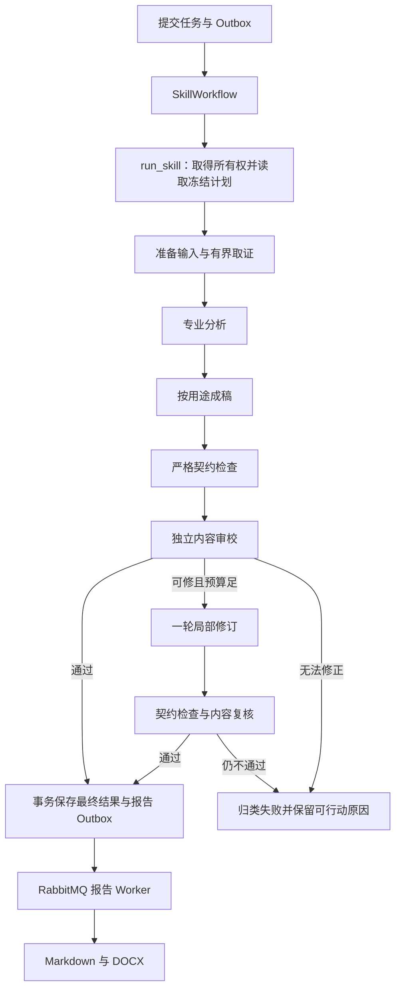

# Skill 体系、结果契约与分析 Harness

本页定义分析 Skill、结果契约和分析 Harness。Harness 是围绕模型的任务约束、取证工具、执行计划、内容审校、恢复和交付机制。当前实现、产品目标和验证事实分别标注；调度与故障恢复的唯一规范见[工作流与平台下载目标](15-工作流与平台下载目标.md)，任务模型与执行器见 [AI 分析](10-AI分析.md)。

## 分层

| 层 | 职责 | 形态 |
| --- | --- | --- |
| Skill（方法） | 怎么分析：领域方法、判断标准、参考材料 | `SKILL.md`（Agent Skills 规范）＋ `references/` ＋固定版本的上游模块，编译成每个任务不可变的指令快照 |
| 结果契约（形态） | 输出长什么样：模型 Schema、严格解析、持久化、报告渲染、API／前端视图 | 契约注册表中的一项；Skill 通过 `video-server-output-contract` 选择 |
| 引擎（调用） | 怎么调用模型：Codex App Server、Claude CLI、HTTP API | 通用适配器，按契约取 Schema 与契约提示，不感知具体 Skill |

同一契约可以被任意多个 Skill 复用；新增 Skill 只要沿用已有契约，就只需新增 Markdown 与测试样例。只有需要新的输出形态时才新增契约。

## 当前实现

结果契约注册表位于 `services/analysis/rules/contracts.py`，集中登记契约值、结果 kind、输入类型和结果类型；解析、持久化与报告渲染在各自层内以这些标识分派。模型侧 Schema 与提示位于 `integrations/ai_cli`；API 的判别联合和前端结果视图仍须随新增契约同步更新，由契约测试检查覆盖。注册表不意味着添加任意新输出形态都无需修改 API 或前端。

当前包含五种契约：`video-visual-analysis`、`video-article`、`screenplay-analysis`、`screenplay-rewrite`、`structured-report`。引擎按契约调用，产品 Skill 只选择方法和章节，不改变固定 Schema。

## 通用结构化报告契约（已实现，仅视频）

`structured-report` 供标题包装、开头钩子、发布文案等不需要专用结构的 Skill 复用：

- `language`、`title`、`summary`、`sections`、`limitations`。
- 每节包含唯一 `id`、`heading`、`body`、`items` 和 `evidence`；文本是纯文本，由报告渲染器转义。模型不能嵌入可执行 HTML、链接、图片或自行定义 Markdown 排版。
- 每节证据包含 `start_ms`、`end_ms`、`note`，必须落在权威视频时长内；没有证据时可为空。
- 1–16 节，每节最多 20 条候选、12 条证据，全报告最多 12 条局限；条目与局限最长 1,000 字符。具体文本上限由模型与严格解析器共同固定，Skill 不得放宽。
- 已接通模型 Schema、严格解析、数据库 CHECK、结果持久化、Markdown/DOCX 报告、OpenAPI 与通用前端视图。

剧本输入不开放此契约：剧本分析依赖分块与汇总，通用契约的分块合并规则需另行设计。

## 第三方 Skill 引入

第三方 Skill 可能含工具调用、项目工作流和不适用的输出要求，因此只引入经逐项审查的 Markdown，不接入市场、不在运行时下载。静态扫描只提供审查线索，不能代替逐段检查。

引入由 `python -m app.workers.skill_import`（在 `backend/` 执行，仅维护者机器联网）完成，规则固定：

1. 只从固定 commit 获取，记录仓库、commit、文件路径与 SHA-256；`--path` 支持 Skill 目录或单个 Markdown 文件，显式路径不得经过软链接。
2. 许可证白名单：MIT、Apache-2.0、BSD、CC-BY-4.0；无许可证或其他许可证拒绝引入。
3. 只保留 Markdown；脚本、可执行文件、MCP 配置、插件清单、安装脚本和二进制资源一律丢弃且不执行。
4. 静态提示注入扫描（忽略先前指令、调用工具或网络、读取文件或密钥、外发数据等模式）；命中需人工确认后才能写入。
5. 原文不修改地放入 `skills/modules/<来源>/`，附带原许可证；在 `modules/manifest.json` 固定哈希、许可证与选用章节（默认登记全部二级标题，维护者按需收窄），并追加 `NOTICE.md` 条目。已存在且内容不同的文件拒绝覆盖。
6. 由项目自己的产品 Skill 通过 `video-server-modules` 组合上游章节，产品 Skill 决定契约、边界与输出，上游文本只作为方法参考。

更新上游版本必须重新执行上述审查，并补静态样例与真实模型验收后才能发布。

## 上游模块选用

当前固定 14 个上游模块（drama-skills 6 个、screenwriting-skills 6 个、Humanizer-zh 与中文文案排版指北各 1 个）；原文、许可证、SHA-256 与选用章节见 `skills/modules/manifest.json`，逐模块用途见 `skills/NOTICE.md`。

选用规则：只选与产品任务对题的章节。若某一节需要在 Skill 正文里写“忽略其中的……”才能使用，它就不应进入选用范围；无任何 Skill 使用的 vendored 文件直接删除。按此规则：

- 不引入 marketingskills：其平台人口、算法与发布时间说法未经核实，英文模板钩子要求虚构亲历和效果，剪辑解剖的交付物是复刻他人成片，均与“包装已有视频、只承诺素材已兑现内容”的边界冲突。短视频包装与剪辑节奏改用项目自有的 `references/packaging-method.md` 与 `references/editing-rhythm-rubric.md`。
- 不引入 drama-skills 的 review-method：其规则分级、机械检查与 finding 结构面向该项目的文件和校验器流程，与本项目 JSON 契约冲突。
- 镜头与剪辑模块只保留判断问题，不编译音频入出点与对白估时、镜长配额、逐镜运镜行格式和提示词反模式；结构模块不编译按分钟切分的九节拍、分场表流程与反模式。

| 产品 Skill | 上游方法 |
| --- | --- |
| 导演拉片 | `drama-shot-craft`、`drama-shot-grammar`、`drama-blocking-playbooks` |
| 剪辑节奏审阅 | `drama-edit-cut-craft`（镜序与相邻关系） |
| 连续性与成片 QA | `drama-blocking-playbooks` |
| 剧本审稿系列 | `drama-story-script`、`drama-anti-template` 与 `sw-*` 诊断章节，按 Skill 组合 |
| 全部分析 Skill | `humanizer-zh`、`zh-copywriting-guidelines`（剧本改写只用后者） |

上游章节先编译，随后加载产品 Skill 正文和 references；需要说明适用方式的 Skill 在正文“上游方法的用法”一节写明。

## 成稿写作规范

报告是 Skill 的最终交付物，文字须读起来像经过编辑的专业稿件，而不是字段释义或模型输出。写作要求分三层维护：

| 层 | 位置 | 内容 |
| --- | --- | --- |
| 共享规范 | `skills/shared/report-writing.md` | 项目自有。结论先行、段落与句式、事实／判断／建议分层、标题与条目写法、需删除的套话、中文排版、交付前通读 |
| 契约写法 | `skills/shared/screenplay-coverage-writing.md` 与各契约提示 | 字段在渲染报告中的位置与写法；剧本审稿 7 个 Skill 共用一份 |
| Skill 重点 | 各 `SKILL.md` 的“成稿重点”与 Skill 自有 references 的字段写法 | 本 Skill 的标题、导语与关键字段应当回答什么、写成什么样 |

字段写法只在一处定义：文本字段写成连贯的句子或段落，不使用“字段名：……；……”式的标签串；分镜等内部 ID 只出现在 `*_shot_ids` 数组中，正文写“分镜 003”。

`video-server-references` 可引用 `references/<名>.md`（Skill 自有）或 `shared/<名>.md`（项目自有、多 Skill 复用）；`shared/` 不含 `SKILL.md`，不会被注册为 Skill。

共享规范参照两类成熟写法：专业审阅报告（审稿 coverage、拉片笔记）的严谨，以及公众号深度稿的可读性——导语给结论、小标题可扫读、段落一个信息单元、以具体行为代替形容词、事实与判断分开。

同时固定引入两个 MIT 写作模块作为自查清单：`humanizer-zh`（op7418/Humanizer-zh，去除模板化表达的 A–F 模式与交付前核对）和 `zh-copywriting-guidelines`（sparanoid/chinese-copywriting-guidelines，中文空格、标点与专有名词）。它们只检查 Skill 自己写的报告文字，不用于评判被分析的剧本台词或画面文字，也不得为了“具体”补造事实；`screenplay-rewrite` 只加载排版规则，并保留人物有意为之的口语表达。

渲染器同步调整为文档版式：视频报告使用中性章节名（核心判断、内容如何展开、逐镜证据、值得回看的片段、修改建议、需保持一致的视觉资产、分析口径与局限），适用于全部视觉 Skill；剧本审稿报告保留字段中的分段，按“审稿结论 → 故事概览 → 结构与节奏 → 人物 → 对白 → 逐场附录”排版，英文结果使用英文章节名；改写报告按目标语言本地化，并以场次序号代替内部场景 ID。

写作参考文件改变新建任务的 Skill 指令快照哈希；已有任务沿用创建时的 Skill 快照。但契约提示来自执行时代码，尚未整体冻结，更新它会影响旧运行中尚未执行的模型请求。报告版式变化只影响新发布的报告。

## 验证边界

目录发现、契约绑定、章节排除、单文件许可证继承、软链接拒绝及包装样例的解析／持久化／API／报告链路由自动化测试覆盖。静态测试与有限模型调用不替代真实作品、长视频、长剧本分块汇总、业务 Workflow 和人工产品验收。

执行边界保持不变：不执行第三方脚本，运行时不联网获取 Skill，每个任务固定不可变指令快照（SkillWorkflow 步骤日志依赖这一点复用结果）。

## 产品诊断与研究依据（2026-10-04）

### 这次要解决的使用问题

创作者拿到分析后，应能判断下一轮先改什么、凭什么改、怎样检查是否改对。编辑拿到文章后，应能继续编辑正文，并快速回查重要陈述。作者拿到审稿后，应能定位因果和人物选择的问题，同时保留自己的创作决定。

“AI 感重”是用户给出的产品反馈。本次将它拆为可检查的问题：句子适用于任意作品、结论没有材料依据、每个栏目都被填满、章节反复说同一件事、建议无法执行、正文与证据混排。语言自然是结果，不能以检测器分数、套话计数或更口语化代替专业判断。

调查范围为本地代码、现有测试材料、20 个内置 Skill、5 种结果契约和官方工程资料。代码基线为 `ccb53260`；未抽查生产数据库、用户私人报告或真实 Provider 新输出。下表的实现问题有代码证据，但“这些问题导致实际成稿不佳”仍需真实作品盲评验证。本次人工样例用于校准标准，不构成用户访谈、市场调研结果或模型效果基线。

### 设计要求与实现之间的差距

| 优先级 | 当前证据 | 对交付的影响 | 最小行动与验证 |
| --- | --- | --- | --- |
| P0 | [视频执行器](../../backend/app/services/analysis_execution/video_executor.py)只记录 `video` 模型步骤；[执行服务](../../backend/app/services/analysis_execution/service.py)随后直接发布严格解析后的结果 | Schema、时间范围和 ID 正确，仍可能留下无依据推断、重复与空泛建议；没有独立内容审校的执行证据 | 在既有步骤日志中增加独立审校与有界修订；用证据不足和重复结论的样例验证，不能只测 JSON 能解析 |
| P0 | [API 抽帧](../../backend/app/integrations/ai_api/frames.py)最多 64 帧、有界均匀采样；[CLI 媒体工具](../../backend/app/integrations/ai_cli/media_mcp_tools.py)允许按疑点取单帧与区间概览 | 两类 Provider 的观察能力不同；完整时间线字段不能证明所有事件都被观察 | 冻结能力和覆盖说明；采样间隔内的 Cut 或短暂事件不能写成精确事实，按需复核或降级 |
| P1 | [加载器](../../backend/app/services/analysis/skills/loader.py)把所有选定模块、正文与 references 一次性编译；本次修改前综合分析为 14,933 字符、文章为 15,229 字符、故事审稿为 53,827 字符 | 方法、写作、契约和诊断问题同时进入上下文，缺少按阶段取用；字符数是观察值，不是 Token 数或效果因果证据 | 保留不可变完整快照，执行阶段只取所需片段；比较同作品的全文与阶段装载结果，再决定删减 |
| P1 | [视觉报告](../../backend/app/services/analysis/video_report.py)及[章节渲染](../../backend/app/services/analysis/video_report_sections.py)固定先结构、逐镜表、高光，再建议与资产；所有视觉 Skill 共用 | 剪辑决策、资产整理和导演拉片的信息顺序不一致，读者被迫先读附录 | 按交付用途定义版式；本次仅提供样例，后续同时验证 Web、Markdown、DOCX 与两种语言 |
| P1 | [前端分派](../../frontend/src/components/analysis/analysis-video-result.tsx)仅对场景拆分改变默认视图，其余视觉 Skill 默认进入 shots | 用户选择的任务和进入结果页后最先看到的内容未充分对应 | 以用户要做的决定设置默认视图，保留原始证据入口；390px 真实交互验收 |
| P1 | [制作建议模型](../../backend/app/services/analysis/rules/result_models.py)强制非空 `recommended_extensions`；文章也要求非空摘要与结语 | 没有问题的素材仍可能被要求填建议；贫乏素材可能被扩写。Schema 约束是事实，模型是否因此凑字尚未验证 | 当前可写有依据的保留或复核动作，禁止虚构缺陷；后续以样例评估是否调整契约的可空语义 |
| P1 | [契约提示](../../backend/app/integrations/ai_cli/prompt.py)原先建议文章 3–7 节，并要求视觉摘要交代最强之处和首要风险 | 与低信息量短稿、无缺陷素材的试点目标冲突；只改 Skill 不能消除上层提示压力 | 本次同步改成按证据量定章节、按用途给判断，并调整共享导语规则；契约数量与严格解析边界保持一致 |
| P1 | [步骤监控](../../backend/app/services/analysis_execution/monitor.py)在返回异常时释放步骤；设计 15 已标明 Provider 冻结和超时计费语义待实施 | 阶段增多后，配置漂移和不明调用重发会扩大重复计费风险 | 多阶段上线前先冻结 Provider／计划，并收紧已发出请求后的超时、连接中断分类 |
| P2 | [报告测试](../../backend/tests/unit/services/analysis/test_report.py)主要验证完整性、顺序、转义与证据时间；文字夹具包含“信息密度高”等泛化描述 | 工程链路通过，不能证明作者会采纳建议或文章可直接编辑 | 增加带源材料的校准样例、失败例和人工盲评；保留既有工程测试 |

文字审校使用本地 `pm-toolkit:grammar-check` 的位置、错误、修正、理由四项方法。高影响问题属于逻辑与行文：无依据效果判断应收窄为观察，重复栏目应合并，空泛建议应改为对象、动作与检查方法。它提供审校方法，不提供运行时工具或 Temporal 编排。需求组织同时参考 `pm-execution:create-prd`；代码核对参考 `pm-ai-shipping:intended-vs-implemented`，只采用其证据方法，不将产品问题描述成安全漏洞。不复制这些插件的整套输出标题，也不未经引入审查把其文件装进产品。

### 官方资料带来的设计决策

| 资料 | 可借鉴的事实或方法 | 本项目的决定 |
| --- | --- | --- |
| [Agent Skills 规范](https://agentskills.io/specification) | metadata、主体、资源分层装载；示例与边界可放参考文件 | 完整快照保证可恢复，阶段视图控制上下文；不是给所有 Skill 添加更多常驻文本 |
| [OpenAI Harness engineering](https://openai.com/index/harness-engineering/) | 将约束与反馈变成可检查的环境机制 | 写作规范之外，必须有证据检查、样例和发布关口；这是对视频领域的设计迁移，非该文已验证结论 |
| [Anthropic Building effective agents](https://www.anthropic.com/engineering/building-effective-agents) | 明确标准时可使用生成、评价、改进的流程；执行需有停止条件 | 使用单条受控流水线中的角色阶段；独立审校调用，最多一轮修订，先验证收益再增加复杂度 |
| [Anthropic Harness design](https://www.anthropic.com/engineering/harness-design-long-running-apps) | 用具体评价项和校准示例改善主观质量评估 | 审校查证据、用途与可执行性；模型评分仍要人工校准，不能自评通过就发布 |
| [OpenAI Function calling](https://developers.openai.com/api/docs/guides/function-calling) | 模型提出参数，应用执行工具并返回结果；strict Schema 约束参数形状 | 工具权限、事实校验与预算由服务端执行；最终 JSON 输出与工具调用是两个不同接口 |
| [Temporal 错误处理](https://docs.temporal.io/develop/python/best-practices/error-handling)、[Workflow basics](https://docs.temporal.io/develop/python/workflows/basics) | Activity 可重复执行；Workflow 有确定性约束 | 模型和媒体 I/O 在 Activity 内；Workflow 重放不重新调用模型，外部调用仍依赖业务步骤日志与不确定结果保护 |

上述资料多来自编码 Agent。其观察可以指导本项目架构，但不能证明视频审稿一定更好，不采用其时间或质量数字作为本项目指标。

### 同类创作产品与交付方法

本次仅核对以下官方公开说明，没有购买、实际试用或评测这些产品；不推断市场份额、准确率或用户偏好。

| 对照对象 | 官方说明支持的能力或方法 | 对帧取的启示 |
| --- | --- | --- |
| [Descript 视频／播客转博客](https://www.descript.com/ai/turn-into-blog-post)、[视频文字描述](https://www.descript.com/tools/describe-video) | 将脚本转成文章；视频描述流程使用转写和语音分析 | 语义重组依赖可读语义材料。帧取当前没有可靠音频转写，应把仅视觉材料写成观察稿，不能靠 Harness 推断演讲内容；以后接入语音需另定需求与证据契约 |
| [Celtx Script Coverage](https://blog.celtx.com/what-is-script-coverage/) | 将故事概述、人物／结构分析和评审结论组织成报告 | 摘要帮助核对理解，分析服务于读者的决定。帧取面向作者修改，应优先交代具体问题与修改目标；不照搬采购评级或未经验证的商业判断 |
| [Celtx 剧本编辑器](https://support.celtx.com/hc/en-us/articles/360009310173-The-Film-TV-Script-Editor)、[Breakdown](https://support.celtx.com/hc/en-us/articles/216581678-Breakdown) | 在源剧本上附着反馈，并将剧本拆解用于目录及报告 | 读者应能从发现回到原场，资产任务则需要对象目录；不能让所有任务都进入同一散文或同一分镜表 |

这些对照支持“先认清输入能力，再按岗位交付”的设计方向，尚未证明帧取能达到同类产品效果。当前的综合能力增强重点是把已有视觉与剧本文本能力用完整，而非扩张到未获证据支持的音频、商业或发布能力。

## 分析 Harness 的目标规格（待实施）

### 用户任务与交付形态

默认任务从 Skill 确定，用户“分析重点”补充本次要解决的问题。缺少可选信息时采用明确默认值，不为执行分析额外等待一轮问答；材料不可读、类型不支持或必要输入缺失时仍拒绝。用户无需配置阶段、工具、模型或 Token。

| 使用任务 | 默认读者与问题 | 交付的首要内容 | 证据位置 |
| --- | --- | --- | --- |
| 综合分析 | 创作者：下一轮先改什么 | 核心判断、保留项、按影响排序的行动 | 结论可回看，完整分镜放附录 |
| 导演拉片／叙事／节奏／连续性 | 对应创作岗位：哪里成立、哪里失效 | 与本专项有关的发现及前后镜关系 | 局部证据在发现附近，完整时间线可展开 |
| 分镜／场景拆分 | 导演或剪辑：怎样拆解原片 | 连续时间线与段落关系 | 时间线本身为主内容 |
| 高光／开头钩子／短视频包装 | 剪辑或运营：采用哪个候选、为何 | 候选、比较、适用边界 | 对应区间与限制，不预测传播表现 |
| 资产目录 | 制作人员：哪些对象可复用、哪些状态需保持 | 去重的身份、特征和状态变化 | 首见与变化的帧，不强行输出叙事长文 |
| 视频转文章 | 编辑：文章回答什么、还缺什么 | 独立可读正文 | 可删除附录；关键限定仍保留在正文 |
| 剧本审稿系列 | 作者：先恢复哪条因果或人物选择 | 优先修改、保留机制、再到逐场审阅 | 源场顺序与短摘录，不把 ID 当作事实证明 |
| 剧本改写 | 作者：改写是否保留意义与人物声音 | 候选文本与术语一致性 | 对照原场；有意口语不强制“润色” |

前三个试点是综合分析、视频转文章、剧本故事审稿。其余 Skill 的方法与五种契约先沿用，待试点完成真实作品验收后按完整用例推进，不能批量替换提示词就宣布全体系升级。

### 分层职责

| 层 | 输入与输出 | 强制边界 |
| --- | --- | --- |
| 任务约束 | 输入类型、用户重点、默认读者、交付用途 → 不可变 brief | 原重点与推断默认值分别记录；不补受众画像、平台指标或作者意图 |
| 计划 | brief、输入大小、Provider 能力 → 阶段、依赖与上限 | 服务端批准有限阶段图；模型可提出取证疑点，不能自行增加权限或修改总预算 |
| 取证 | 权威制品／规范化剧本 → 有界证据与覆盖缺口 | 事实来源限本次授权输入；抽样不等于逐帧看片，剧本文字不等于附件 |
| 专业分析 | 证据、领域参考 → 观察、判断与候选行动 | 关键判断要有支持和反例检查；无证据时收窄结论 |
| 成稿 | 已支持判断、用途、写作方法 → 契约内草稿 | 不读取全套无关方法，不把事实栏逐项翻译成散文 |
| 独立审校 | 草稿、brief、证据与能力说明 → 定位到字段的 findings | 不读取生成阶段的自评；指出问题和修正目标，不直接扩写新事实 |
| 修订与交付 | 草稿、findings → 校验后的最终结果与版本 | 最多一轮局部修订；严格解析、复核通过后发布，失败不能把草稿冒充成品 |

角色阶段是职责划分，不要求部署多个 Agent、容器或新的通用 Agent 框架。应用服务仍在 `services/analysis_execution`，Provider 与工具协议仍在 `integrations`，事实和事务仍由既有 repositories 管理。

### 阶段装载与不可变计划

保持创建任务时的完整 Skill 指令快照和哈希。后续由项目自有参考片段标识选择本阶段内容，阶段输入摘要同时包含完整快照哈希、片段选择、brief、制品摘要、能力版本、结果契约、审校标准和已冻结的 Provider 配置版本。来源哈希改变或输入不同，不能复用旧步骤。

观察阶段读取取证边界和领域观察问题；成稿阶段读取已支持判断、字段写法与少量正反例；审校阶段读取独立准则、证据与草稿。上游模块的固定来源仍留在快照中，工具不能从外网更新它。现有加载器一次性编译的行为尚未改成阶段装载，本次样例也不声称具备该能力。

计划最少冻结以下字段，作为业务运行内容保存在 PostgreSQL，具体结构变更按 schema.sql／ORM／契约测试一起实施：

| 字段 | 用途 |
| --- | --- |
| `input_digest / skill_snapshot_sha256 / contract / prompt_template_version / schema_sha256` | 固定本次材料、方法、契约提示与严格 Schema；现有 Skill 快照并未固定整个运行时提示 |
| `brief / deliverable_profile` | 读者任务与受控版式，默认值注明来源 |
| `provider_profile_id / provider_config_version / capabilities` | 禁止恢复时漂移，不包含 Secret |
| `stages / dependencies / selected_reference_ids` | 可恢复步骤与阶段上下文 |
| `deadline / max_model_calls / max_tool_calls / max_revisions` | 全运行上限，跨尝试不重置 |
| `review_rubric_version / renderer_version` | 回溯方法与版式差异 |

短视频试点拟用 6 次应用级模型请求（观察、分析、成稿、审校、修订、复核）作为起始上限，工具 24 次、修订 1 轮；这些是待压测的产品预算，不是已生效配置，也不是 CLI 内部模型轮次的保证。无 findings 时跳过修订与复核。长剧本按既有权威分块数计算总预算，超出则在首个付费调用前拒绝或收窄范围，不先做一半再耗尽。

对于无法报告或限制 CLI 内部模型轮次的引擎，明确记录观测能力未知，并以墙钟、工具和应用级调用上限约束；不能承诺精确 Token／费用封顶。Provider 不支持独立阶段输入、工具协议或严格结果时，冻结为只读采样路径或现有单步路径，并在结果说明能力限制，不伪装拥有完整能力。

## Function call 与内部契约（目标）

### 先区分已有工具与新增能力

CLI 已有 `probe_video`、`inspect_video_overview` 和 `inspect_video_frame`；工具取证发生在 `video` 模型步骤内部，现有应用步骤日志没有逐条工具调用的持久记录。API 当前接收有界帧证据并生成结果，`with_structured_output`／`json_mode` 不是可自主取证的 function call 循环。

| 操作 | 可见参数 → 返回 | 调用者与副作用 | 验证和限额 |
| --- | --- | --- | --- |
| `probe_video`（已有） | `{}` → 权威时长、容器等技术元数据 | 模型可请求；只读 | 服务端绑定本次制品，不接受路径 |
| `inspect_video_overview`（已有） | `start_ms, end_ms` → 16 帧概览 | 模型可请求；只读取证 | 整数、正区间、权威时长内；新增全运行计数在后续实现 |
| `inspect_video_frame`（已有） | `timestamp_ms` → 附近单帧 | 模型可请求；只读取证 | `0 <= timestamp_ms < duration_ms`；缓存按制品摘要与参数去重 |
| `read_screenplay_scene`（拟新增） | `source_scene_id` → 源场文本、范围与来源摘要 | 模型可请求；只读 | ID 必须属于本次权威场景；限制文本长度，不接受文件路径 |
| `check_result_contract`（拟新增） | `draft_ref` → 解析错误的字段位置和归类 | 服务端必调；纯校验 | 复用现有解析器；不能由模型选择跳过 |
| `review_draft`（拟新增） | `draft_ref, brief_ref, evidence_ref` → 审校 findings 引用 | 服务端必调；付费模型调用 | 走既有步骤日志；只能引用本运行记录；不明结果禁止重发 |
| `revise_draft`（拟新增） | `draft_ref, findings_ref` → 契约内新草稿引用 | 服务端控制；付费模型调用 | 最多一次；不能修改权威输入、证据 ID 或任务约束 |
| 结果提交与报告导出（已有业务操作） | 已校验结果 → 报告版本、导出制品 | 服务端事务／报告 Worker | 不作为模型工具；原子 Outbox、幂等版本、下载状态不受影响 |

后四项是内部应用操作，不全部暴露给模型。模型仅拿到本阶段允许的只读取证工具；不得通过工具提交报告、选择 Provider、调用 shell、访问任意 URL 或修改预算。参数 Schema 与实际执行函数同时检查类型、范围、绑定关系；工具注解与 Skill 的文字声明不构成授权。

示例是拟新增读取工具的 OpenAI Chat Completions 适配形态，其他引擎按其正式协议映射；不能直接把它登记进现有 loader：

```json
{
  "type": "function",
  "function": {
    "name": "read_screenplay_scene",
    "description": "回查本次剧本的一个权威源场景，不读取外部文件。",
    "strict": true,
    "parameters": {
      "type": "object",
      "properties": {"source_scene_id": {"type": "string"}},
      "required": ["source_scene_id"],
      "additionalProperties": false
    }
  }
}
```

单条执行顺序：收到工具名与参数 → 根据冻结计划校验权限与预算 → 校验参数和输入绑定 → 命中本运行缓存或执行 → 记录输入／结果摘要、状态与耗时 → 回传有界内容 → 模型继续。仅回放纯读取结果，无法确认是否已完成的付费模型请求仍按设计 15 处理。工具错误返回固定 `code` 与可行动说明，不能暴露真实路径、Key、原始异常或其他任务材料。

### 草稿与审校结果

最终结果继续使用现有五种契约；增加下面的内部概念不表示新增 HTTP DTO。中间内容在受控业务存储按运行引用管理，不进入 Temporal History、普通日志或前端。运行结束后按现有步骤保留期清理；长期保留的仅为最终结果、版本和脱敏统计。

审校 finding 最少包含 `id`、`field_path`、`category`、`severity`、`problem`、`evidence_refs`、`revision_goal`。分类为事实、推断、任务对齐、重复、行动、表达与版式；`severity` 为 blocking／major／minor。字段必须来自草稿路径，证据引用必须属于本运行；未知位置、无依据问题及“整体润色”不能进入自动修订。

示例：`sections[0].body` 写“永不漏水”，但证据只有短暂倒置。审校应标记 blocking／事实，修正目标为“改成短暂倒置期间桌面未见水滴，并在正文保留长期表现未知”，不能自己添加实验数据。正常术语、作者口语或必要重复引用不因命中词表而判失败。

每条主要判断都有内部 claim 记录：观察／推断／建议类型、对应文字位置、支持证据、相反证据和确定程度。视频的时码与剧本的场景 ID 只说明位置，不能自动证明语义正确。阶段之间传可核查判断和材料摘要，不保存或要求模型输出隐藏推理过程。

## Temporal 执行计划与恢复（目标接入方式）

Temporal 执行已批准的计划，规划由应用根据任务和能力形成；Workflow 不用 LLM 临时决定权限或依赖。沿用 `SkillWorkflow`、`ff-skill` 和 `skill/<job_id>/<run_no>`，Outbox 直接启动，RabbitMQ 继续负责报告发布。本方案不建立第二调度器、SQLite 任务库或文件任务账本。



以上是目标阶段图，现有代码尚未执行其中的独立审校与修订。第一轮实现保持 `run_skill` 为一个业务 Activity，在其内部使用现有 `monitor.step` 承载 `observe`、`analyze`、`draft`、`review`、`revise-01`、`verify-01`；长剧本沿用 `chunk-NNN`、`synthesis` 与必要的全局审校。每个付费阶段有唯一步骤键，固定输入摘要、返回结构和 parse 函数，已完成步骤直接复用。

这种选择保留现有所有权、心跳、取消与替补语义，避免把每帧读取建成 Activity。未来只有在独立超时或恢复数据证明确有必要时再拆阶段 Activity；拆分时仍以引用通信，并先通过 Workflow 重放验证。具体故障策略、清理与业务重试以设计 15 为准。

| 中断点 | 目标行为与验收 |
| --- | --- |
| 模型发出之前 | 未占预算前拒绝缺失输入；已占预算但可证明未发出时允许同一步恢复 |
| 模型返回并完成步骤保存之后 | 杀掉 Worker 再接管，复用保存结果，不多计一次模型调用 |
| 请求已发出，收到结果前失联／超时 | 不能用“超时异常已返回”证明外部未执行；无幂等查询能力时归类 outcome_unknown，不自动再发 |
| 审校返回 major 问题 | 消耗唯一修订机会，复核仍失败则终止；不能把业务审校失败交给 Temporal 无限重试 |
| 用户取消／旧 owner 返回结果 | 终止工具与模型会话，清理工作区，拒绝迟到写入；保留原 run_no／所有权检查 |
| 最终内容已保存，导出失败 | 只恢复导出，正文继续可读，不重新成稿或重新计费 |
| 活动 Provider 配置发生变化 | 当前运行沿用冻结版本；若版本不可使用则归类失败，新 run 才能采用新配置 |

预算由 PostgreSQL 事务在调用前占用，跨 Activity 替补和业务尝试不重置。纯读取按输入摘要去重，付费步骤始终沿用开始／完成／结果未知保护。审校调用本身失败同样受此保护。Workflow 只接收现有业务 ID，返回状态／重试时间，heartbeat 不带帧、文本、Prompt 或原始响应。

## 交付格式与质量标准（目标）

### 正文先帮助行动，证据支持回查

版式由受控 `deliverable_profile` 决定。Schema 仍然存储完整证据，不要求所有字段在正文同等突出。综合报告首屏为核心判断与优先行动，逐镜表移到附录；导演拉片与时间线拆分保留镜序为主体；资产目录以身份及状态为主体。Web 提供展开和回看，Markdown／DOCX 采用对应顺序与附录，不依赖只能在 Web 工作的隐藏内容。

视觉结果现有契约没有结构化 limitations 或多条 findings，不能仅重排字段就声称达成完整内容审校。试点先用已有 summary 与建议表达必要限制；后续若需要独立字段，在同一契约内同步修改严格 Schema、parser、schema.sql、存储、OpenAPI、Web／App／Electron 和导出测试，不新增平行 DTO 或代际 API。

人工构造的综合报告目标开篇示意（不是当前渲染器输出）：

> **倒置演示应保留，旋盖步骤可按用途缩短。**
>
> 杯盖旋紧后，杯子短暂倒置，桌面未见水滴。若本次目标是压缩展示过程，先缩短 00:03–00:07 的旋盖段，保持旋紧与倒置紧邻；若要展示完整装配步骤，则保留原过程。短暂观察不足以证明长期不漏水。
>
> **下一轮检查**：修改后是否看得清倒置前杯盖已旋紧？结束文字是否只承诺画面已经展示的内容？完整分镜证据见附录。

文章的关键限定必须保留在正文，不能正文夸大后在可删除附录中纠正。没有重要修改问题时直接说明保留理由，不必须同时出现正面与负面判断。空栏目不写“本报告不为了凑数”等模型自述；有必要时只给简短业务说明。

### 发布关口

| 检查 | 方法 | 判定 |
| --- | --- | --- |
| 输入与契约 | 确定性 parser、时长／场景顺序、大小和引用约束 | 全部通过；错误不靠文字改写掩盖 |
| 关键事实 | 与源材料逐项核对；采样缺口明确标记 | 零已知无依据的关键事实、身份、引语、效果数据 |
| 推断边界 | 独立审校检查支持、反例和限定 | 不能把位置引用当语义证明；blocking／major 未解决不得发布 |
| 用途与行动 | 对照 brief；建议是否含对象、动作、检查方法 | 有修改问题时首要行动可执行；无问题时不虚构动作 |
| 行文 | pm-toolkit 审校方法和项目写作规范 | 词表只给线索；不惩罚正常术语，不统一改成聊天口吻 |
| 成品版式 | 渲染后检查顺序、证据、两种语言与导出 | 脱离内部字段仍能读懂；Web 390px 能完成阅读与回查 |

工程通过与产品接受分开记录。质量失败不能把“Schema 通过”展示成“审校完成”，也不能用“模型认为可发布”代替人对真实作品的验收。

### 试点评估

目标准备 30 份有授权的真实输入，综合、文章、故事审稿各 10 份。包括长短素材、无音频、低信息量、反例、英文和跨块因果；训练／提示校准材料与最终留出集分开，同一作品的剪短版不能同时落入两组。具体材料、评审人和成本预算待试点启动时落实，当前未收集。

同一输入、同一 Provider 冻结配置比较当前链路与目标链路，随机隐藏版本与顺序，至少两名对应岗位读者独立评审。分歧回到源材料裁定；评审模型只辅助定位，不充当第二位真人。

| 指标 | 计算方式 | 拟定试点放行条件 |
| --- | --- | --- |
| 事实可靠性 | 逐项关键陈述对照源材料；记错误类型和严重程度 | 留出集零关键事实错误；不能用平均分抵消 |
| 建议可用性 | 判定每条主要建议是否有对象、动作、检查方法 | 至少 90% 达标，无问题样本按保留／复核判断 |
| 自然与专业 | 真人对具体性、连贯性、模板重复分别按 1–5 评分并举例 | 三项中位数均至少 4；分值锚点先用样例校准 |
| 版本偏好 | 有效样本中偏好目标链路的比例，平局单列 | 目标至少 70%；同时报告分母、平局、分歧和不确定性 |
| 时间与调用 | 应用模型请求、工具数、端到端耗时、修订触发率 | 全部不越冻结上限；延迟与成本是否值得由试点评审决定 |

以上是待验证门槛，不是现有成绩；30 份样本只能支持试点决策，不足以宣称稳定泛化能力。不得使用“AI 文本概率”作为放行指标。用户反馈优先收集“哪里不可用／改了哪条／缺了什么证据”，而非只询问是否满意。

## 实施顺序、风险与本次交付状态

| 阶段 | 完整用例与归属 | 完成条件 |
| --- | --- | --- |
| S0 校准方法（本次） | 产品：诊断与目标；Skill：三个试点；测试：带源观察的 JSON 样例 | 样例通过现有 parser／渲染器，反例被拒绝；人工构造与当前实现明确标识 |
| S1 固定运行输入 | 后端：Provider 版本、brief、能力、预算；仓储：schema.sql 与 ORM；恢复：设计 15 | 配置改变不漂移，预算跨接管不重置，不明请求不重发；空库与已有当前态测试库验证 |
| S2 接入独立审校 | 后端：阶段装载、审校／修订／复核；工具适配：现有 CLI 与 API 能力边界 | 长短输入完成全链路；恢复、取消、坏引用、审校误报和未知结果均有稳定测试 |
| S3 按用途交付 | 后端报告、DOCX；Web／App／Electron 按 OpenAPI 同步 | 正文与证据次序符合岗位用途；390px、英文、复制正文与真实导出验收 |
| S4 真实作品试点 | 产品与岗位评审人；Provider／Workflow 本地发布验收 | 留出集与故障演练通过，再扩展到其余 Skill；不以 S0 替代此阶段 |

按可验收增量排期，不在尚无真实材料与成本基线时承诺固定日期。S1 是多阶段调用上线的前置条件，S2 与 S3 的真实作品验收共同决定 S4 放行。

主要风险是审校增加时间与计费、生成与审校共用模型产生相同盲点、贫乏证据被误判成原作缺陷，以及去模板化损伤作者风格。对策分别为有界阶段和停止条件、源材料核对与真人校准、显式能力／覆盖说明，以及事实优先、保留正常表达。Prompt 长度只作为诊断信号，删减以真实结果对比为依据。

本次落地三个 Skill 的任务对齐、反例核对、低信息量处理和校准示例，并同步消除契约提示与共享导语规则中的凑章节／凑优缺点压力；新增[综合分析样例](../../backend/tests/unit/services/analysis/examples/comprehensive.json)、[文章样例](../../backend/tests/unit/services/analysis/examples/video-article.json)、[剧本样例](../../backend/tests/unit/services/analysis/examples/screenplay-analysis.json)及[源材料说明](../../backend/tests/unit/services/analysis/examples/source-cases.json)。机器验证只确认契约与渲染链路，人工标准说明不等于审校引擎已实现。

共享导语规则会改变所有加载它的 Skill 的新建任务快照；三个试点另有专属方法与样例。旧任务保存的 Skill 快照不变，但恢复时运行的契约提示使用当前代码，故本次提示调整不能宣称只影响新任务。现有 Temporal、报告顺序、API 和数据库没有在本次切换。S1–S4、真实 Provider 对比、真人盲评、跨端和 DOCX 成品验收仍待实施，不能据此宣称完整 Harness 已上线。
