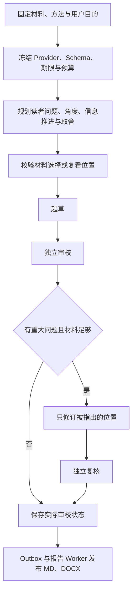

# 内容能力、Skill 与执行 Harness

帧取面向部署者自己的视频、剧本、笔记和草稿，交付可以直接阅读、导出后继续编辑的内容。Skill 提供专业方法；Harness 选择阶段、绑定材料、调度工具、校验结果并控制修订；Temporal 保证任务调度、取消和进程中断后的恢复。三者分别承担明确职责，方法数量不作为质量指标。

## 1. 产品决策

用户反馈中的问题是：文章按截图和操作过程复述，每段解释证据，固定导语、小标题、要点、结尾，加上反复免责声明，读起来像处理记录。仅换模板或标题不能解决问题。

当前选择先从已有材料建立读者问题、写作角度和信息推进，再起草与独立审校。每段必须增加理解；段落、小标题和列表由内容决定。说明文档确有操作依赖时仍使用步骤；不为追求文章感牺牲操作清楚性。作者范文只提供语气与节奏，不能借用身份、经历或事实。

产品取舍采用 pm-product-strategy 的目标、用户任务、能力和取舍框架，以及 pm-execution 的执行与验收方法。证据来自用户反馈、真实稿件和代码；尚无使用频率或规模化质量数据，不编造市场、增长与采用率结论。

## 2. 当前七个产品任务

| 产品任务 | Skill ID | 交付与关注项 |
| --- | --- | --- |
| 成片审阅 | video-review | 整体判断、优先修改、保留理由；按问题选择叙事、镜头、剪辑或连续性方法 |
| 视频写作 | video-to-article | 从可见材料形成独立文章；不逐画面复述，不承担可靠语音转写 |
| 素材拆解 | video-breakdown | 根据用途交付镜头、场景或资产记录中的相应结果 |
| 传播策划 | short-video-packaging | 用户所需的开头、标题或片段方案；现有素材与新增文案分别说明 |
| 剧本审阅 | screenplay-analysis | 故事审稿与逐场定位；人物、对白、结构、场景、连续性作为关注项 |
| 剧本改写 | screenplay-rewrite | 目标语言的文本候选、术语一致性与源文本覆盖 |
| 文字写作 | content-writing | article、post、guide 共用材料绑定，采用各自文体 |

原来的 23 个产品 Skill 收敛为 7 个，移除 18 个旧目录及专属 references，新建 3 个目录，重写保留任务的方法。专项能力合并为任务关注项，不再强迫所有视频都输出分镜、场景、高光、资产与建议的完整套餐。

新任务目录不接受已移除的 ID。历史结果、报告和任务方法快照仍是原始业务记录，不修改或删除；它们按自己的结果契约阅读。执行阶段来自任务保存的不可变方法快照，旧快照中没有 Plan 的任务不会被偷偷加上新付费阶段。

## 3. baoyu 与专业方法

核对 [baoyu-skills 固定版本](https://github.com/JimLiu/baoyu-skills/tree/1567581c26ec29f4216c6e6835415bf30343b0e3)。format-markdown 保留原文与作者表达，只在真正转题时增加标题；它承担排版，不是从材料创作文章的引擎。项目独立实现材料到文章的写作与审校方法。

已保存 title-formulas.md 原文与 MIT LICENSE，仅编译 Straightforward Style 为 baoyu-article-title，供写作与传播策划使用。描述型标题说明对象，判断型标题表达有材料支持的结论；钩子公式、固定字数和强制冲突不装载。

剧本、镜头、剪辑与连续性方法继续引用有实际用途的专业章节。Humanizer 用于独立审校的表达检查，不把作者声音统一成口语，也不用于判断原剧本是否合格。中文排版方法用于成品表达。来源、SHA-256、完整 commit、许可证与章节选择见 [manifest](../../backend/app/services/analysis/skills/modules/manifest.json) 与 [NOTICE](../../backend/app/services/analysis/skills/NOTICE.md)。

运行时不下载方法、安装整包、执行上游脚本或取得公众号权限。图片、封面、渠道排版与明确触发的公众号草稿连接器后置；当前导出仅 Markdown 和 DOCX，没有 HTML 文件导出。方法升级须重新审查并比较真实稿件。

## 4. 材料与正文

普通内容入口 `POST /api/content/analyses` 接收 1–8 份文字材料与 brief；每份最多 40,000 字符，合计最多 160,000 UTF-8 字节，至少一份事实材料。作者范文标记 author_style。原文与 brief 的 SHA-256 固定在任务中；不能通过长自由 Prompt 伪造材料附件。

[content_document.py](../../backend/app/services/analysis/rules/content_document.py) 是文字内容唯一模型。正文最多 120 个段落、标题、列表或引语块，总量最多 200,000 字节。帖子可以无标题；文章和说明文档有标题，均不强制小标题、导语或结尾。

视频文章保留视频 evidence 契约；lead、section.title、closing 可为空，key_points 可以无项目。渲染器省略空字段，正文可以是一篇仅有标题和自然段的文章。时间证据、limitations、私有计划和审校历史不进入 Markdown／DOCX 正文。

文字 evidence_index 绑定正文块、材料与精确的 2,000 字符原文片段，作者范文不能作为事实证据。视频 evidence 不超过权威时长。这些检查证明引用存在和位置有效；事实是否被合理使用由独立审校核对，不能由 JSON 有效推导稿件可用。

## 5. 已实现的 Harness

[ContentExecutor](../../backend/app/services/analysis_execution/content_executor.py) 与 [视频执行器](../../backend/app/services/analysis_execution/video_editorial.py) 在同一 SkillWorkflow Activity 内执行有界阶段：

当前四种视频任务和文字写作正常为 3 次应用级模型调用，最多 5 次：Plan、Draft、Review、可选 Revise、Verify。没有开放式循环或自动扩预算。私有计划说明 reader_question、angle、movement、omit 和材料引用／复看时间；movement 是信息推进，不能直接作为文章小标题。

每阶段只装载对应方法与必要专业模块。审校对照完整原材料独立判断，不采用写作者自评。只有实际影响采用的问题才产生 findings；没有问题允许为空。缺材料时保存 needs_material，不凭空补事实。一次修订后仍有重大问题为 needs_review，不把文件产出当成审校通过。

修订只改变 blocking／major findings 指出的位置；未涉及正文、标题、顺序和证据必须保持原样。视频章节 ID 与数量不变，禁止笼统以 result 要求重写全文。文章页面只读，具体审校意见位于正文之外；不恢复人工修订入口。

剧本审阅仍执行完整场景阅读、分块与全局综合；剧本改写仍执行术语、块改写、覆盖校验与确定性合并。它们已有方法和步骤日志，本次没有将其宣称为新增的五阶段独立审校。

## 6. 函数与观察工具

| 能力 | 实际调用与限制 |
| --- | --- |
| list_materials | 应用列出本任务材料及登记片段 |
| read_material | 严格校验 material_id／segment_id，每阶段最多 88 次；Draft 只取得 Plan 选中的片段，Review 对照完整集合 |
| probe_video／inspect_video_overview／inspect_video_frame | Codex 视频观察 MCP 的实际工具调用；覆盖全片后按需要复核，受时间、调用和文件预算约束 |
| API 视频取证 | 有界均匀抽帧，后续阶段按计划补充复看截图；总帧数仍受 Provider 上限约束，复看最多占一半配额 |
| Review／Revise | 受 journal 记录的模型阶段，不能隐藏额外付费调用 |
| 渲染与保存 | 应用事务、Outbox 和报告 Worker，发布文件不调用模型 |

文字材料选择是模型规划后由应用执行的受控函数调度；当前不是 Provider 原生动态 function calling 循环。API 截图也不是原生视频观察工具循环。Schema／JSON mode 不赋予任意工具能力。

没有任意路径、Shell、账号、网络或其他任务读取。模型输出中的函数与材料标识不改变权限。供应商内部 CLI 迭代和 token 消耗不等于上述应用级调用次数，不能据此承诺固定费用。

## 7. Temporal、预算与恢复

Temporal 编排解析与 Skill 调度；它不替模型决定写作角度。SkillWorkflow 调用 run_skill，Harness 在 Activity 内控制阶段；不为每段建立 Activity。PostgreSQL 保存业务状态、方法快照、模型步骤和预算；Temporal History 只保存任务引用与小状态。报告发布、下载与导入继续用 RabbitMQ。

当前视频任务与文字写作首次付费调用前冻结输入摘要、方法、阶段 Prompt 模板、Schema、语言、Provider／模型／配置摘要、调用上限和期限。密钥不进入绑定。接管不能刷新 deadline；配置变化失败关闭。

started 步骤与预算占用同一事务，发送前校验 owner、attempt、取消、删除、输入、期限和剩余次数。收到返回先持久化，再校验；不合格返回仍占次数。恢复回放已收到结果不增加调用；只有明确未执行才释放占位。发出后超时、断连或进程退出返回 analysis_outcome_unknown，禁止自动再发。显式重跑形成独立运行与预算，不覆盖历史结果。

终态或报告已持久化后清理临时步骤 payload；不可变报告与方法快照保留。供应商未提供可查询的幂等回执时，Temporal 恢复也无法证明恰好执行一次。

## 8. 交付与后续顺序

结果页只读，提供 Markdown 与可编辑 Word 导出。材料或目的改变时新建任务；原稿小范围调整在导出后的编辑器完成。历史人工稿仅保留阅读与所有权，不恢复写接口。新任务不能覆盖原报告。

后续顺序：扩大真实中文／英文文章、短帖、说明文档样本；补充可靠转写、字幕、网页与图片材料绑定；按表达需要加入视觉资产；最后实现明确触发的公众号草稿连接器。连接器的草稿写入与公开发布分别授权和验收。

## 9. 验收条件

- R1 方法：目录只有七个产品任务，无旧 ID 别名；仍使用的专业源模块固定来源与许可，按阶段选用。
- R2 内容：同一材料的新文章围绕一个读者问题，段落推进、归属准确，允许无小标题；正文与导出无计划、时码、审校或重复免责声明。说明文档仍能指导完成任务。
- R3 执行：3／5 次调用、一次定点修订、完整材料独立审校；无效材料选择、越界取证、未指定部分变化均拒绝。未知调用不重发，已知结果可回放，配置和预算不漂移。
- R4 交付：历史结果仍可读，新结果三端按同一契约展示；真实浏览器验证桌面、390px、明暗主题、正文和回查切换；MD／DOCX 检查正文与元数据边界。
- R5 质量：真实模型样稿与自动化检查分别记录；单个通过样本不代表规模化质量、完整音频理解或公众号发布已验证。

实际验证事实随当前实现更新。确定性测试覆盖结构、执行、权限与恢复；真实模型和浏览器用例覆盖选定样本。未完成的产品验收继续在 BACKLOG 导航，不能靠方法文件或文档提交关闭。

源视频已完成的结果页提供“新建创作任务”，保留旧报告并使用当前任务清单新建记录；“重新分析”仍沿用原不可变方法与配置。修改任务用途不需要先删除旧结果。
