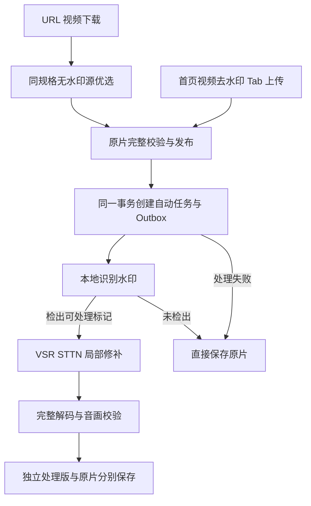

# 视频去水印设计

产品流程以[视频去水印 PRD](../prd/PRD-视频去水印.md)为准，实际证据见[执行计划](../plan/PLAN-视频去水印.md)。接口只以 FastAPI OpenAPI 为契约。

## 1. 自动处理链路

普通「本地视频」导入不创建处理任务；专用 Tab 在媒体导入请求中传入 `remove_watermark=true`，纳入请求指纹并存入下载计划。URL 视频的原片完成事务默认创建自动任务，不需要请求参数；图集 ZIP 不进入视频处理。

内容仍按[解析引擎](14-解析引擎.md)准入，不解密、不扩张身份权限、不依赖公共解析站。

## 2. 源优选

候选 `has_watermark: bool | None` 保存单个上游候选的明确声明；缺字段为 unknown，保留锁定 yt-dlp 的 `Download video, watermarked` 标记。不得从 URL 名称、数字 preference 或顶层字段推断所有流无水印。

先满足原有分辨率、帧率、编码、音轨和容器要求，再按「明确无水印 → 未知 → 明确带水印」选择。同等证据保留现有 muxed、provider hint 与画质规则，不静默降档。B 站同轨道官方备用 URL 需通过现有媒体地址准入，禁止改写签名或放宽端口策略。

## 3. 识别与修补选型

默认修补核心为 [VSR](https://github.com/YaoFANGUK/video-subtitle-remover) 的 STTN，固定提交 `e109b9ddc1d0e8f153199dfa05c1d767546906d8`；VSR 根许可 Apache-2.0，STTN 子目录许可 MIT。仅调用未修改的 `STTNInpaint`，不运行上游 GUI、OCR 或固定帧率视频封装。STTN 权重 SHA-256 为 `c8408c9dd1300bd7000ea3a81b8236db89d9c0f185837781e38283c1e464675b`。

自动识别使用 [RapidOCR](https://github.com/RapidAI/RapidOCR) 3.4.2、ONNX Runtime 1.22.0 和固定 PP-OCRv4 权重；源码与 PaddleOCR 模型来源采用 Apache-2.0，文件摘要在 [检测执行器](../../backend/scripts/detect_watermark.py) 固定。

识别规则为：每 0.5 秒检查四角带补边的画面，只有置信度达标、匹配已知品牌文字且位于边角的标记才产生候选；同一行紧邻的作者名可合并。每帧再次匹配文字边缘，避免水印消失或场景切换后继续涂抹。规则不会把所有 OCR 文字当成水印，不把检测为空解释为视频完全无水印。覆盖范围与质量限制见执行计划。

[WatermarkRemover-AI](https://github.com/D-Ogi/WatermarkRemover-AI/tree/127108a5bff1b880ad34ba26ac8b60710b69bb3b) 的 Florence 检测作为实验参考；本机对 Microsoft Florence-2 base-ft、large-ft 和 large 的实测出现字幕/场景品牌误报，未接为生产检测器。不能把这一观察泛化为所有 Florence 权重的评测结论。

[FFmpeg delogo](https://ffmpeg.org/ffmpeg-filters.html#delogo) 与 removelogo 只作实验基线：抖音贴边样本分别出现黑色渐变和异常色块，不提供算法切换 UI。[ProPainter](https://github.com/sczhou/ProPainter) 的 S-Lab 非商业许可与重量级依赖不纳入默认运行时。LaMa 逐帧修补未验证时序效果，不作为另一条备用产品实现。

## 4. 任务、存储与恢复

原片 Artifact 保持一对一下载语义；`watermark_tasks` 单独绑定来源制品、来源 SHA-256、引擎版本、幂等键、状态、租约和独立输出 key。状态包括 queued、running、succeeded、unchanged、failed、cancelled。公开请求不接收区域、时间、任意路径、URL、滤镜或 shell 参数。

原片完成事务先按 owner 锁顺序处理，再为派生任务预留额度并写入 outbox；额度不足记录处理失败，原片发布不回滚。任务与事件原子提交，重复完成不会重复排队。消息只含任务 ID。单个消费者 prefetch=1；复用 RabbitMQ，新增 `video.watermark` 路由与死信队列，不另起消息设施。

处理在隔离 Python 环境的受限子进程执行；宿主 worker 可使用 MPS，CUDA 主机或 CPU 使用同一入口。启动先校验代码、权重并加载模型后报告可用；离线时状态显示等待服务。Worker 租约、心跳、attempt fence 防止旧进程发布。进程取消终止进程组；线程执行的 MinIO PUT 必须完成后才清理，避免取消后迟到写入。

原片及处理版都纳入容量统计、所有权校验、删除和管理员清理；失败输出 key 在物理清理确认前持续可追踪。未开始的自动任务可随原片删除取消，正在执行或尚未清理的租约保护原片。原片与处理版分别通过 owner 校验后取回，支持 Range；不暴露存储凭据。

## 5. 媒体验证与资源

支持的输入限制：180 秒、1920×1080 像素数量、6000 帧、2 GiB、8-bit yuv420p SDR、方形像素、无旋转、单视频流，以及 AAC 音轨或静音。超出限制保留原片，不隐式裁边、缩短、降分辨率、转 SDR 或转 CFR。

PyAV 保留每帧 PTS 与原时间基，视频按 H264 CRF18 重编码；FFmpeg 复制音轨。输出必须通过完整解码、视频帧时间戳与画幅逐项一致、时长容差、全部解码音轨哈希与起点校验，原片哈希保持不变。未检出时不生成重复重编码文件。

子进程限时 30 分钟，临时空间需满足有界输入、中间文件和输出预算。模型只安装到隔离计算环境，不成为 FastAPI 或下载 Runner 的依赖。

## 6. 客户端

首页专用上传 Tab 和 URL 下载共享内置处理能力，详情仅展示处理状态与原片、处理版保存入口。失败允许无参数重试，不增加人工编辑步骤。处理状态与原片下载状态独立；AI 分析始终读取原片。

API 生成到 Frontend 后同步 Electron；App 只更新冻结契约中已有的媒体导入字段，不增加未授权的移动端编辑器。真实媒体、桌面/390px、明暗主题、键盘、保存与失败恢复分别验收，记录于执行计划。
