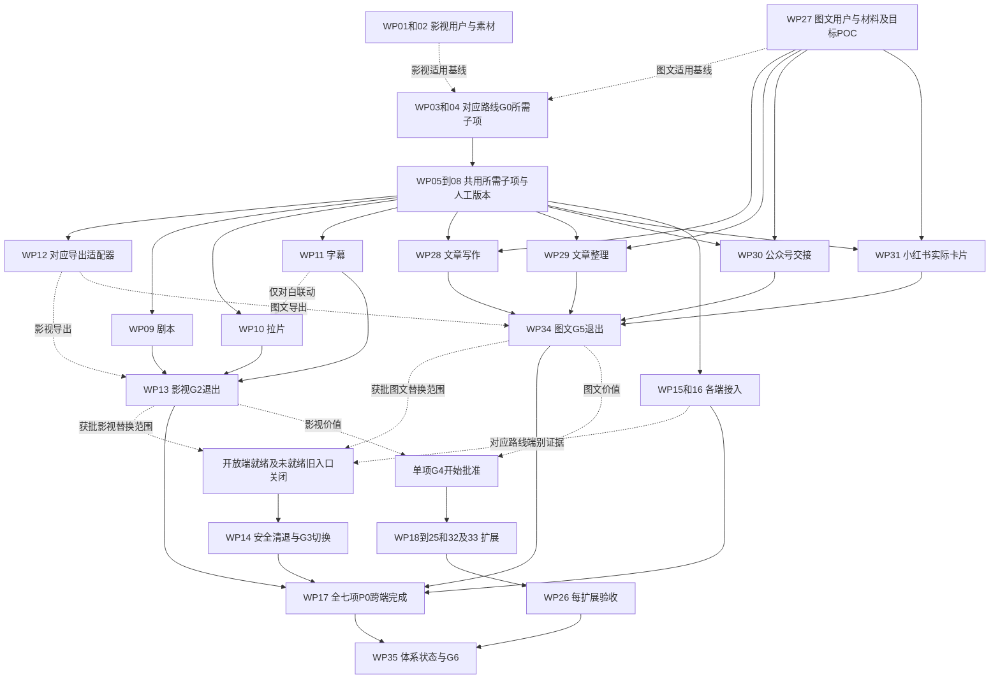

# 内容创作 Skill 体系执行计划（PLAN）

| 项目 | 内容 |
| --- | --- |
| 产品与范围 | 帧取 FrameFetch；落实影视 11 项和文章／图文 6 项，共 17 项能力，按领域及 P0／P1／P2 分阶段交付 |
| 需求来源 | [内容创作 Skill PRD](../prd/PRD-内容创作Skill体系.md)；原影视基线为 `a6754d1f`，本轮随用户补充同步文章与图文范围 |
| 编制日期 | 2026-10-04，Asia/Shanghai |
| 当前状态 | 执行计划已编制；下述工作包、验证和发布均未开始，不代表新能力已实现 |
| 本次授权 | 需求拆解、功能与非功能要求、实施顺序、完整性检查、验收与 checklist；不执行安装、业务代码清退、数据库变更或发布 |
| 使用方法 | pm-execution 的 sprint-plan、user-stories、test-scenarios、pre-mortem、outcome-roadmap |
| 文档职责 | PRD 定义产品范围与成功标准；本文维护落实方式、依赖、工作包、执行门槛和证据状态；[系统设计](../design/README.md)维护技术约束 |

## 1. 执行目标与管理方式

让用户围绕自己的剧本、成片、文章和图文材料完成“确认材料与范围 → 运行创作任务 → 核查依据 → 人工修订 → 保存版本 → 导出继续工作”。P0 有两条可独立推进的路线：影视三项与文章／图文四项，共七项；共用材料、版本、任务和预算基础，公众号与小红书交付不依赖影视转录和切点完成。

“完整”在本计划中指：PRD 的 17 项能力均有明确的输入、用户动作、交付物、依赖、失败处理、评测和发布负责人；各项上线时都能走完完整使用流程。规划覆盖完整不等于已经全部可用，P1／P2 尚未验收不能算作已支持。全部七项 P0 均达标才可称整体 P0 完成；分方向或分端交付明确列出未完成项。完整 NLE、自动成片或自动平台发布不属于这份承诺。

数字目标引用 PRD 的[影视指标](../prd/PRD-内容创作Skill体系.md#42-建议验收目标)与[文章图文指标](../prd/PRD-内容创作Skill体系.md#43-文章与图文建议验收目标)，均为待验证目标。本计划不编造团队人数、历史速度、模型质量、硬件性能或准确工期。不使用旧 Skill、旧结果枚举、旧模型流水线推导新能力；实施前对旧代码的检查仅用于确定安全清退和引用集合。

### 1.1 负责人和执行记录

| 角色代号 | 职责 | 人员状态 |
| --- | --- | --- |
| PO | 用户价值、范围、预算、排期和发布决定 | 待指派 |
| PM | 需求追踪、用户观察、验收口径和风险维护 | 待指派 |
| FILM | 编剧／导演／剪辑专业评审，标注与质量复核 | 待邀请；不能用模型自评分替代 |
| EDIT | 文章作者／编辑与图文评审，结构、改稿、排版、逐页阅读及交接 | 待指派；不要求所有文章由 FILM 评审 |
| BE | 材料、任务、版本、执行、契约、数据与导出 | 待指派 |
| AI | Skill 方法、证据、工具与模型适配、离线和真实评测 | 待指派 |
| WEB | Web 任务入口、证据回查、校订和交付 | 待指派 |
| DESK／APP | Electron／Flutter 独立接入与安装包／真机验收 | 待指派；保护各仓库已有并行修改 |
| QA／OPS | 测试、故障演练、容量、制品保留和切换 | 待指派 |

角色可由同一人兼任，但每个工作包必须在开始前指定一个实际负责人。工作包初始状态全部为“未开始”；执行时只在本文更新状态和脱敏证据链接，不另开平行任务账本。

工作包记录格式：`ID／实际负责人／状态／估算与实际投入／阻塞／实现提交或 PR／测试环境／证据链接／评审者／下一步`。状态为未开始、待澄清、可开始、进行中、待验收、完成或受阻；“受阻”需说明条件和处理人，“完成”必须符合第 5.3 节。未开始的 P1／P2 使用“未开始”，不能以“暂不做”代替覆盖或验收。

### 1.2 开始实施前需要冻结的决定

| 决定 | 需要的具体结果 | 负责／截止门槛 |
| --- | --- | --- |
| DEC-01 用户与范围 | 两个方向的访谈、任务、七项 P0 分批交付与替换范围；任何删减回写 PRD | PO／PM；对应路线 G0 前 |
| DEC-02 评测集 | 按影视／图文分别冻结授权来源、素材哈希、标注规则、样本分组、训练／调参与验收素材区分 | 对应领域 FILM 或 EDIT／QA；对应路线 G0 前 |
| DEC-03 运行环境 | 按任务所需冻结 CPU、内存、GPU／显存、操作系统、编码范围、模型和计算精度 | BE／AI／OPS；对应路线 G0 前 |
| DEC-04 资源与费用 | 单任务时间／CPU／内存／磁盘／调用／token 限额，价格与计费粒度、成本预留和可核实的费用上限，取消清理期限、排队上限；无法核实金额边界的付费线路不开启 | PO／BE／OPS；对应路线 G0 前 |
| DEC-05 精度与质量 | 两个方向的 PRD 事实口径、影视适用 CER／时间判据，以及每组通过条件 | 对应领域 FILM 或 EDIT／AI／QA；对应路线 G0 前 |
| DEC-06 字幕与交付 | 中文断句、行长、阅读速度、重叠对白、格式与目标播放器 | FILM／WEB／QA；字幕任务 DoR 前 |
| DEC-07 工具与权限 | 来源版本、许可范围、模型权重、允许文件／网络、预置依赖与故障降级 | BE／AI；相关工作包 DoR 前 |
| DEC-08 容量与排期 | 实际人员、可用时间、估算、预留容量与评审时间 | PO／各角色；每次迭代承诺前 |
| DEC-09 扩展能力标准 | 每项 P1／P2 的业务样本、专业评审判据、目标软件／服务和必要权限 | PO／对应领域 FILM 或 EDIT／QA；对应能力 DoR 前 |
| DEC-10 切换与恢复 | 当前任务与历史制品盘点、关闭入口方式、客户端就绪条件、恢复演练结果 | BE／OPS／客户端负责人；G3 前 |

未冻结的决定是进入相应实施或发布阶段的前置条件，不是本次计划编写的完成条件。不得用“待定”绕过验收，也不得因为没有团队容量就给出假工期。

新增决策按图文路线使用，未完成的媒体子项不阻塞已经就绪的文本子项；每包分别记录子项状态，不能将整个共用包标为完成。

| 决定 | 需要的具体结果 | 负责／截止门槛 |
| --- | --- | --- |
| DEC-11 文章质量与模式 | 图文用户与基线、文本／文件上限、段落来源、格式／改写允许变更、事实与编辑样本 | EDIT／PM／QA；图文 G0 所需项，WP-27 |
| DEC-12 图文目标与资源 | 公众号目标编辑器／交接方法，卡片模板／画布／字体／页数预算，素材权利、解码限制、实际文件判据 | EDIT／BE／QA；WP-30／31 的 DoR 前；平台规则接入时核实 |
| DEC-13 可选外部线路 | 网页合法用途、允许来源／重定向／快照与摘录范围；图像账号／计费／外发／保留规则 | PO／BE／AI／QA；WP-32／33 中相关调用开始前 |

## 2. 功能性需求与完整能力覆盖

### 2.1 共用功能需求

下述 F 编号是 PRD 的执行拆解，FR／US／TC 是 PRD 原有编号。功能先按完整用户动作实现，再组合成 Skill；工具抽帧、切点检测、转录或 MCP 本身不作为新增用户 Skill 计数。

| ID | 描述性功能需求与可观察完成条件 | PRD 来源 | 工作包 |
| --- | --- | --- | --- |
| F-01 材料接入与确认 | 接收允许的成片、文本、字幕、文章／笔记、用户图片和专名表，展示原件、可处理范围与缺失项。用户确认场景／媒体区间／文章段落及资产范围，错误、超限或提取失败在模型调用前停止；原件与确认版本分开保存。 | FR-01／05，US-01／02，TC-01～04 | WP-05／08 |
| F-02 任务选择与可用性 | 按用户工作目标展示已验收任务，检查必要材料、语言、工具和当前客户端是否支持。缺条件时给出补充材料、缩小范围或更换任务的操作；未开放的能力不能出现可执行的半成品入口。 | FR-05／10／11／12，TC-08／13／21／22 | WP-07／08／15／16 |
| F-03 范围、外发与预算确认 | 提交前让用户看清使用哪个材料版本、读哪些场景／时间范围、哪些内容会送给外部模型及可用预算。一次确认绑定一次任务；重复请求不能重复创建同一付费任务，范围变更需要重新确认。已提交且费用未知的调用继续占用预留预算，不能按未收费释放或重试。 | FR-01／08／09，US-02／07，TC-03／04／18 | WP-05／06／08 |
| F-04 可核查观察 | 把事实、解释、建议和存疑分别组织。事实引用原文跨度或源时间证据，点击能回到同一材料；证据合法但不支持结论仍是不合格，不能只用 schema 校验判定正确。 | FR-02／03／06，US-03／04，TC-05～07／22 | WP-05／08／09／10／11 |
| F-05 校订与人工决定 | 用户可改字幕、镜头、文章段落、渠道稿、页卡与素材说明，采纳、拒绝或标记存疑。保存生成独立人工版本，保留生成候选与作者来源；普通修改不重新调用模型，也不覆盖原剧本和视频。 | FR-04，US-03～05，TC-05／06／09／11／12 | WP-08／09／10／11 |
| F-06 状态、取消与恢复 | 显示任务与局部覆盖的真实状态，区分待人工确认、结果未知、分析失败和导出失败。断网重连、进程退出和用户取消后重新查询服务端状态；已保存版本可取回，未知付费调用不可自动重发。 | FR-08／09／11，US-08，TC-15～18 | WP-06／08／13 |
| F-07 格式化交付 | 按任务从确认版本生成 Markdown／DOCX、CSV、SRT／VTT／TXT、受限 HTML、PNG／JPEG 与素材包；检查正文、引用、编码、字段与目标阅读器。导出失败只重做导出，不能重新推理，旧导出文件不被覆盖。 | FR-07，US-06，TC-12／17 | WP-12 |
| F-08 历史与版本回查 | 找回原始材料、确认范围、候选、人工版本和导出之间的关系。换稿或换素材后保留旧工作但明确其来源；删除／保留规则在实现时核对引用，不能因旧代码清退删除用户制品。 | FR-01／04／07，TC-01／12／15／20，PRD 8.2 | WP-05／08／14 |
| F-09 Skill 接入和更新 | 为每项能力维护方法、输入、步骤、证据、停止条件、模板和正负例；工具由受控执行层提供。来源、许可、中文修改和评测版本冻结后才进入目录；更新上游或模型需重新完成相应评测。 | FR-10，PRD 3.4／7.6，TC-21 | WP-03／07 |
| F-10 跨端同一工作 | Web、Electron、App 共用生成的服务契约和材料／人工版本。客户端独立实现选择、回跳、校订、恢复、保存与导出；未通过独立验收的端不声明支持，源码同步和构建不能替代验证。 | FR-12，TC-19 | WP-15／16／17 |
| F-11 旧目录安全清退 | 在新闭环达标后关闭旧创建入口，排空或确认取消，核对历史制品，再停旧执行者并切换。清理旧 Skill 内容、调用方、依赖、结果入口和文档，不新增别名或永久兼容流程。 | PRD 8.2，TC-20 | WP-14 |
| F-12 专业评测与发布声明 | 用冻结样本和真人评审验证正确性及可用交付，把范围、局限、未处理区间和未支持语言写入实际能力声明。各能力、模型线路、格式和客户端分别记录结果，失败不能被总成功率掩盖。 | PRD 4.2／4.3／7.2／8.4，TC-05～13／19／22 | WP-02／04／13／17／26 |

图文专属需求沿用同一材料、任务和版本基础，不另建调度／结果账本。

| ID | 描述性功能需求与完成条件 | PRD 来源 | 工作包 |
| --- | --- | --- | --- |
| F-13 文章写作与编辑 | 确认主题、受众、目的与模式；生成提纲／正文或整理用户稿。事实回查段落来源，新增观点为候选，重要删改可比较、采纳／撤销；格式模式保护事实、代码与引用。 | FR-13，US-09／10，TC-23～25 | WP-27／28／29 |
| F-14 公众号可编辑交接 | 直接使用用户确认稿，编辑段落、标题／摘要、图注／图片引用和样式，导出母稿、受限 HTML、资源与说明；本地预览和目标编辑器分别验收。缺图、清洗差异明确，无账号写入。 | FR-14，US-11，TC-26／27 | WP-30 |
| F-15 小红书文案与实际卡片 | 直接使用确认资料／文章，编辑标题、正文、话题候选、逐页要点和页序；模板输出真实 PNG／JPEG。文本与图片状态分别显示；裁字／缺字体不算成功，改字后仅重做受影响渲染。 | FR-15，US-12，TC-28／29／34 | WP-31 |
| F-16 配图资产与可选生成 | 配图位置、图注／alt、风格和来源／权利清楚，区分用户图、方案、提示词与真实产物；原图保留，输出新文件。AI 生成独立确认外发、账号、预算与回执。 | FR-16，US-13，TC-30／31 | WP-27／31／32 |
| F-17 有权资料摘录 | 先处理用户本地参考；联网时确认合法用途与范围，受控只读取得正文并保存来源、时间、快照／哈希和短引文。保护、不可访问与缺失明确，不从浏览器取凭据、不抓整站。 | FR-17，US-14，TC-32 | WP-33 |
| F-18 跨渠道版本与独立支持 | 母稿、渠道稿、页卡和资源绑定确认版本；改母稿提示受影响项，不覆盖人工派生稿或重新收费。各路线和各端独立验收，七项全部通过才称整体 P0 完成。 | FR-18／12，US-15，TC-33～35 | WP-05／08／17／34／35 |

### 2.2 全部 17 项能力与执行链

| 能力 ID | 阶段／用户能力 | 工作包 | 主要前置能力与产物 | 首次验收编号 |
| --- | --- | --- | --- | --- |
| CAP-01 | P0 剧本诊断与修订计划 | WP-09 | 已确认场景、原文证据、人工修订清单 | TC-01／02／05／12 |
| CAP-02 | P0 镜头与视听拉片 | WP-10 | 源时间、镜头候选、画面／对白笔记、人工声音注释 | TC-06～08／22 |
| CAP-03 | P0 中文字幕与对白校订 | WP-11 | 受控音轨、转录／已有字幕、术语表、校订字幕 | TC-09～11／12 |
| CAP-04 | P1 故事开发与场景写作 | WP-18 | 作者约束、场景目标、Fountain 候选 | AT-01 |
| CAP-05 | P1 分镜与视听方案 | WP-19 | 已确认剧本、制作约束、镜头与资产清单 | AT-02 |
| CAP-06 | P1 剧本与成片对照 | WP-20 | CAP-01／02／03、双侧证据、人工匹配 | AT-03 |
| CAP-07 | P1 连续性与剪辑审阅 | WP-21 | CAP-02／03、连续片段、可核查修改建议 | AT-04 |
| CAP-08 | P1 影视资料与参考研究 | WP-22 | 作品消歧、授权参考／可用资料接口、来源 | AT-05 |
| CAP-09 | P2 有权选段与粗剪交接 | WP-23 | CAP-02／03、确认选段、目标 NLE、EDL／OTIO | AT-06 |
| CAP-10 | P2 AI 预演与视觉参考 | WP-24 | CAP-05、确认分镜、参考权利、提示词与可选生成 | AT-07／08 |
| CAP-11 | P2 影视解说与传播准备 | WP-25 | CAP-02／08、确认观点与资料、解说／宣传候选 | AT-09 |

CAP-04／05 可以使用用户已确认的自有文本，不要求先在 CAP-01 里完成诊断。CAP-06 不要求一个镜头对应一个场景；CAP-08 可先处理用户明确提供的参考，外部资料接口通过条款和运行验证后才接入；CAP-10 的文本提示词交付与付费生成分别验收。

图文六项的映射如下；公众号与小红书都可直接消费用户确认稿，不以文章生成、彼此或影视三项作为硬前置。

| 能力 ID | 阶段／用户能力 | 工作包 | 前置与产物 | 首次验收 |
| --- | --- | --- | --- | --- |
| CAP-12 | P0 文章策划与结构化写作 | WP-28 | 文本来源、主题／受众、提纲与人工正文 | TC-23／33／34 |
| CAP-13 | P0 文章编辑与格式整理 | WP-29 | 用户稿、模式、差异与确认版本 | TC-24／25／33／34 |
| CAP-14 | P0 公众号图文编排与交接 | WP-30 | 确认稿、资产、受限 HTML 与可编辑包 | TC-26／27／34 |
| CAP-15 | P0 小红书笔记与卡片整理 | WP-31 | 文案、逐页源、模板／用户图与实际卡片 | TC-28／29／34 |
| CAP-16 | P1 内容配图与视觉资产整理 | WP-32 | 确认稿／页卡、权利、方案与可选真实图 | TC-30／31，AT-10 |
| CAP-17 | P1 有权网页与素材摘录 | WP-33 | 本地参考或允许网页，短引文与来源快照 | TC-32，AT-11 |

### 2.3 各能力的执行要求

#### CAP-01：剧本诊断与修订计划

- **输入与用户动作**：作者提供允许格式的剧本，确认文本版本、分场和处理范围，可填写关注点。无法定位原文先补材料，不运行空文本或默默扩到未读场景。
- **实施内容**：整理情节事实，逐项检查人物目标、冲突、场景变化、因果和连续性；引用原文再给修订候选，保留有效之处，不强制套统一故事公式或评分。
- **交付与人工决定**：概览、问题优先级、证据、有效之处和下一稿修订清单；作者可编辑、采纳、拒绝或存疑，导出 Markdown／DOCX。
- **验收**：TC-01／02／05／12；具体观察回查有效并通过语义支持复核；修改后版本与导出一致，原稿不变。故事评价和审美意见不冒充客观事实。
- **候选与责任**：AI／FILM／BE／WEB；PRD S-01 只作修订方法参考，诊断与项目证据规则自行实现，不直接把写作 Skill 当诊断器。

#### CAP-02：镜头与视听拉片

- **输入与用户动作**：用户选择有权成片的区间，检查音轨、转录和画面能力，选择观察重点；确认或修改切点候选。
- **实施内容**：检测边界、读取实际帧及可用对白证据，记录可见动作和剪辑关系。工具候选、人工边界、语义场景和解释分开；单帧不证明镜头运动、焦距或导演意图。
- **交付与人工决定**：镜头清单、画面与对白笔记、可选人工声音注释、叙事关系、依据与局限；笔记 Markdown／DOCX，镜头表 CSV。
- **验收**：TC-06／07／08／12／22；按冻结绝对时间误差和切点指标评测。没有可靠音频理解时不写音乐、环境声、语气等已确认事实；无对白片段仍可完成视觉研读。
- **候选与责任**：AI／FILM／BE／WEB；T-03 和受控媒体读取为工具候选，不把 S-02 的“剧本到分镜”当作成片读取能力。

#### CAP-03：中文字幕与对白校订

- **输入与用户动作**：用户确认成片音轨、字幕语言和范围，可提供已有 SRT／VTT 与专名表；校词、断句、时间和存疑后保存。
- **实施内容**：转录或校核用户字幕，检查缺词、专名与时轴，保留合法重叠对白。不会辨认人物姓名时保留未知，不靠剧情补听不清的台词。
- **交付与人工决定**：确认版 SRT／VTT、TXT、术语与存疑清单、修改记录；原始字幕、转录候选和人工版可区分。
- **验收**：TC-08～12；清晰普通话按 PRD 测 CER 和起止时间误差，噪声、方言、混说、音乐和重叠单列。无音轨不能转录；转录不可用时只校用户字幕并声明未听音核验。
- **候选与责任**：AI／FILM／BE／WEB；T-04 做本地 POC，权重预置与依赖固定。S-04 云替代需单独验证，不作为默认上传路径。

#### CAP-04：故事开发与场景写作

- **输入与用户动作**：作者提交原创概念／已授权文本，确认人物、场景目的、前后状态、长度与创作限制；缺失关键输入先澄清。
- **实施内容**：生成可选择的故事方向、梗概、节拍或场景候选，维持作者已确认约束，写可被拍摄的行动和对白。新增情节作为创作候选，不伪装为用户原稿中的事实。
- **交付与人工决定**：梗概、节拍、Fountain 场景和修改理由；作者确认后保存派生文本，原文不覆盖。正文与制作说明分开，格式可在已选择的剧本工具中读取。
- **验收**：AT-01；中文场标题与角色规则、对白区块和用户约束不丢；正文可导入／阅读，拒绝或修改候选能保存。专业可用性判据由 DEC-09 冻结。
- **责任与依赖**：AI／FILM／BE／WEB；复用来源明确的 S-01 方法，依赖材料与版本基础及 G4，不要求自动生成全长商业剧本。

#### CAP-05：分镜与视听方案

- **输入与用户动作**：提供已确认剧本场景、时长与制作限制，可附人物／地点／道具连续性资料；用户选取可拍摄方案。
- **实施内容**：把场景意图转成镜头目的、景别、机位／运动建议、视线与空间方向、声音计划、连续性和资产需求。建议是制作规划，不是原片观察或已有资产证明。
- **交付与人工决定**：可编辑镜头清单、声音计划、人物／地点／道具与连续性清单，文本／CSV；需要的场景文本可用 Fountain。没有图像 API 也能交付文本方案。
- **验收**：AT-02；每镜对应场景与制作目的，时间／镜头数量自洽，必要资产和未知项可见，中文字段正确，修改后交付同步；不把提示词当图片。
- **责任与依赖**：AI／FILM／BE／WEB；可适配 S-02；依赖确认材料、人工版本和 G4，不依赖 CAP-10 的云生成。

#### CAP-06：剧本与成片对照

- **输入与用户动作**：确认同一作品、版本的剧本与成片，选择双侧范围，逐项确认自动匹配或手动调整。
- **实施内容**：用文本、对白和片段证据提出匹配候选，列出增删、调序与表达变化；容许一对多、多对一和未匹配，不强行把场景与镜头拉成一对一。
- **交付与人工决定**：双侧定位的对照表、变化笔记、存疑与未匹配清单，引用确认版本；人工调整后保持双方链接一致。
- **验收**：AT-03；用删场、调序、相似对白和缺失文本样例检查错误匹配，低置信项不成为确认事实；回跳两侧合法，版本变化不复用过时确认。
- **责任与依赖**：AI／FILM／BE／WEB；依赖 CAP-01／02／03 的证据与定位以及 G4，不另建文本或媒体任务账本。

#### CAP-07：连续性与剪辑审阅

- **输入与用户动作**：选连续成片范围，可附剧本或作者意图；用户回看候选问题并决定保留或修改。
- **实施内容**：检查动作、道具状态、空间方向、对白和节奏关系，每个问题给可回看的上下文。跨镜缺失证据标存疑，区分艺术选择、实际事实错误和创作建议。
- **交付与人工决定**：问题／有效之处、时间证据、建议与优先级；保留人工决定，生成可导出的审阅清单。
- **验收**：AT-04；正例与正常剪辑／有意跳切负例均经专业评审，不能只“总能找出问题”。没有直接音频能力时不检查未核验的声画同步或语气事实。
- **责任与依赖**：AI／FILM／BE／WEB；在 CAP-02／03 的质量达标后开展，专业正确性与误报判据在 DEC-09 冻结。

#### CAP-08：影视资料与参考研究

- **输入与用户动作**：选择明确作品身份、研究问题与有权参考；同名作品或剧集／版本不明时用户先消歧。
- **实施内容**：在允许的只读来源取得资料，标明出处、检索时间、语言和缺失字段，分开外部资料、片中证据和研究观点；资料冲突不默默合并成事实。
- **交付与人工决定**：带来源的研究笔记、比较表、待核实项和资料引用；用户可修订观点和保留来源，缺外部服务时可限定为用户参考的研究。
- **验收**：AT-05；同名、错版、中文字段缺失、引用失效／来源冲突、服务限流分别验证。代码许可不替代数据／图片条款，不能通过爬库补接口缺失。
- **责任与依赖**：AI／PM／BE／WEB；T-01 是有条件工具候选；资料和图片权限在 G4 与 DoR 前验证，拟接外部接口时另验证服务凭据和地区可达；用户提供参考的线路不依赖外部接口可用。

#### CAP-09：有权选段与粗剪交接

- **输入与用户动作**：选择自己的合法素材、剪辑目标、片段及目标 NLE；人工确认顺序、入点与出点。
- **实施内容**：保存来源时间与时间线时间的映射、素材引用、片段顺序和必要音视频属性，按已验收格式生成交接，不隐含复制商业片授权。
- **交付与人工决定**：确认片段清单、CSV、选定的 EDL／OTIO 和引用说明；导出引用素材的时间线，不声称已经渲染成片。
- **验收**：AT-06；在固定 NLE／adapter 版本真实导入并检查素材链接、帧率、入出点、顺序和音轨；可再导出核对能保存的字段。未支持字段／效果明确列出，缺素材不显示完整成功。
- **责任与依赖**：BE／AI／FILM／QA；CAP-02／03、人工选段和 G4；T-05 只做交换工具候选，按软件与格式逐项验收。

#### CAP-10：AI 预演与视觉参考

- **输入与用户动作**：提供已确认分镜、连续性和参考权利；先核对提示词／参考包，选择是否显式发起云生成并确认费用与外发内容。
- **实施内容**：组织逐镜提示词、参考资产和一致性限制，标明未生成部分。付费生成有独立请求与回执，未知结果停止自动重发，不能用文字包成功证明云产物已可用。
- **交付与人工决定**：提示词和参考包；可选生成的分镜板／预演候选及来源，人工接受／拒绝并记录版本；生成图不作为真实事件或原片事实证据。
- **验收**：AT-07 文本参考包与 AT-08 云执行分别通过；人物／道具／风格一致性专业检查，缺账号、超预算、部分成功、回执丢失和取消分别验证。
- **责任与依赖**：AI／FILM／BE／QA；CAP-05、G4、参考权利与外发范围；S-03 为条件候选，S-05 与 Wayland 许可未清前不可直接复制。

#### CAP-11：影视解说与传播准备

- **输入与用户动作**：选择已确认观察、资料、作品定位、受众和传播目标，明确观点与剧透范围；需要作品资料时先消歧。
- **实施内容**：组织解说提纲／宣传候选和依据，区分原话、概括、创作表达与观点，不虚构台词或补造研究资料，不由文案推断票房或传播收益。
- **交付与人工决定**：可编辑提纲、解说／宣传候选、引用与存疑；用户确认后离线导出，正文与回查材料分开。
- **验收**：AT-09；关键事实来源正确、未确认观点可见、缺证据不强行续写；用户改稿与导出一致，不发生平台账号连接、草稿写入或自动发布。
- **责任与依赖**：AI／PM／FILM／BE／WEB；CAP-02／08 和 G4；自媒体用户价值另验证，不因文稿生成成功宣称传播有效。

#### CAP-12：文章策划与结构化写作

- **输入与处理**：原创观点、有权参考、受众和目的；先确认角度与提纲，再生成可修改正文。缺资料可给观点框架，不补造统计、引语或经历。
- **人工与交付**：提纲、正文、来源与待核事实，逐段修改、确认、保存，Markdown／DOCX 与确认版本一致。
- **验收与依赖**：TC-23／33／34；EDIT／AI／BE／WEB，依赖共用文本、预算、人工版和导出所需子项，不依赖视频、ASR 或 CAP-17 联网。

#### CAP-13：文章编辑与格式整理

- **输入与处理**：直接输入用户稿／笔记，选择格式整理、润色、重组或压缩，记录必保留项。冲突资料待核实，格式模式不静默改标题、数字、引文和代码。
- **人工与交付**：原稿、差异、整理候选、确认版与引用，可采纳／撤销重要删改；只重导出不重复推理。
- **验收与依赖**：TC-24／25／33／34；EDIT／AI／BE／WEB，独立于 CAP-12，用真实中文、表格、代码、链接和多稿负例评测。

#### CAP-14：公众号图文编排与交接

- **输入与处理**：用户确认稿、授权图片、样式与目标编辑器；结构、摘要、图注和资源可修改，渲染受限 HTML 并做安全预览。
- **人工与交付**：可编辑母稿、HTML、资源、来源／权利和交接说明；保留缺图与复制清洗局限，不进行账号连接、草稿 API 或发布。
- **验收与依赖**：TC-26／27／34；EDIT／BE／WEB／QA，在用户授权的真实目标编辑器人工复制／导入并预览，不自动保存草稿；本地包不冒充平台接受证据。不依赖小红书或云出图。

#### CAP-15：小红书笔记与卡片整理

- **输入与处理**：确认文章／资料、受众、逐页目标、模板及可选用户图；文案、页内内容、来源和页序可编辑。不虚构亲历、产品效果或数据。
- **人工与交付**：笔记、逐页可编辑内容源、实际封面／内页 PNG／JPEG、顺序和资源包。文字、模板渲染与 AI 图片状态分开，失败保留源稿；改字只重渲染受影响页。
- **验收与依赖**：TC-28／29／34；EDIT／BE／WEB／QA，逐页真图与手机可读性、缺字体／坏图／溢出反例通过；只有方案不能关闭 P0。用户图／字体／模板准入在共用基础及 WP-31，不依赖 CAP-16 的 P1 整包或云账号。

#### CAP-16：内容配图与视觉资产整理

- **输入与处理**：确认稿、配图位置、已有资产与权利，形成封面／配图方案、alt、图注和清单；可选生成有独立外发、费用和请求。
- **人工与交付**：可编辑方案、权利／哈希清单和已存在图片；原图保持，未生成明确，用户接受／替换。与影视预演共用预算保护，但不伪造相同用户任务。
- **验收与依赖**：TC-30／31、AT-10；EDIT／AI／BE／QA，用户素材交接与云产物分别验收；对应方向 G4，A-04／06 条件适配。缺云路线不阻止 P0 模板图。

#### CAP-17：有权网页与素材摘录

- **输入与处理**：合法取得的本地材料，或用户指定且有允许用途依据的网页，限定摘录范围。记录来源、取得日期、快照／哈希与短引文，正文和图片权利分开。
- **人工与交付**：Markdown、来源／冲突／不可访问清单；页面变化不替换旧稿依据，用户可修订并保存。不能仅凭公开或勾选认定转载授权。
- **验收与依赖**：TC-32、AT-11；EDIT／BE／QA，G4、DEC-13 适用条件和受控提取工具；保护内容、私网／重定向／页面指令负例。无网络可继续整理已提供参考，不读宿主账号。

## 3. 非功能性需求

NFR 是实现和发布要满足的质量约束，不是额外用户 Skill。PRD 已有数值只引用原标准；本节补充测量、故障和证据要求。硬件相关时间、内存、并发和外部费用在 DEC-03／04 冻结，未冻结或未通过的线路不得发布，不填任意秒级 SLA。

| ID／质量属性 | 描述性要求 | 验证与通过条件 | 负责／适用 |
| --- | --- | --- | --- |
| NFR-01 数据完整性 | 原件、确认材料、候选、人工版本和制品身份清楚；重跑、导出或清退不覆盖已有用户工作 | 换版本、重复保存、失败恢复与切换后核对引用和哈希；所有确认工作和历史制品可取回 | BE／QA；全部 |
| NFR-02 证据正确性 | 结构合法与语义支持分开；事实、推测、建议、存疑及来源类别明确 | 影视 P0 至少 200 条观察、图文 P0 至少 100 条事实按 PRD 分组双人复核；新增能力按 DEC-09 冻结的事实样本与判据评测，纯创作候选另做专业质量检查；低支持率阻止相应事实线路发布 | FILM／EDIT／AI／QA；产生事实的线路，创作质量另评 |
| NFR-03 时间精度 | 使用源时间基准，处理帧率、剪裁偏移、恒定错位与累计漂移 | PRD 的回跳、硬切与对白边界目标分别测试；100 回跳点、50 硬切、10 叠化、100 对白起止边界分组记录 | BE／AI／QA；媒体任务 |
| NFR-04 语言与字幕质量 | 中文界面、术语、UTF-8 和断句可用，中文与英文／混说承诺分开 | CAP-03 及声称自动对白能力的线路按 PRD 用 60 分钟授权普通话评 CER，清晰语音与噪声、专名、方言、重叠单列；纯文本按 DEC-11／12、专业创作按 DEC-09 的适用判据检查，英文输出另评 | 对应领域 FILM 或 EDIT／AI／QA；文本与字幕，CER 仅适用自动对白 |
| NFR-05 音频与视觉能力边界 | 音轨、ASR 与实际听音能力各自声明；实际帧和连续证据不足时不猜运动、身份或意图 | 无音、静默、有音但只能读文字、单帧与低证据样例均不输出越界事实；TC-08／22 及专业盲评 | AI／FILM／QA；CAP-02／03／07 |
| NFR-06 可恢复性 | 已确认结果可复用，分析与导出恢复分开，未知收费调用不能自动重发 | 模型已受理但回执丢失、持久化前退出、导出失败后恢复；每个付费请求与回执可核对，无盲目重复 | BE／AI／QA；全部 |
| NFR-07 取消与并发一致性 | 取消阻止后续步骤和迟到覆盖，人工保存／重试／客户端重连不能互相覆盖确认版本 | 取消各阶段、迟到回执、并发保存与版本过期验证；不丢已发生的确定回执，也不假称远端费用已停止 | BE／QA；全部 |
| NFR-08 预算与有限执行 | 单任务有可执行的资源、时间、调用和 token 限额；付费步骤先按核实的计费规则预留成本，超限停止并给局部覆盖 | 冻结配置下压测和低预算负例；重启／重试不重置预算，未知费用持续占用预留，核实回执后才结算或释放；无法验证金额上限的线路不开启付费，不承诺未知供应商账单的硬上限；取消期限内终止子进程，不能隐含下载模型 | BE／AI／OPS／QA；全部 |
| NFR-09 性能与容量 | 首期面向个人部署，一条活跃重任务；记录排队、冷／热启动、处理速度与峰值资源 | DEC-03／04 先确定参考环境与上限，再验证最长支持素材和资源耗尽；不同硬件分别报告，不扩成多租户集群 | BE／AI／OPS；P0 |
| NFR-10 隐私与权限 | 外发去向可理解，文件／网络／工具权限由执行层限制，作品和凭据不进入普通日志 | 未授权文件、不可信材料 URL／重定向访问私网、素材注入命令与脱敏日志负例；Skill 与业务容器不得读取宿主 CLI 认证目录，宿主 CLI 认证凭据仅由已授权宿主 CLI 自身使用；其他 Provider 密钥遵循项目类型化配置／加密存储及 Worker 内存使用边界，密钥不进入模型输入；不限制配置且授权的内部服务连接 | BE／AI／QA；全部 |
| NFR-11 许可与供应链 | Skill、运行库、权重、数据和素材许可分别记录，使用经审查固定来源 | 来源 commit／release、文件哈希、许可／NOTICE、权重和工具 schema 有证据；版本变化重新评审，未清项不得接入 | AI／BE／PO；全部 |
| NFR-12 可用性与无障碍交互 | 桌面与 390px 能完成核心工作，键盘焦点、错误、恢复与编辑状态清楚 | 实际浏览器完成回跳、校订和导出；明暗主题、键盘、弹层关闭恢复、窄屏溢出按根 design.md 检查 | WEB／DESK／APP／QA；开放端 |
| NFR-13 契约与跨端一致性 | 服务契约唯一，客户端不复制业务引擎或数据库，任务与人工版本一致 | OpenAPI 生成及契约测试，Web 真实浏览器、Electron 安装包、App 真机分别验证；未验收端不借用另一端证据 | BE／各客户端／QA；全部 |
| NFR-14 交付可携带性 | 文件与确认版本对应，格式确实可被目标工具读取，导出成功不等于发布或渲染成功 | Markdown／DOCX、CSV、SRT／VTT／TXT、HTML／资源包与 PNG／JPEG 真实打开；CAP-04 的 Fountain、CAP-09 的 NLE 导入另验；缺媒体／字段准确报告 | BE／对应领域 FILM 或 EDIT／QA；各格式 |
| NFR-15 可诊断与最小记录 | 能区分材料、工具、模型、质量、导出和恢复失败；保留脱敏的版本、阶段、耗时、预算和错误类别 | 正常和故障任务可定位原因；日志／诊断导出无作品正文、画面、声音、密钥、完整 URL；不新增默认第三方遥测 | BE／AI／OPS／QA；全部 |
| NFR-16 维护与部署 | 沿用项目进程、持久化和接口职责，只引入有用依赖，不新增平行调度／通用 Agent 框架 | 适用设计、依赖锁、有限资源、现有基础设施和停止／恢复验证；更新方法、模型、工具或客户端时重跑受影响评测 | BE／AI／OPS；全部 |

新增图文质量项与原 NFR 共用，CER／时间／声音判据仅用于相应媒体能力；纯文本按 PRD 第 4.3 节和 DEC-11／12 检查。

| ID／质量属性 | 要求 | 验证与通过条件 | 负责／适用 |
| --- | --- | --- | --- |
| NFR-17 编辑保真 | 格式与改写模式分开，来源／数字／引文／作者观点可核对 | 20 份文档及事实样本按 PRD 测差异与保留项；冲突待核，不把润色效果当事实正确 | EDIT／AI／QA；图文 |
| NFR-18 安全预览与图文结构 | 中文、段落、代码、表格、图片与说明保持可编辑；受限 HTML 不执行素材代码 | 脚本／事件／危险 URL／外部资源负例，长内容与复杂元素降级可见；实际预览、编辑器交接分别测 | BE／WEB／QA；HTML／图文 |
| NFR-19 页卡与资产一致 | 文案、页序、模板、字体、实际图片和母稿版本对应；生成状态准确 | PNG／JPEG 逐页真实打开，中文／emoji／英文无裁字／乱码，手机可读；缺资源不伪成功，改母稿不静默覆盖或收费 | BE／EDIT／QA；卡片／配图 |
| NFR-20 目标交付兼容 | 编辑器、交接方法、字体／模板／画布版本冻结，并有合法使用／分发范围 | 公众号手工交接与小红书真实文件独立证据；不编造平台官方上限，不从文件生成推断审核／发布／流量 | EDIT／QA；公众号／小红书 |

## 4. 工作包、依赖与里程碑

### 4.1 工作包清单

工作包用于估算与分工，不宣称一个工作包就是一个迭代。复杂包在完成 DoR 后拆成能独立验收的小任务，每个子任务保留原 WP、F／CAP／NFR 和测试关联。所有工作包当前均未开始。

| ID | 要做的工作与交付物 | 前置 | 负责 | 完成证据 |
| --- | --- | --- | --- | --- |
| WP-01 | 观察 6–8 名影视用户的真实任务，确认影视三项 P0、基线和价值假设 | 无 | PM／PO／FILM | 脱敏观察、任务耗时与 DEC-01；不能当总体市场证明 |
| WP-02 | 准备有权素材、正负例、专业标注和冻结评测集 | WP-01 | FILM／QA | 素材授权／哈希、样本分组和可复现标注；DEC-02 |
| WP-03 | 按路线复核来源／许可，做所需中文、工具、模型和参考环境 POC | 可与 WP-02 并行 | AI／BE | PRD 候选逐项决定、版本与权重记录；中文结果、资源和权限证据；DEC-03／07 |
| WP-04 | 按路线冻结质量、预算、环境与交付；图文不等待 ASR／切点 POC | 对应路线 WP-03 子项，影视 WP-01／02 或图文 WP-27 的适用基线 | PO／AI／BE／QA | DEC-04／05／06、明确降级与 G0 判断 |
| WP-05 | 定义并实现材料身份、文本段落／场景／源时间、母稿与派生版本及契约 | 本路线 WP-04 所需子项 | BE／AI | 当前态 SQL／ORM／OpenAPI 与契约验证，TC-01～04／33／35 的适用项；不复刻旧 DTO |
| WP-06 | 实现任务意图、费用预留／结算与资源预算、步骤结果、取消和未知回执保护 | 本路线 WP-04／05 所需子项 | BE／AI／OPS | TC-15／16／18 的可复现故障证据，未知费用保留占用、重启不重置、状态真实收敛 |
| WP-07 | 按路线建立首期方法包、工具权限与验收后才开放的目录；选型记录可追溯 | 本路线 WP-03／04／05 所需子项 | AI／BE | 方法、正负例、模板、版本和权限齐全，TC-13／14／21 |
| WP-08 | 实现共用 Web 材料／范围、证据、人工版本与状态；文本编辑和媒体子项分别验收 | 本路线 WP-05／06／07 所需子项 | WEB／BE | US-01～15 的适用共用交互，文本／媒体／渠道子项分别记录；真实浏览器和版本过期处理 |
| WP-09 | 跑通 CAP-01 的文本事实、诊断、修订清单和人工决定 | WP-07／08 | AI／FILM／BE／WEB | TC-01／02／05 与真实剧本专业复核；由 WP-12 补文件交付 |
| WP-10 | 跑通 CAP-02 的源时间、镜头候选、画面／对白笔记和声音边界 | WP-07／08；对白联动依赖 WP-11 | AI／FILM／BE／WEB | TC-06／07／08／22、冻结时间指标；不阻止无对白视觉工作 |
| WP-11 | 跑通 CAP-03 的普通话转录／已有字幕校订、术语与人工时轴 | WP-07／08 | AI／FILM／BE／WEB | TC-08～11，分组 CER 与时间误差，明确可用线路 |
| WP-12 | 按适配器实现报告／字幕／文章／HTML／卡片／资源包导出和独立恢复 | 本路线 WP-05／06／08 所需子项；各适配器与 WP-09～11 联调 | BE／QA | TC-12／17，真实打开文件，无模型重复调用 |
| WP-13 | Web 影视三项 P0 集成、专业质量、用户价值和故障验收 | WP-09／10／11／12 | QA／FILM／PM／WEB | TC-01～18／21／22 与第 6 节评测；G2，不能仅用 mock |
| WP-14 | 盘点旧任务／制品、排空／取消、安全切换及完整旧目录清退 | 获批替换路线的 G2 或 G5；G3 的客户端与备份条件 | BE／OPS／QA | TC-20、历史文件哈希／取回、旧入口与依赖清理、恢复演练 |
| WP-15 | Electron 接入同一契约、人工版本与文件交付，验证安装包 | WP-05／08；验收依赖对应路线的实际任务及导出 | DESK／BE／QA | TC-19／35 的 Electron 独立证据；不能只对照源码快照 |
| WP-16 | App 接入同一契约、校订与导出，验证真机生命周期 | WP-05／08；验收依赖对应路线的实际任务及导出 | APP／BE／QA | TC-19／35 的 App 独立证据；前后台、断网与系统保存 |
| WP-17 | 核对所有开放客户端、能力声明、切换和发布条件 | WP-13／14／15／16／34 | PO／QA／OPS | 七项 P0 与三端独立证据齐全、失败项关闭与支持矩阵 |
| WP-18 | 实现并验收 CAP-04 原创故事和场景写作闭环 | G4，WP-05／08／12 | AI／FILM／BE／WEB | AT-01，作者约束和目标剧本工具验证 |
| WP-19 | 实现并验收 CAP-05 分镜、视听规划与连续性／资产清单 | G4，WP-05／08／12 | AI／FILM／BE／WEB | AT-02；有权文本可独立输入，不等待云生成 |
| WP-20 | 实现并验收 CAP-06 双侧匹配、变化与人工对照 | G4，WP-09／10／11 | AI／FILM／BE／WEB | AT-03；多对多／缺失／错版反例，双侧回跳 |
| WP-21 | 实现并验收 CAP-07 连续性和剪辑意见 | G4，WP-10／11 | AI／FILM／BE／WEB | AT-04；专业正负例、误报和声音范围 |
| WP-22 | 实现并验收 CAP-08 消歧、许可来源与参考研究 | G4，WP-03／05／08／12 | AI／PM／BE／WEB | AT-05；资料／图片条款和服务可用性分别验证 |
| WP-23 | 实现并验收 CAP-09 人工选段与固定 NLE 的交换交接 | G4，WP-10／11／12 | BE／AI／FILM／QA | AT-06；真实素材引用与 NLE 导入／往返 |
| WP-24 | 实现并验收 CAP-10 提示词／参考包，可选付费预演 | G4，WP-19／06／12 | AI／FILM／BE／QA | AT-07／08 分开；未通过云执行只开放文本范围 |
| WP-25 | 实现并验收 CAP-11 解说／传播准备与来源回查 | G4，WP-10／22／12 | AI／PM／FILM／BE／WEB | AT-09；事实／观点与正文／回查分开，无账号写入 |
| WP-26 | 每项扩展独立复核功能、NFR、客户端、用户价值和发布范围 | 对应 WP-18～25／32／33，不要求一次全部完成 | PO／FILM／QA／各端 | 对应 AT、DEC-09、支持矩阵与 G4 决定；不批量关闭未做能力 |

WP-08 实施原稿保护、人工版本和交互基础；WP-09～11 实施专业任务，不复制第二套材料管理或编辑系统。WP-12 可先与 WP-09 或图文 WP-28／29 做首个文本闭环，再增加镜头和字幕适配器；不要求等三个任务都完成才能验证第一项用户价值。

图文与总体覆盖工作包如下，初始也全部为“未开始”。复杂共用包按文本／媒体子项记录；一条路线所需子项通过就能开始该路线，不假称整包完成。

| ID | 要做的工作与交付物 | 前置 | 负责 | 完成证据 |
| --- | --- | --- | --- | --- |
| WP-27 | 图文用户观察、样本、来源／许可、编辑模式、模板／字体／目标交接 POC 与判据冻结 | 可与影视 WP-01～04 并行；实际 POC 权限先核对 | EDIT／PM／BE／QA | 图文 6–8 人基线、DEC-11／12 适用项；不能借影视结论 |
| WP-28 | CAP-12 主题／提纲、正文、来源与人工写作交付 | WP-27，共用 WP-05～08／12 的文本所需子项、图文 G0 | EDIT／AI／BE／WEB | TC-23／33／34，真实文章、差异与文件 |
| WP-29 | CAP-13 模式、结构／保真、差异、采纳／撤销与整理交付 | 同 WP-28 基础；不要求 WP-28 完成 | EDIT／AI／BE／WEB | TC-24／25／33／34，原文／引用保留与导出 |
| WP-30 | CAP-14 可编辑母稿、HTML 安全预览、资源包与公众号交接 | WP-27、共用版本／文本／导出子项；直接用户稿可用 | BE／EDIT／WEB／QA | TC-26／27／34，本地与目标编辑器分别证据 |
| WP-31 | CAP-15 文案、逐页源、模板卡片／资源准入与实际文件 | WP-27、共用版本／文本／导出子项；不依赖 WP-30／32 | BE／EDIT／WEB／QA | TC-28／29／34，逐页 PNG／JPEG 与手机检查；文字方案单独状态 |
| WP-32 | CAP-16 配图／封面方案、用户资产与可选生成 | 对应图文 G4，共用基础、确认稿／页卡、DEC-13 适用项 | AI／BE／EDIT／QA | TC-30／31、AT-10；文本／用户资产／云执行分别验收 |
| WP-33 | CAP-17 本地／有权网页摘录、来源快照与范围 | 对应图文 G4，共用基础，联网另需 DEC-13 | BE／EDIT／QA | TC-32、AT-11；短引文、快照、缺失与越权负例 |
| WP-34 | 图文四项 P0 专业／用户价值、恢复、交接及各开放端验收 | WP-28～31、相应客户端及共用子项 | EDIT／PM／QA／各端 | TC-23～29／33～35、NFR 与图文 G5，分端支持矩阵 |
| WP-35 | 核对统一体系 17 项状态与全部开放范围，复核整体交付 | 相应 WP-13／17／26／34，各项实际证据 | PO／EDIT／FILM／QA | G6；未做项保留，P0 全七项后才关闭 P0 总验收，17 项均通过才称全能力交付 |

### 4.2 关键路径与可并行项

图按路线所需子项使用，虚线是有条件的联动或证据，不表示所有来源节点都必须完成。共用包按已验收子项交付，图文所需 G0 不要求影视访谈、ASR、切点或 GPU 就绪，影视路线也不必等待所有图文 POC。图文四项可以分别接用户确认稿，公众号与小红书互不依赖；模板图片在 WP-31，不以 P1 的 WP-32 配图为前置。

影视沿 WP-09～13 经 G2；图文沿 WP-28～31／34 经 G5。内测开始和价值退出分开，先满足安全、质量及恢复，再收集用户价值。相应服务／契约与共用交互可用后，各端接入能并行，验收等待该路线真实任务及导出。

G3 整体清退以前，PO 确认本次替换和开放范围，所有未就绪旧入口必须关闭，不保留旧别名或双引擎作为长期兼容。单方向先发布时，另一方向保持未完成／未开放；WP-17 必须七项 P0 及三端独立证据齐全才完成。G4 以对应方向 P0 价值和单项 DoR 为前置，不能用影视价值代替文章价值，亦不要求全部七项 P0 完成才可开发本方向扩展。

### 4.3 里程碑与用户结果

| 里程碑 | 用户或执行结果 | 组成与退出条件 |
| --- | --- | --- |
| M0 按路线可实施基线 | 知道为谁做、成功判据、环境和预算 | WP-01～04 对应路线子项及图文 WP-27 的适用项齐全；本方向 G0，不要求其他路线全部完成 |
| M1 影视首个闭环 | 作者能完成确认剧本、核查诊断、修订与文件导出 | WP-05～09 和 WP-12 剧本适配器；G1，不称三项 P0 完成 |
| M2 Web 影视三任务内测 | 作者、学习者和字幕作者均能完成有依据、可修改、可导出的工作 | WP-10～13；PRD P0 质量与价值目标；G2 |
| M3 按范围安全替换与跨端交付 | 开放客户端能够取回同一作品与人工版本，旧目录已清退且历史可读 | WP-14 与获批路线开放端、G3；WP-17 全七项／三端通过才关闭 |
| M4 P1 专业创作与研究 | 故事、分镜、对照、剪辑审阅和资料研究逐项形成可用交付 | 影视 WP-18～22 及图文 WP-32／33，每项对应方向 G4 与适用验收后开放 |
| M5 P2 制作与传播交接 | 有权选段、预演参考和解说准备逐项可带走继续工作 | WP-23～26；NLE、云调用、研究依据分别通过；不自动制作或发布 |
| M6 图文首期闭环 | 作者把文章整理成可编辑公众号包／实际小红书卡片 | WP-27～31／34、G5、本方向质量与价值；不要求影视 G2 完成 |
| M7 体系覆盖与总体交付 | 各领域／客户端状态完整、声明真实 | WP-35／G6，整体 P0 与全 17 项分别判断 |

PRD 的相对周期作为排期初稿参考。执行前按实际人员与估算重新确认，不把上述里程碑直接换算成固定周数或确定发布日期。

## 5. 迭代容量、开始与完成定义

### 5.1 排期方式

建议以 1–2 周为一个检查窗口，每次只承诺可完成 DoR、可独立验收的任务；复杂工作包先细分。没有近三次迭代速度时不编造 story points，使用实际可投入时间和团队估算，完成后记录偏差。

可用容量 = 本轮各成员实际可投入时间 − 已知维护／评审／会议投入；承诺容量最多取可用容量的 80%～85%，留 15%～20% 处理缺陷、未知依赖和返工。每次迭代只选前置已满足、负责人已确认的最高优先任务；超过容量先调整范围，不压缩专业评审、真实验证或保留原件的步骤。

| 检查窗口 | 目标 | 候选工作，不代表已承诺 |
| --- | --- | --- |
| 首个窗口 | 完成本方向用户、素材、许可与环境基线 | WP-01～04 所需子项／图文 WP-27 按实际容量选取；对应路线用户／FILM 或 EDIT 不可用则不能假称本方向 G0 通过 |
| 基础窗口 | 首个作者能核查并带走剧本修订或文章整理稿 | 影视 WP-05～09 和 WP-12 文本适配，或图文 WP-27～29 的所需子项；按容量选择一条首个闭环，不同时开全部 P1 |
| 媒体窗口 | 画面和对白使用同一源时间，字幕与笔记可修订 | WP-10／11 与 WP-12 媒体交付，先验精度再扩大时长 |
| 验收与切换窗口 | 获批路线任务、故障保护、开放端及历史保留通过 | 影视 WP-13 或图文 WP-34 与 WP-14～17 所需项；缺陷和恢复演练占预留容量，失败即停止切换 |
| 扩展窗口 | 一项明确专业任务完成真实交付 | WP-18～25／32／33 中一个符合本方向 G4 的任务，以及对应 WP-26 复核 |

每次迭代记录：目标、实际容量、承诺任务及估算、负责人、前置、保留容量、阻塞、演示与验收安排。演示成功不能自动关任务；发现需要变更产品范围或指标时先改 PRD 再重排计划。

### 5.2 Definition of Ready（DoR）

按工作类型检查适用项并记录理由：WP-01～04 及 WP-27 是发现／POC 工作，开始需要明确问题、负责人、投入、可核查交付以及本次 POC 必需的素材与权限，待产出的 DEC 和评测集不是其开始前置；WP-05～08、12、15、16 等基础或组件任务需要已满足的直接依赖和本包契约／测试条件，未做的下游用户流程需保持未完成。产品能力和发布里程碑应用全部相关条目；清退包应用数据保留、入口关闭与恢复条件。任何“适用项排除”不得排除素材授权、凭据边界或收费保护。

- [ ] 已对应 PRD、F／CAP 和适用 NFR，用户动作、输入、交付与不支持范围清楚。
- [ ] 工作包已细分为可独立说明与验收的任务，实际负责人和评审者已指派，估算进入实际容量。
- [ ] 直接前置和本包开始所需 DEC 已完成；发现包待产出的决定列为交付，不循环要求；“待核许可／等待账号”不能当作相关实际调用已就绪。
- [ ] 正例、负例、素材权限和时间／文本参考可用；专业判断有人评审。
- [ ] 界面流程与错误／局部结果／取消／恢复明确，必要设计稿已完成并链接。
- [ ] 契约、版本、保存与导出关系清楚，不依赖旧方法 ID 或永久兼容。
- [ ] 涉及付费、外发和独立权限的条件已核对；本轮授权生成计划不替代账号素材授权。
- [ ] 已选择最小充分工程检查和真实验收，知道在哪里保存脱敏证据。

### 5.3 Definition of Done（DoD）

发现包以可复核的材料、结果、决策及后续阻塞记录完成；基础／组件包以本包契约、实现和适用测试完成，并明确待集成项。完整用户流程、专业质量和真实端验收用于相应能力／里程碑，不能强加给每个基础包，也不能用基础包完成代替能力验收。清退包须有完整保留、停写和恢复证据；每包按下列适用项复核，排除项需说明理由。

- [ ] 本包交付与关联验收条件通过；能力／里程碑的用户能够走完回查、人工决定、保存和交付，组件包的未完成下游仍准确列出。
- [ ] 源版本、范围、证据和局限准确；不把结构通过、模型自评或工具 job 成功当事实正确。
- [ ] 关联 NFR 与故障负例通过；明确未覆盖线路、客户端和格式，没有隐藏阻塞缺陷。
- [ ] OpenAPI、生成客户端、当前态 SQL／ORM、依赖锁和设计按实际变更同步；不提交私有素材和凭据。
- [ ] 适用工程检查完成且结果如实记录；真实模型、浏览器、播放器／NLE、安装包、真机证据各自存在。
- [ ] 导出与人工版本一致，旧原件／文件未改变；恢复和取消不触发未知重复收费。
- [ ] 负责人、FILM／EDIT／QA 的适用评审和发布决定完成复核；证据包含版本、环境、样本、分母、失败与局限。
- [ ] 状态和 checkbox 在证据存在后更新；只编写文档、导入 Skill、构建成功均不能关闭实现任务；图文仅方案不关闭实际卡片。

## 6. 验收、评测和发布门槛

### 6.1 PRD 原验收的执行分组

原 TC 的起始条件、操作与预期结果统一以 [PRD 第 8.3 节](../prd/PRD-内容创作Skill体系.md#83-验收矩阵)为准，本计划不复制一份可漂移的测试定义。所有 TC 当前未执行。

| 验收组 | PRD TC 全量覆盖 | 执行环境／证据 | 工作包 |
| --- | --- | --- | --- |
| 材料与范围 | TC-01／02／03／04 | 允许／错误格式、确认版本、受限区间；浏览器与服务契约 | WP-05／08／09 |
| 专业事实与时间 | TC-05／06／07／08／22 | 原片／原文、实际帧／对白与人工参考，质量和绝对误差 | WP-09／10／13 |
| 中文字幕 | TC-09／10／11 | 原始音轨、冻结人工作业、字幕播放器；CER 与时间分组 | WP-11／13 |
| 交付与恢复 | TC-12／15／16／17／18 | 真实文件、受控故障注入、模型回执模拟及相应真实线路记录 | WP-06／12／13 |
| 权限与来源 | TC-13／14／21 | 缺能力、材料命令注入、固定来源与脱敏诊断 | WP-03／07／13 |
| 跨端与清退 | TC-19／20 | Web、安装包、真机、任务盘点、历史哈希与恢复演练 | WP-14～17 |

质量评测采用已冻结的 PRD 判据：影视至少 200 条事实观察、60 分钟普通话、100 个回跳点、50 个硬切、10 个叠化和 100 个对白起止边界。报告注明分母、抽样、参考标注分歧与裁决、未处理范围和失败样本；不把用于调参的素材作为唯一发布集。用户价值比较按相同任务与交付标准，交叉安排顺序以降低熟悉素材的偏差，小样本只用于本轮产品决定。

#### 6.1.1 图文验收分组

完整步骤以 PRD 的 TC-23～35 为准；图文评测独立使用第 4.3 节的 6–8 人、100 条事实、20 份文档、10 篇公众号稿和 6 套／20 张卡片建议样本，不借影视已测结果。格式保真、创作质量、图片可读与平台交接分别报告。

| 验收组 | TC 全量覆盖 | 实际证据 | 工作包 |
| --- | --- | --- | --- |
| 写作与编辑 | TC-23／24／25 | 原稿、事实来源、模式、差异与确认文件 | WP-28／29／34 |
| 公众号交接与安全 | TC-26／27 | 本地包、受限 HTML、目标编辑器人工交接／预览、网络负例 | WP-30／34 |
| 小红书内容与实际卡片 | TC-28／29 | 逐页内容源、PNG／JPEG、字体／模板版本及手机检查 | WP-31／34 |
| 配图与可选云生成 | TC-30／31 | 文件／权利／哈希与生成回执分开，未知费用占用 | WP-32／26 |
| 有权参考摘录 | TC-32 | 来源用途、快照／范围、短引文与访问负例 | WP-33／26 |
| 派生版本与独立跨端 | TC-33／34／35 | 无影视模型正例、母稿／渠道版本、各端恢复和导出证据 | WP-05／08／15／16／34 |

### 6.2 P1／P2 扩展验收

AT 是 PRD 能力地图的执行用例，限定在已有范围内。每项都要满足共用 F、适用 NFR、DoD 和开放客户端验证；专业数量阈值与目标软件版本在 DEC-09 冻结。下表所有状态均为未执行。

| ID／目标 | 前置与角色 | 操作步骤 | 可观察预期与负例 |
| --- | --- | --- | --- |
| AT-01／CAP-04 | 作者；原创概念／有权场景、明确人物与状态、选定剧本工具 | 确认约束 → 生成候选 → 修改一段对白 → 保存 → 导出／读取 Fountain | 原创候选与原文分开；中文角色、场标题与对白正确；不覆盖原稿；缺场景目的先补充，不自动生成未请求全片 |
| AT-02／CAP-05 | 导演；确认剧本与时长、场地／人物／道具限制 | 拆分镜头 → 检查目的／方向／连续性 → 改一镜 → 导出 CSV／文本 | 场景来源与制作目的明确，资产与声音方案是规划；没有图像工具仍可交付；违反约束／时长不自洽进入待确认 |
| AT-03／CAP-06 | 编剧／剪辑；同作品双侧版本，含删场、调序和相似对白 | 提出匹配 → 回跳双侧 → 人工调整多对多与未匹配 → 保存／导出 | 不强制一一对应；错误／低置信匹配未确认；换稿需重新确认；双方跨度和时间合法 |
| AT-04／CAP-07 | 导演／剪辑；有连续性问题正例与正常／艺术选择负例 | 审阅 → 点依据 → 保留／拒绝建议 → 修改清单 → 保存／导出 | 问题能在上下文核查；误报与漏报分别评审；无音频理解不判断非对白声音或同步事实；建议不冒充导演意图 |
| AT-05／CAP-08 | 研究者；同名作品、冲突来源和缺失中文字段样例 | 消歧 → 只读检索／用户参考 → 回查来源 → 处理冲突 → 保存研究笔记 | 作品版本准确，来源和检索时间存在；数据／图片许可分别核验；缺服务只限用户材料，不绕过条款爬库或虚构字段 |
| AT-06／CAP-09 | 剪辑；合法素材、固定 NLE／adapter、含非零入点和多帧率 | 选段并确认顺序 → 导出 → 实际 NLE 导入 → 检查素材和音轨 → 可行时往返核对 | 源时间与时间线时间一致，格式和字段局限明确；缺素材、错帧率或未支持效果不提示完整成功；文件生成不等于成片渲染 |
| AT-07／CAP-10 文本包 | 导演；确认分镜、连续性资料和可用参考 | 生成提示词／参考包 → 修改一镜 → 保存／导出 | 全包绑定确认分镜，未生成资产准确标注；无云账号仍可完成文本范围；文本包不冒充图像／视频 |
| AT-08／CAP-10 云执行 | 导演；AT-07 包、已授权素材、有效账号与冻结费用；可受控故障 | 确认外发与费用 → 发起 → 核对实际产物 → 模拟部分失败／取消／丢回执 → 恢复 | 实际文件可读并经一致性评审；缺账号／预算不调用；未知回执不重发，已发生费用与确定产物如实记录 |
| AT-09／CAP-11 | 解说作者；确认观点、片中观察、资料与传播目标 | 生成提纲／文案 → 点关键依据 → 人工改稿 → 保存／导出 | 事实、原话与观点分开，来源不足标存疑；正文与回查分离；不连账号、不写草稿、不承诺收益 |

新增图文条件能力附加验收，当前也未执行；P0 卡片 TC-29 不因没有云生成账号而排除。

| ID／目标 | 前置与角色 | 操作 | 预期及负例 |
| --- | --- | --- | --- |
| AT-10／CAP-16 可选 AI 配图 | 作者；确认稿／参考权利、已授权供应商、冻结计费及预算 | 先核外发与价格 → 生成 → 检查真实文件 → 取消／丢回执 → 恢复 | 图片实际可读，来源／局限与费用如实记录；未知保留预留、不重发；提示词或模板图不能冒充 AI 图；未开放云范围有独立状态 |
| AT-11／CAP-17 网页线路 | 作者；合法用途依据、允许网页、保护／重定向／正文缺失负例 | 确认范围 → 受控提取 → 检查正文与快照 → 修改网页再回查旧稿 | 旧稿仍绑定旧快照；不可访问／越权不绕过，短引文用途和图片许可分开；不读宿主凭据，不以退出码证明正文完整 |

### 6.3 发布与阶段门槛

受控试用按路线核准：先验证拟开放任务的核心流程、适用事实／编辑／时间质量、材料权限、外发、预算和恢复；PO／QA 记录范围。影视 G2 与图文 G5 是本方向内测退出，不用另一方向的指标、素材或人数代替。用户时间节省、首次价值和再用意愿在 PRD 规定的首个内测周期内测量，G2／G5 是各路线内测退出门槛，不能在开放前假称已收集价值结果。安全、完整性或收费保护失败则不开始试用；价值不足则在退出评审中收窄或修订 PRD，不直接进入切换。

| 门槛 | 允许进入的状态 | 必须满足／失败时的处理 |
| --- | --- | --- |
| G0 按路线可实施 | 开始该路线所需基础 | 共用权限／预算与该路线用户、素材、来源、模型／环境 POC 的适用项冻结；图文不等影视 ASR／切点。失败补证或改 PRD；整包完成与子项通过分开 |
| G1 首个文本闭环 | 内部验证 CAP-01 | 文本确认、诊断、证据、人工版、导出与相应 NFR 达标；不能据此开放全部 P0 |
| G2 影视 P0 内测退出 | 进入影视替换准备 | 影视三项流程、专业／时间质量、故障／预算、TC 适用项与本方向用户价值通过；不证明文章可用 |
| G3 全局清退与按范围发布 | 切换获批新目录和开放端 | 拟替换方向的 G2／G5 已通过，PO 确认范围；所有未就绪旧入口关闭；排空／取消、历史制品、停旧写入及恢复通过。分方向发布不关闭全七项 P0／三端的 WP-17 |
| G4 每项 P1／P2 扩展 | 开始及开放该方向一项扩展 | 对应方向 P0 价值、单项 DEC-09／DoR 与权限先核准，实施后适用 TC／AT／NFR、专业及开放端证据通过才发布；开始与发布决定分别记 |
| G5 图文 P0 内测退出 | 进入图文替换准备 | 四项图文核心流程、事实／编辑／实际卡片、公众号交接、恢复／预算、TC 与本方向用户价值通过；与 G2 独立，未通过项不得称完整 P0 |
| G6 统一覆盖与总体完成 | 复核体系发布声明 | 七项 P0＋三端通过才关闭 WP-17 的整体 P0；WP-35 持续记录全部 17 项，只有全部能力适用验收通过才称全能力交付 |

有任何数据丢失、未授权外发、事实误归因、未知重复收费、预算越界、时间判据未冻结或客户端支持声明不实，都不能通过对应发布门槛。只有模型不可用等已声明的降级不等于整项完成；缩水范围需由 PO 改 PRD，不能修改 checklist 掩盖缺口。

### 6.4 证据记录与覆盖核查

证据保留在项目现有受控测试／制品位置，本文只放脱敏摘要或可访问链接；不提交用户媒体、剧本文字、账号、完整响应或私有访问地址。每条记录包含：需求／WP／TC 或 AT、实际负责人、代码与方法／模型／工具版本、硬件与客户端版本、素材哈希／授权范围、测量口径和分母、结果、失败样本摘要、复核者、日期与后续处理。

| 覆盖项 | 计划层检查 | 当前执行事实 |
| --- | --- | --- |
| PRD 全部能力 | CAP-01～17 与影视 WP-09～11／18～25 及图文 WP-28～33，一项一份任务和交付 | 新任务实施与验收未开始 |
| 共用功能 | FR-01～18、US-01～15 均进入 F-01～18 与工作包 | 未验证 |
| P0 原验收 | TC-01～35 全部归入第 6.1 节，没有删除负例 | 未执行 |
| P1／P2 专业验收 | AT-01～11 与每能力的 DEC-09／13 及 WP-26 | 未执行；文本包／云执行分开 |
| 图文功能与交付 | FR-13～18、US-09～15、TC-23～35、CAP-12～17 的工作包 | 未执行；方案、模板图、云生成和平台交接分别记录 |
| 非功能 | NFR-01～20 均有验证方式、角色和适用范围 | 指标／环境仍需冻结，未测性能或安全 |
| 客户端与历史 | 各开放端、原件／人工版本／历史文件和旧目录清退分别核查 | 未切换、未清退、未作跨端验收 |

## 7. 执行 checklist

所有 checkbox 初始未勾选。编写本计划没有完成工程工作；只有对应决定、交付或验收证据齐全，实际负责人及复核者才能勾选。每项回填 WP 和证据，不能一次把整个阶段全部勾选。

### 7.1 发现与选型

- [ ] CK-01：实际 PO、工程负责人、各端和 FILM／QA 已指派，容量与评审时间可用。
- [ ] CK-02：完成目标用户真实任务观察，保存原流程基线，确认 P0 范围与价值判据。
- [ ] CK-03：素材授权、哈希、中文正负例及独立发布集已冻结。
- [ ] CK-04：所有候选逐项决定可适配／工具／参考／不接入，许可与版本范围有证据。
- [ ] CK-05：模型权重与依赖已选定、预置和冻结，中文结果、资源与权限 POC 可复现。
- [ ] CK-06：质量、绝对时间误差、资源／费用、取消清理与排队上限已冻结。
- [ ] CK-07：字幕断行、时间与目标播放器，以及生成内容的专业判断规则清楚。
- [ ] CK-08：G0 和第一轮任务 DoR 通过，未确定项有负责人且未被计入承诺。

### 7.2 共用功能与执行

- [ ] CK-09：原件、文本场景、音轨、字幕、区间和材料身份可核对，超限／坏材料在调用前拒绝。
- [ ] CK-10：源时间、剪裁偏移、可变帧率与文字定位一致，恒定错位负例已通过。
- [ ] CK-11：确认材料、候选、人工版本和导出关系可追溯，原件不会被覆盖。
- [ ] CK-12：提交前范围、外发内容、费用与资源可理解；重复提交不重复建付费任务。
- [ ] CK-13：事实、解释、建议、存疑和工具／人工证据分别展示且回跳有效。
- [ ] CK-14：字幕、镜头与修订清单可人工编辑、采纳／拒绝、保存，不重复整段模型调用。
- [ ] CK-15：排队、处理、待确认、局部覆盖、完成、失败、取消和结果未知均如实表示。
- [ ] CK-16：回执未知、恢复、重试与预算不重置；未知费用保留预留占用，核实后才结算或释放；已确认结果可复用，导出单独恢复。
- [ ] CK-17：工具文件／网络／参数受控，日志与诊断脱敏，素材指令不能扩大权限。
- [ ] CK-18：同一 OpenAPI 契约、当前态 SQL／ORM、依赖锁与适用设计同步，没有旧别名或平行 DTO。

### 7.3 影视三项 P0 与用户价值

- [ ] CK-19：CAP-01 完成真实剧本诊断、原文回查、修订决定与报告交付，有效之处和存疑不丢。
- [ ] CK-20：CAP-02 完成镜头候选、切点校正、画面／对白笔记与 CSV，来源时间和局限正确。
- [ ] CK-21：CAP-03 完成普通话／已有字幕校订、专名、重叠对白、人工时轴和字幕文件交付。
- [ ] CK-22：无音轨、静默、有音但无直接听音、单帧不足证据均按范围降级，没有臆测声音事实。
- [ ] CK-23：事实支持率、CER、回跳、切点和字幕边界分别按冻结样本及分组通过。
- [ ] CK-24：Markdown／DOCX、CSV、SRT／VTT／TXT 在实际目标工具中可打开，与确认版本一致。
- [ ] CK-25：6–8 名用户完成相同任务对照，首次价值、校订、节省时间与再次使用意愿有证据。
- [ ] CK-26：TC-01～18／21／22、适用 NFR 和 Web 桌面／390px／键盘／明暗主题全部通过。
- [ ] CK-27：未处理区间、失败样本、未支持语言／线路／格式如实显示，没有用总成功率掩盖失败。
- [ ] CK-28：G2 已复核；尚未清退或未通过客户端验收的项目没有标为已完成。

### 7.4 跨端、清退与发布

- [ ] CK-29：Electron 使用同一真实服务和人工版本，安装包完成回跳、校订、恢复和系统保存。
- [ ] CK-30：App 真机完成同一流程、前后台、断网重连、文件保存与取回。
- [ ] CK-31：三端证据独立，未就绪端相关入口关闭，旧客户端不能继续创建旧任务。
- [ ] CK-32：当前旧任务、历史原件／报告／人工文件和引用已盘点；恢复点和备份可验证。
- [ ] CK-33：缺文件的历史结构化结果先导出只读文件并核对，失败时暂停清退。
- [ ] CK-34：关闭旧创建入口后排空或确认取消，记录迟到的确定回执，确认旧执行者停止。
- [ ] CK-35：旧 Skill、模块、导入、调用、Schema、renderer、依赖、测试和文档失效引用清理；有效许可未误删。
- [ ] CK-36：新目录只出现已验收能力，旧 ID 明确不可用，不转投新任务，不新增永久兼容层。
- [ ] CK-37：历史文件哈希与取回通过，切换与恢复演练通过，没有重复收费或数据覆盖。
- [ ] CK-38：G3、TC-19／20 与所有开放端完成；发布声明、未支持项和后续阻塞准确。

### 7.5 P1 能力完整性

- [ ] CK-39：CAP-04 完成作者约束、梗概／节拍／Fountain 场景的生成、修订、保存和读取；AT-01 通过。
- [ ] CK-40：CAP-05 完成分镜目的、制作约束、声音计划、连续性与资产清单；AT-02 通过，不依赖云生成。
- [ ] CK-41：CAP-06 完成双侧回跳、多对多、增删调序与人工对照；AT-03 通过，错版和未匹配不会强行确认。
- [ ] CK-42：CAP-07 完成有依据的连续性／剪辑建议与人工决定；AT-04 正负例和误报复核通过。
- [ ] CK-43：CAP-08 完成作品消歧、来源、资料冲突与中文缺失；AT-05 通过，数据／图片权限和服务条件明确。
- [ ] CK-44：每项 P1 的 DEC-09、专业评审、NFR、格式与开放客户端独立验证，不借用 P0 证据。
- [ ] CK-45：需直接听音的扩展另做音频能力 POC 与阈值，未通过就不开放对应判断。
- [ ] CK-46：每项 P1 的开始与发布 G4 决定分别记录，未做条目仍保留未完成状态。

### 7.6 P2 能力完整性

- [ ] CK-47：CAP-09 完成人工选段、源时间映射、片段清单与固定 NLE 的 EDL／OTIO 导入；AT-06 通过。
- [ ] CK-48：CAP-10 的提示词／参考包可独立修改和带走；AT-07 通过，未生成资产不显示已生成。
- [ ] CK-49：可选云预演已确认参考权利、外发、账号、费用和真实产物；AT-08 正负例及未知回执通过，或明确未开放云范围。
- [ ] CK-50：CAP-11 完成来源清楚的提纲／解说／宣传候选、改稿与离线交付；AT-09 通过，无平台写入。
- [ ] CK-51：目标 NLE、adapter、云 schema／计费和参考许可在接入当时复核，不只复用研究快照。
- [ ] CK-52：各项 P2 的用户价值、专业质量、NFR 和开放端独立通过；部分生成和交接失败没有伪完整成功。
- [ ] CK-53：未进入首期的完整 NLE、自动成片、账号发布、声音克隆和未授权资料库没有被顺带加入。
- [ ] CK-54：CAP-01～17、全部 F／NFR／WP／TC／AT 都有实际状态和证据，未实施条目仍明确未完成。

### 7.7 文章、公众号与小红书完整性

- [ ] CK-55：EDIT／QA、图文用户与真实任务基线已确认，不借影视访谈或用时结果。
- [ ] CK-56：DEC-11、文本／资产支持上限和共用子项已冻结，无影片／ASR／GPU也能启动适用图文任务。
- [ ] CK-57：CAP-12 主题／受众／提纲、事实来源和人工文章交付通过，虚构数字／引语／经历负例通过。
- [ ] CK-58：CAP-13 的格式／改写模式、代码／链接／引用保真、冲突／差异、采纳／撤销和文件交付通过。
- [ ] CK-59：母稿、公众号稿、页卡、图片和制品绑定确认版本，旧版可取回。
- [ ] CK-60：Markdown／DOCX 真实打开，导出故障只重做导出，不重新写稿或重复推理。
- [ ] CK-61：CAP-14 本地可编辑包与授权目标编辑器人工交接分别有证据，坏图／清洗差异准确，无自动草稿／发布。
- [ ] CK-62：HTML 脚本／事件／危险 URL、未授权外部资源及发文指令负例不扩大工具或网络权限。
- [ ] CK-63：CAP-15 文案与逐页源可改字／调序／保存，观点与来源保留，文字方案不标图片完成。
- [ ] CK-64：P0 卡片的用户图／字体／模板准入在共用或 WP-31 完成，不挂在 P1 配图整包后；许可和文件状态可核对。
- [ ] CK-65：改母稿提示受影响派生稿，需作者选择刷新，不覆写人工版本，不自动付费生图。
- [ ] CK-66：CAP-15 的真实 PNG／JPEG 逐页及手机检查通过，无乱码／缺字／裁字／溢出；渲染失败保留可编辑源。
- [ ] CK-67：CAP-16 用户资产／文字方案与 AI 出图分别验收；未开放云范围明确，或 TC-31／AT-10 的产物／费用／未知回执通过。
- [ ] CK-68：TC-23～35、AT-10／11 适用项和 NFR-17～20 有实际状态及证据；未测／不适用分别说明，不能全勾代替。
- [ ] CK-69：图文 G5、本方向价值与每个开放端独立通过，不以影视 G2 代替；分端支持声明准确。
- [ ] CK-70：CAP-01～17 各自保留状态，17 项均有完整任务链；文档完成不冒充实现完成。
- [ ] CK-71：CAP-17 的合法用途、只读范围、快照／哈希、短引文及访问保护负例通过；已有本地参考不依赖联网。
- [ ] CK-72：七项 P0 全通过才关闭整体 P0，17 项全通过才称全能力交付；单轨内测不以整体完成为开始前置，全部清退满足 G3。

## 8. 失败预演与应对

使用 pre-mortem 方法把潜在失败分为需处理的真实风险、容易被夸大的担忧和待验证的假设。这些分类来自逻辑与 PRD，不是实际事故记录；截止使用阶段门槛，不编造日历日期。

| 风险 | 类型／是否阻止发布 | 最小应对与失败后的决定 | 负责／截止 |
| --- | --- | --- | --- |
| R-01 专业结论或文章事实依据错误 | Tiger／对应能力发布阻断 | 先冻结双人样本和回查标准；支持不足就减少自动结论，先保留检索和人工笔记，改 PRD 后重评 | FILM／EDIT／AI／QA；G2／G5／对应 G4 |
| R-02 时间整体偏移或字幕漏词被平均值掩盖 | Tiger／媒体能力发布阻断 | 测绝对偏移、帧率、源时间和分组 CER；不达标缩小格式／语言／时长范围，不偷改标准 | AI／BE／QA；G2 |
| R-03 回执未知重发导致重复收费 | Tiger／付费任务发布阻断 | 验证受理、费用预留、持久化、重启与取消窗口；未知停止且保留预算占用，核实后再结算；显式新尝试需重新授权并核对剩余额度 | BE／AI／QA；G1／G2／G5／对应生成开放前 |
| R-04 清退丢任务或历史报告 | Tiger／G3 阻断 | 关创建→排空／确认取消→核对制品→停旧写入→切换；缺文件先导出，恢复演练失败就暂停 | BE／OPS／QA；G3 |
| R-05 素材／凭据外发或执行权限扩张 | Tiger／对应线路发布阻断 | 限制文件／网络／参数，确认外发并脱敏，对素材注入与越权做负例；不直接安装整套上游执行脚本 | BE／AI／QA；G1 与每次 G4 |
| R-06 17 项同时开工挤掉基础与验收 | Tiger／迭代承诺阻断 | P0 先闭环，容量只承诺 80%～85%，每次只开前置齐全的扩展；不砍 QA 或 FILM 时间 | PO／PM；每次排期 |
| R-07 本地模型或云服务并不能完成中文任务 | Tiger／对应自动能力阻断 | 用参考硬件和中文素材 POC；可退到用户字幕／文本方案，但明确范围变化，不能称自动能力完成 | AI／FILM／PO；G0／G4 |
| R-08 自托管负担超过用户节省的工作 | Elephant／价值决定待验证 | 观察真实安装和使用成本，用 PRD 时间与再用意愿决定继续或收窄；不只看生成字数 | PM／PO；对应路线 G0／G2／G5 |
| R-09 没有真人专业评审或素材权利 | Elephant／对应 DoR 阻断 | 提前安排评审和授权素材；不可用就不承诺专业质量或复用未授权片库 | PO／FILM／QA；WP-02 和扩展 DoR |
| R-10 手机是否适合复杂校订未知 | Elephant／App 支持决定待验证 | 真机观察关键工作，先保证必要操作可用；不静默仅显示结果页就宣称完整 | APP／PM／QA；WP-16 |
| R-11 必须有图像生成才能交付分镜 | Paper Tiger／不阻断文本范围 | 分镜规划和提示词先独立交付，云预演另验，不让账号和云费用阻塞文字／CSV 方案 | PO／AI；WP-19／24 |
| R-12 必须重建 NLE 或多租户平台才能完整 | Paper Tiger／不投入额外平台 | 用开放文件和指定 NLE 交接；遵守个人自托管与现有进程边界，先完成用户任务 | PO／BE；全部阶段 |
| R-13 整理默默改事实或用户经历 | Tiger／图文能力阻断 | 模式先确认、重要差异核对；数字／引文／代码正负例，不以润色评分证明保真 | EDIT／AI／QA；G5 |
| R-14 卡图是假文件或中文字被裁切 | Tiger／实际卡片阻断 | 文件逐页打开、字体锁与手机检查；失败保留文字源，不能用 prompt／HTML 关闭 | BE／EDIT／QA；G5 |
| R-15 HTML／网页扩张账号或网络权限 | Tiger／图文线路阻断 | 净化、只读范围、资源限制与保护负例；不继承发文、Cookie 或自动下载 | BE／QA；G5／图文 G4 |
| R-16 母稿更新覆写人工卡片或重复收费 | Tiger／派生交付阻断 | 旧版本绑定、受影响清单、人工选择刷新，未知费用保留占用 | BE／QA；G5／对应生成开放前 |

## 9. 当前交付与下一步

本次交付是统一执行计划、18 项功能需求、20 项非功能需求、35 个工作包、17 项能力、35 项 TC 与 11 项 AT、72 项 checklist 及分方向门槛。没有运行候选工具、安装新 Skill、修改运行代码／数据库、清退旧任务或验证模型；没有勾选任何实施完成项。

开始实施时按方向选 WP-01～04 的所需子项，以及图文 WP-27，指派负责人、验证素材与环境、冻结关键判据，再按依赖进入共用功能和首个文本闭环。用户未提供团队与硬件信息属于发现阶段待确认项；它们不会被当作本计划编制已经完成的工程事实。后续产品范围和阈值变更先回写 PRD，计划只更新映射、容量、顺序、状态和证据。
