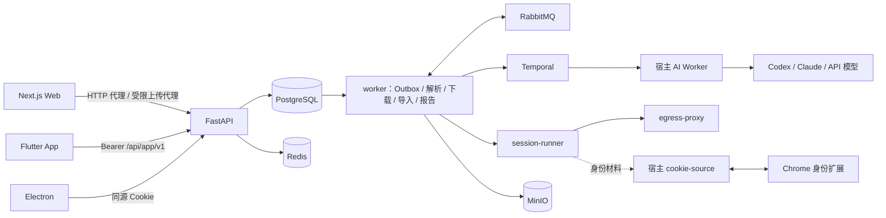

# 总体架构

## 组件

- **前端**：Next.js standalone（8101），承担页面、安全响应头、普通 HTTP 代理与 `/storage-upload` 受限上传代理；WebSocket Upgrade 由部署入口直接交给 API。
- **API**：FastAPI（8111），负责认证授权、业务用例、状态与配额；只提交、查询、取消，不执行长时间媒体或 AI 工作。
- **持久化**：PostgreSQL 是业务事实唯一来源，结构只由幂等的 `backend/sql/schema.sql` 维护；Redis 只保存限流计数、登录会话缓存与短期租约；MinIO 保存制品、上传 quarantine 与报告。
- **异步**：业务状态与 Outbox 同事务写入；`worker` 内的投递循环启动 Temporal 工作流或发布到 RabbitMQ。职责划分见[工作流编排](13-工作流编排.md)。
- **执行隔离**：`session-runner` 是唯一的媒体执行进程，所有出站流量经 `egress-proxy`；它不持有业务凭据。
- **宿主进程**：AI Worker 使用宿主已登录的 CLI；cookie-source 与用户 Chrome 中的身份扩展通信，见[平台身份](15-平台身份.md)。

## 部署

`docker-compose.yml` 与 `docker-compose-prod.yml` 只启动业务容器，复用宿主已运行的 PostgreSQL、RabbitMQ、Redis、MinIO 与 Temporal。

| 容器 | 职责 |
| --- | --- |
| `api` | 处理请求 |
| `worker` | 单进程分别监督 Outbox 投递、解析、下载、导入与报告发布；单个循环失败只重启它自己 |
| `session-runner` | 执行不可信媒体处理，只有一个实例；共享工作卷由镜像预建属主 |
| `frontend` | Web |
| `workspace` | 知识库与产品文稿站点（8130），只读挂载 `workspace/content`，经 API 保存管理员的网页编辑 |
| `egress-proxy` | Runner 唯一出网 |
| `youtube-pot-provider` | YouTube PO Token |
| `migrate` | 一次性幂等执行 `schema.sql` |

## 后端分层

主依赖方向为 `api → services → repositories → models`；`integrations` 承载外部系统适配，`workers` 承载消费与 Runner。HTTP schema、ORM 模型与内部业务类型各自独立。目录规则见 [PROJECT.md](../../../PROJECT.md#4-后端)，架构测试强制根目录与依赖方向。
